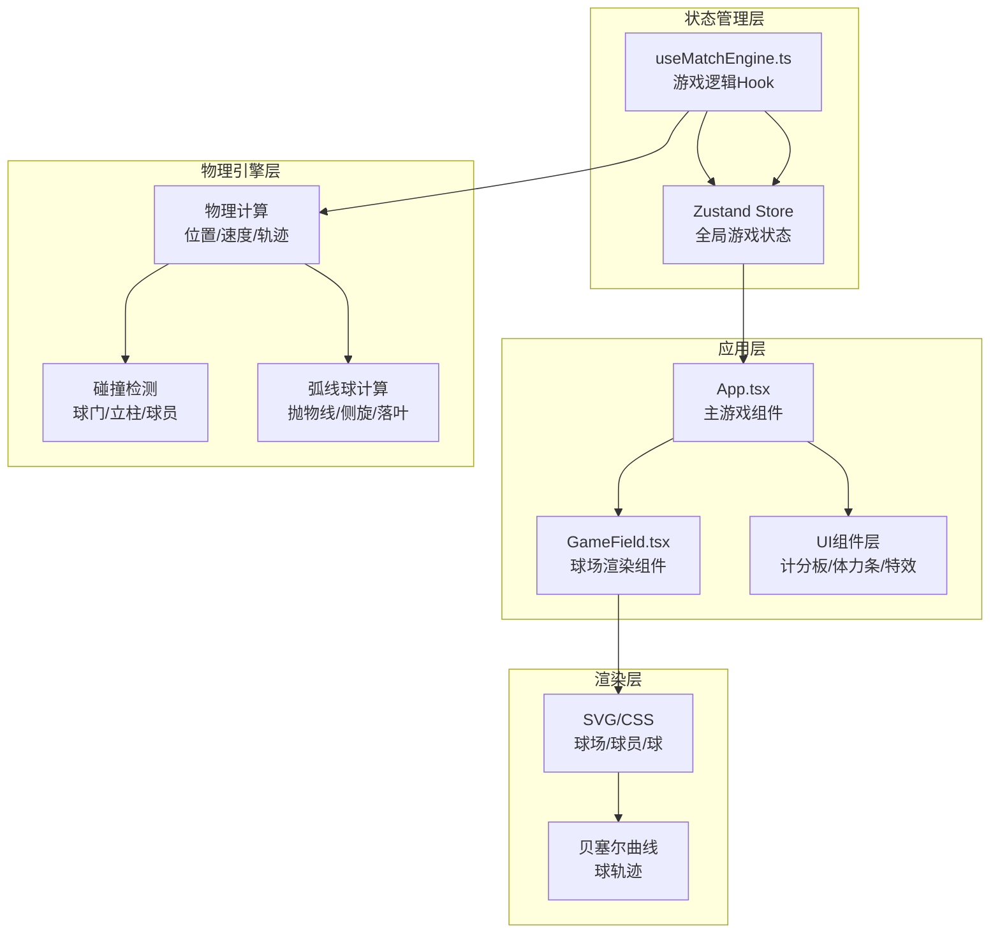

## 1. 架构设计

本项目采用纯前端React应用架构，使用Vite作为构建工具，Zustand管理全局游戏状态，Framer Motion处理动画。



## 2. 技术描述

- 前端框架：React@18 + TypeScript@5
- 构建工具：Vite@5 + @vitejs/plugin-react@4
- 状态管理：zustand@4
- 动画库：framer-motion@11
- 渲染方式：SVG + CSS（球场和球员），Canvas可作为备选
- 无后端，纯前端游戏

## 3. 目录结构

```
d:\Solocoder\VersionFast\tasks\auto57\
├── .trae\documents\
│   ├── PRD.md
│   └── TechnicalArchitecture.md
├── src\
│   ├── main.tsx              # React挂载入口
│   ├── App.tsx               # 主游戏组件
│   ├── GameField.tsx         # 球场渲染组件
│   ├── useMatchEngine.ts     # 游戏逻辑Hook
│   └── store\
│       └── useGameStore.ts   # Zustand状态管理
├── index.html                # 入口HTML
├── vite.config.js            # Vite配置
├── tsconfig.json             # TypeScript配置
└── package.json              # 项目依赖
```

## 4. 核心数据模型

### 4.1 类型定义

```typescript
// 球员类型
interface Player {
  id: string;
  team: 'red' | 'blue';
  number: number;
  position: { x: number; y: number };
  targetPosition: { x: number; y: number } | null;
  stamina: number;
  speed: number;
  isSelected: boolean;
  hasBall: boolean;
}

// 球类型
interface Ball {
  position: { x: number; y: number };
  targetPosition: { x: number; y: number } | null;
  trajectory: { x: number; y: number }[] | null;
  isMoving: boolean;
  movementType: 'pass' | 'shot' | 'dribble' | null;
  spin: 'left' | 'right' | 'none';
  height: number; // 弧线高度
}

// 球门类型
interface Goal {
  team: 'red' | 'blue';
  position: { x: number; y: number };
  width: number;
  height: number;
}

// 游戏状态
interface GameState {
  players: Player[];
  ball: Ball;
  score: { red: number; blue: number };
  selectedPlayerId: string | null;
  possession: 'red' | 'blue' | null;
  isGoalAnimation: boolean;
  fieldSize: { width: number; height: number };
}
```

### 4.2 Zustand Store

```typescript
import { create } from 'zustand';

interface GameStore extends GameState {
  setSelectedPlayer: (id: string | null) => void;
  movePlayer: (id: string, target: { x: number; y: number }) => void;
  passBall: (fromId: string, toId: string) => void;
  shootBall: (playerId: string) => void;
  updateStamina: (playerId: string, amount: number) => void;
  scoreGoal: (team: 'red' | 'blue') => void;
  stealBall: (defenderId: string, attackerId: string) => void;
  resetPlay: () => void;
}

export const useGameStore = create<GameStore>((set, get) => ({
  // ... 初始状态和方法实现
}));
```

## 5. 核心算法

### 5.1 贝塞尔曲线轨迹计算

```typescript
// 计算射门弧线轨迹（二次贝塞尔曲线）
function calculateShotTrajectory(
  start: { x: number; y: number },
  end: { x: number; y: number },
  height: number,
  spin: 'left' | 'right'
): { x: number; y: number }[] {
  const midX = (start.x + end.x) / 2;
  const midY = (start.y + end.y) / 2 - height;
  const spinOffset = spin === 'left' ? -20 : 20;
  const controlPoint = { x: midX + spinOffset, y: midY };
  
  const points: { x: number; y: number }[] = [];
  for (let t = 0; t <= 1; t += 0.02) {
    const x = Math.pow(1-t, 2) * start.x + 2 * (1-t) * t * controlPoint.x + Math.pow(t, 2) * end.x;
    const y = Math.pow(1-t, 2) * start.y + 2 * (1-t) * t * controlPoint.y + Math.pow(t, 2) * end.y;
    points.push({ x, y });
  }
  return points;
}
```

### 5.2 抢断概率判定

```typescript
function calculateStealChance(defenderStamina: number, attackerStamina: number): number {
  return defenderStamina > attackerStamina ? 0.6 : 0.4;
}
```

### 5.3 射门角度判定

```typescript
function isValidShotPosition(
  playerPos: { x: number; y: number },
  goalCenter: { x: number; y: number },
  fieldWidth: number
): boolean {
  const distance = Math.sqrt(
    Math.pow(playerPos.x - goalCenter.x, 2) + 
    Math.pow(playerPos.y - goalCenter.y, 2)
  );
  if (distance > 200) return false;
  
  // 计算40度角范围
  const angle = Math.atan2(
    Math.abs(playerPos.y - goalCenter.y),
    Math.abs(playerPos.x - goalCenter.x)
  ) * (180 / Math.PI);
  return angle <= 40;
}
```

### 5.4 碰撞检测

```typescript
function checkGoalCollision(
  ballPos: { x: number; y: number },
  goal: Goal
): 'score' | 'post' | 'miss' {
  const { x, y } = ballPos;
  const { position, width, height } = goal;
  
  // 球门内部
  if (x >= position.x - width/2 && x <= position.x + width/2 &&
      y >= position.y - height/2 && y <= position.y + height/2) {
    return 'score';
  }
  
  // 立柱碰撞
  const postRadius = 5;
  const leftPost = { x: position.x - width/2, y: position.y };
  const rightPost = { x: position.x + width/2, y: position.y };
  
  if (Math.sqrt(Math.pow(x - leftPost.x, 2) + Math.pow(y - leftPost.y, 2)) < postRadius + 8 ||
      Math.sqrt(Math.pow(x - rightPost.x, 2) + Math.pow(y - rightPost.y, 2)) < postRadius + 8) {
    return 'post';
  }
  
  return 'miss';
}
```

## 6. 性能优化

- 使用requestAnimationFrame进行物理计算，确保60fps
- 组件拆分合理，避免不必要的重渲染
- 使用Zustand的selector精确订阅状态
- 球轨迹使用SVG path，避免频繁DOM操作
- 响应式缩放使用CSS transform而非重绘
- 动画优先使用transform和opacity属性

## 7. 关键文件职责

| 文件 | 职责 |
|------|------|
| [App.tsx](file:///d:/Solocoder/VersionFast/tasks/auto57/src/App.tsx) | 主组件，布局管理，状态订阅，事件分发 |
| [GameField.tsx](file:///d:/Solocoder/VersionFast/tasks/auto57/src/GameField.tsx) | 球场、球员、球的SVG渲染，交互事件处理 |
| [useMatchEngine.ts](file:///d:/Solocoder/VersionFast/tasks/auto57/src/useMatchEngine.ts) | 游戏循环、AI逻辑、物理计算、碰撞检测 |
| [useGameStore.ts](file:///d:/Solocoder/VersionFast/tasks/auto57/src/store/useGameStore.ts) | Zustand全局状态管理，动作封装 |
