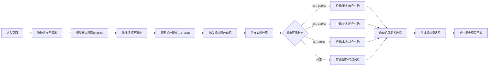

## 1. 产品概述

古代香道隔火熏香交互模拟器，让用户在浏览器中直观体验传统香道中炭火温度控制与香材香味层次释放的艺术。解决传统香道中香炭埋入深度、灰堆形状、香材距离火源远近对香气发散影响难以直观感受和反复试错的问题。

- 主要目的：通过可视化交互，让用户理解香道中温度与香味层次（前调、中调、后调）的关系
- 目标用户：香道爱好者、传统文化学习者、香水调香师
- 产品价值：降低香道学习门槛，提供可重复的虚拟品香体验

## 2. 核心功能

### 2.1 功能模块

1. **主交互区**：三足铜质香炉可视化，炭火埋深控制，银叶位置调整
2. **工具盒**：香炭拖拽、香材（沉香）拖拽、工具选择
3. **品香记录面板**：品香历史记录、香味雷达图、回放功能

### 2.3 页面详情

| 页面名称 | 模块名称 | 功能描述 |
|-----------|-------------|---------------------|
| 主页面 | 香炉组件 | 绘制三足铜质香炉（古铜色#8b6f4e，云雷纹浮雕，蟠螭纹镂空炉盖），灰堆中埋入香炭，支持炭火埋深滑块控制（0-3cm） |
| 主页面 | 工具盒组件 | 木纹底色#c8a86e，提供香炭和沉香拖拽源，拖拽时带渐变阴影效果 |
| 主页面 | 香味模拟系统 | 根据温度计算香味层级：180-220°C前调（果香，淡紫色#dda0dd气泡），140-180°C中调（花香，淡粉色#ffb6c1），80-140°C后调（木香，浅棕色#deb887），异常温度产生焦糊烟雾（灰色#808080） |
| 主页面 | 银叶交互 | 圆形银白色#c0c0c0银叶，支持拖拽调整与炭火距离（0.5-3cm），放置沉香触发2秒香味释放动画 |
| 记录面板 | 品香记录 | 自动记录每次品香参数（埋深、距离、温度曲线、香材类型），最多保存10条 |
| 记录面板 | 雷达图 | Canvas绘制五维雷达图（果香、花香、木香、馥郁度、持久度），支持点击回放 |

## 3. 核心流程

用户进入页面 → 从工具盒拖拽香炭放入灰堆 → 调整炭火埋深滑块 → 从工具盒拖拽沉香放置到银叶上 → 调整银叶距离 → 观察香味释放动画和温度变化 → 系统自动记录品香数据 → 在右侧面板查看雷达图 → 点击历史记录回放当时场景

## 4. 用户界面设计

### 4.1 设计风格

- **整体风格**：文人书斋风格，古朴雅致，东方美学
- **主色调**：浅米色#f5ecd7背景，古铜色#8b6f4e香炉，木纹色#c8a86e工具盒，半透明宣纸色#f8f0e0记录面板
- **字体**：Google Fonts的ZCOOL XiaoWei（中文古风字体）
- **动画风格**：流畅过渡（CSS transition 0.3s ease），粒子飘散效果，卷轴装饰
- **特殊效果**：焦糊时全屏暗红闪烁（200ms），拖拽时渐变阴影

### 4.2 页面设计概述

| 页面名称 | 模块名称 | UI元素 |
|-----------|-------------|-------------|
| 主页面 | 布局 | 三栏式：左侧工具盒，中间香炉区，右侧记录面板 |
| 主页面 | 背景 | 浅米色#f5ecd7，带微妙纹理 |
| 主页面 | 香炉 | 居中靠下，三足铜炉，云雷纹浮雕（CSS repeating-radial-gradient），蟠螭纹镂空炉盖 |
| 主页面 | 温度计 | 实时显示当前温度，颜色随温度变化 |
| 主页面 | 粒子效果 | 香味气泡向上飘散，opacity渐变消失 |
| 记录面板 | 卷轴装饰 | 仿古书卷轴边缘，半透明宣纸质感 |
| 记录面板 | 雷达图 | Canvas绘制，五维对称图形 |
| 记录面板 | 记录列表 | 竖向排列，选中高亮，hover效果 |

### 4.3 响应式

- 桌面端（≥1024px）：三栏完整布局，工具盒200px，记录面板300px，中间自适应
- 平板端（768px-1024px）：工具盒150px，记录面板250px，字体适当缩小
- 所有交互元素保留可点击区域≥44px
- 触控设备支持触摸拖拽

## 5. 性能要求

- Chrome/Firefox稳定60FPS
- 香味动画粒子数≤50个同时存在
- Canvas雷达图更新频率≤30次/秒
- 内存占用≤200MB
- 无明显内存泄漏
