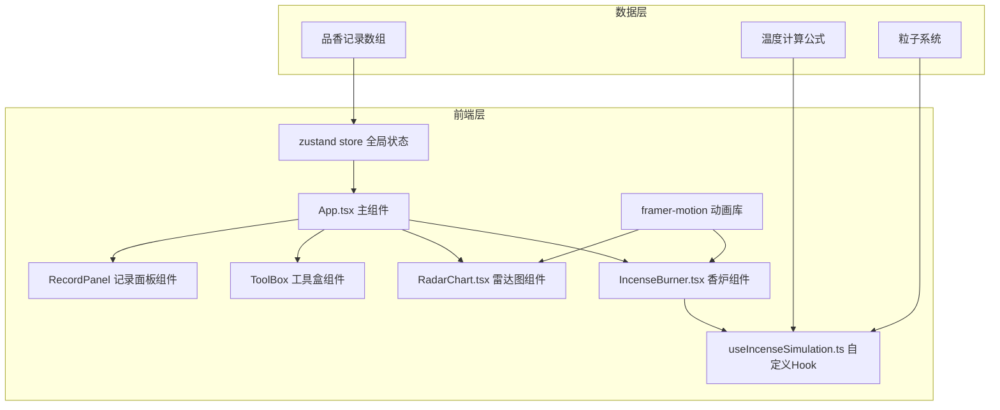

## 1. 架构设计



## 2. 技术描述

- **前端框架**：React@18 + TypeScript
- **构建工具**：Vite@5 + @vitejs/plugin-react@4
- **状态管理**：zustand@4
- **动画库**：framer-motion@11
- **图形绘制**：原生Canvas API
- **字体**：Google Fonts ZCOOL XiaoWei
- **包管理器**：npm

## 3. 项目文件结构

```
├── package.json
├── vite.config.js
├── tsconfig.json
├── index.html
└── src/
    ├── App.tsx
    ├── hooks/
    │   └── useIncenseSimulation.ts
    ├── components/
    │   ├── IncenseBurner.tsx
    │   └── RadarChart.tsx
    ├── store/
    │   └── useIncenseStore.ts
    └── types/
        └── index.ts
```

## 4. 数据模型

### 4.1 类型定义

```typescript
// 香味类型
type FragranceType = 'top' | 'middle' | 'base' | 'burnt';

// 品香记录
interface IncenseRecord {
  id: string;
  timestamp: number;
  charcoalDepth: number;      // 炭火埋深 0-3cm
  silverLeafDistance: number; // 银叶距离 0.5-3cm
  temperatureCurve: number[]; // 温度曲线
  incenseType: string;        // 香材类型
  fragranceScores: {
    fruit: number;     // 果香 0-100
    flower: number;    // 花香 0-100
    wood: number;      // 木香 0-100
    richness: number;  // 馥郁度 0-100
    longevity: number; // 持久度 0-100
  };
}

// 粒子数据
interface Particle {
  id: number;
  x: number;
  y: number;
  vx: number;
  vy: number;
  size: number;
  color: string;
  opacity: number;
  life: number;
  maxLife: number;
}

// 模拟状态
interface SimulationState {
  temperature: number;
  fragranceType: FragranceType;
  particles: Particle[];
  isReleasing: boolean;
}
```

### 4.2 温度计算公式

```
基础温度 = 250 - (埋深 / 3) * 100  // 埋深越浅温度越高
距离衰减 = (距离 - 0.5) / 2.5 * 80  // 距离越远温度越低
实际温度 = 基础温度 - 距离衰减

温度区间判定：
- >220°C 或 <80°C: 焦糊 (burnt)
- 180-220°C: 前调 (top) 果香
- 140-180°C: 中调 (middle) 花香
- 80-140°C: 后调 (base) 木香
```

## 5. 核心组件设计

### 5.1 useIncenseSimulation Hook

**输入**：charcoalDepth (number), silverLeafDistance (number)  
**输出**：temperature, fragranceType, particles, startRelease(), stopRelease()

**职责**：
- 实时计算温度
- 判定香味层级
- 管理粒子系统（生成、更新、回收）
- 控制释放动画周期

### 5.2 IncenseBurner 组件

**Props**：charcoalDepth, onDepthChange, silverLeafDistance, onDistanceChange, incenseOnLeaf

**职责**：
- CSS绘制三足铜炉（云雷纹、蟠螭纹）
- 绘制灰堆和炭火
- 渲染银叶和香材
- 处理滑块交互
- 展示温度计
- 渲染粒子动画

### 5.3 RadarChart 组件

**Props**：records: IncenseRecord[], selectedId, onSelect, onReplay

**职责**：
- Canvas绘制五维雷达图
- 支持多条记录对比
- 点击记录回放
- 30fps节流更新

### 5.4 Zustand Store

**State**：
- records: IncenseRecord[] (最多10条)
- selectedRecordId: string | null
- isReplaying: boolean

**Actions**：
- addRecord(record: IncenseRecord)
- selectRecord(id: string)
- startReplay(id: string)
- stopReplay()

## 6. 性能优化策略

1. **粒子系统**：对象池模式，复用粒子对象，最多50个
2. **Canvas渲染**：requestAnimationFrame，30fps节流
3. **状态更新**：useMemo/useCallback避免不必要重渲染
4. **动画**：transform/opacity属性动画，开启GPU加速
5. **事件**：拖拽事件节流，避免高频触发
