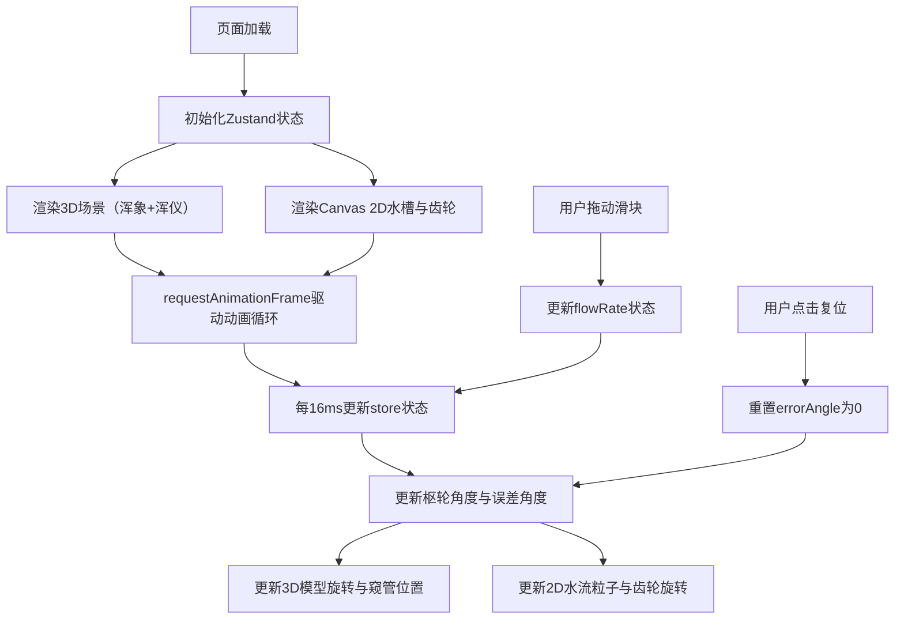

## 1. 产品概述

本项目是一个基于浏览器的古代水运仪象台3D可视化应用，模拟宋代天文仪器"水运仪象台"的擒纵机构、枢轮传动、浑象自转与浑仪窥管追踪等核心机械原理。用户可通过调节水斗泄水速度，实时观察机械传动的联动效果与误差累积，体验古代司天监掣壶正的工作场景。

## 2. 核心功能

### 2.1 用户角色

| 角色 | 注册方式 | 核心权限 |
|------|----------|----------|
| 访客 | 无需注册 | 调节水流速度、观察机械运转、复位擒纵机构 |

### 2.2 功能模块

1. **主3D场景**：浑象天球模型、浑仪三重环与窥管追踪
2. **水槽控制区**：木制水槽、水流粒子动画、流速调节滑块
3. **齿轮传动区**：枢轮间歇性转动、齿轮啮合动画、转数仪表盘
4. **误差监控区**：实时偏差数值显示、准星状态指示
5. **复位控制**：擒纵机构复位按钮

### 2.3 页面详情

| 页面名称 | 模块名称 | 功能描述 |
|----------|----------|----------|
| 主页面 | 3D天文场景 | 展示浑象天球自转（二十八宿星点）、浑仪三重环结构、窥管沿赤道环追踪行星 |
| 主页面 | 水槽控制区 | 底部木质水槽（500x60px），水流粒子动画，横向滑块调节流速（0.5-3.0L/s） |
| 主页面 | 齿轮传动区 | 右侧枢轮（12肘木）间歇性转动，齿轮啮合火花效果，时辰转数显示 |
| 主页面 | 误差监控 | 左下角实时偏差显示（角分），窥管准星颜色变化与闪烁 |
| 主页面 | 复位按钮 | 铜色圆形复位按钮，重置误差角度与窥管位置 |

## 3. 核心流程

用户进入页面后，3D场景自动加载，水运仪象台开始运转。用户通过拖动滑块调节泄水速度，观察枢轮转速变化、浑象与浑仪的同步转动，以及误差累积的可视化效果。点击复位按钮可重置误差累积。

## 4. 用户界面设计

### 4.1 设计风格

- **主色调**：深蓝渐变背景（#0a0a2a 至 #1a1a4a）
- **强调色**：古铜色（#b8860b）、金色（#ffd700）、木色（#a0784a、#6b4e2e）
- **字体**：使用宋体类衬线字体体现古风，搭配现代无衬线字体保证可读性
- **UI控件**：铜锈颗粒质感，边框金色，悬停时亮度提升
- **整体风格**：宋代天文台风格，庄重典雅，兼具科技感与历史感

### 4.2 页面设计概述

| 页面名称 | 模块名称 | UI元素 |
|----------|----------|--------|
| 主页面 | 3D场景区 | 居中占70%面积，天蓝色半透明天球，铜色三重环，红色窥管带绿色准星 |
| 主页面 | 水槽控制区 | 左侧宽200px，深木色滑动轨道，铜色滑块，木色水槽，蓝色半透明水粒子 |
| 主页面 | 齿轮仪表盘 | 右侧宽200px，十二肘木枢轮，铜色齿轮，金色啮合火花，时辰数字显示 |
| 主页面 | 误差显示区 | 左下角，铜色边框面板，实时偏差数值，状态指示 |
| 主页面 | 复位按钮 | 右下角，铜色圆形按钮，金色"复位"文字 |

### 4.3 响应式设计

- 桌面优先设计，支持1440x900和1920x1080分辨率自动缩放
- 3D场景使用ASPECT_RATIO常数保持响应式宽高比
- UI控件使用相对单位，在不同分辨率下保持比例协调

### 4.4 3D场景设计

- **环境**：深蓝星空背景，环境光模拟夜空
- **光照**：柔和方向光模拟月光，点光源突出铜质金属质感
- **相机**：透视相机，初始角度俯视仪象台内部，支持鼠标拖拽旋转视角
- **动画**：浑象匀速自转，窥管沿赤道环追踪，转速与流速正相关
- **后处理**：轻微辉光效果突出星点与金属边缘
- **性能**：保持50FPS以上，粒子数变化时帧率下降不超过10%
