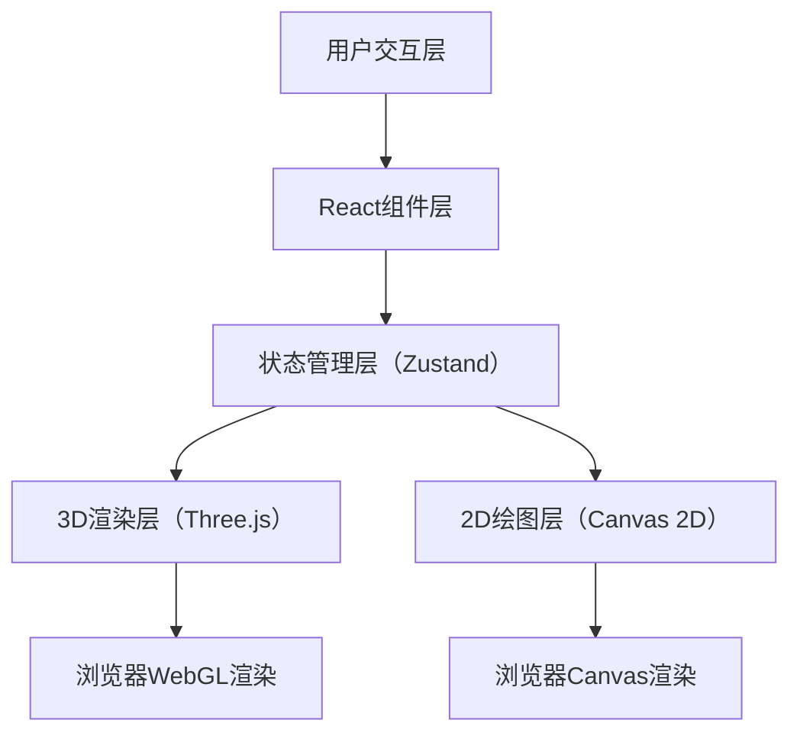

## 1. 架构设计



## 2. 技术描述

- **前端框架**：React@18 + TypeScript@5 + Vite@5
- **3D渲染**：Three.js@0.160 + @react-three/fiber@8 + @react-three/drei@9
- **状态管理**：Zustand@4
- **开发工具**：@vitejs/plugin-react@4
- **构建工具**：Vite

## 3. 项目结构

```
├── package.json
├── vite.config.js
├── tsconfig.json
├── index.html
├── src/
│   ├── components/
│   │   ├── Astrolabe.tsx      # 浑象与浑仪3D组件
│   │   ├── WaterClock.tsx     # 水槽与齿轮2D组件
│   │   └── App.tsx            # 主应用组件
│   ├── store/
│   │   └── useClockStore.ts   # Zustand全局状态
│   ├── utils/
│   │   └── constants.ts       # 常量定义
│   ├── main.tsx               # 入口文件
│   └── index.css              # 全局样式
```

## 4. 状态管理设计

### 4.1 Zustand Store 状态定义

```typescript
interface ClockState {
  flowRate: number;           // 泄水速度 0.5-3.0 L/s
  pivotAngle: number;         // 枢轮累计角度 0-360度
  errorAngle: number;         // 擒纵叉齿隙误差 0-5角分
  ratio: number;              // 传动比 10:1
  waterLevel: number;         // 水斗水位 0-100%
  revolutionCount: number;    // 枢轮累计转数
  setFlowRate: (rate: number) => void;
  tick: (deltaTime: number) => void;
  reset: () => void;
}
```

### 4.2 状态更新频率限制

- 使用 `requestAnimationFrame` 驱动动画循环
- Zustand 更新频率限制为每16ms一次（约60fps）
- 3D场景与2D画布独立渲染，共享状态但不同步刷新

## 5. 核心模块设计

### 5.1 Astrolabe 组件（浑象与浑仪）

- **浑象天球**：SphereGeometry，半透明天蓝色材质，表面28宿星点使用Points
- **浑仪三重环**：TorusGeometry分别创建六合仪、三辰仪、四游仪
- **窥管**：CylinderGeometry红色细杆，末端十字准星使用LineSegments
- **星官名称**：悬停时使用HTML Overlay显示中文星官名
- **传动比**：天球角速度 = 枢轮角速度 × 3.6

### 5.2 WaterClock 组件（水槽与齿轮）

- **Canvas 2D**：独立canvas元素绘制水槽、水流粒子、枢轮剖面、齿轮
- **水流粒子**：requestAnimationFrame驱动，粒子数20-120随流速变化
- **枢轮转动**：水位达到75%时旋转30度（一格），间歇性运动
- **齿轮啮合**：齿数比12:5:120，啮合点金色火花粒子效果
- **性能优化**：使用离屏canvas预绘制静态元素

### 5.3 误差累积机制

- 每帧误差增量 = flowRate × 0.001 角分
- 误差超过2角分时，窥管准星变红并闪烁（周期0.3秒）
- 误差最大值限制为5角分
- 点击复位按钮重置误差为0，窥管从0度重新开始追踪

## 6. 性能优化策略

1. **3D场景**：
   - 使用InstancedMesh渲染星点
   - 材质预编译，避免运行时编译
   - 合理设置像素比，避免超采样

2. **2D粒子**：
   - Canvas 2D而非Three.js粒子系统
   - 对象池复用粒子，避免频繁GC
   - 粒子更新使用批量计算

3. **状态管理**：
   - Zustand 选择器订阅避免不必要重渲染
   - 状态更新节流到16ms
   - 组件使用memo包裹

4. **动画循环**：
   - 单rAF驱动所有动画
   - deltaTime归一化保证不同设备速度一致
   - 页面隐藏时暂停动画

## 7. 常量定义

```typescript
// constants.ts
export const ASPECT_RATIO = 16 / 9;
export const MIN_FLOW_RATE = 0.5;
export const MAX_FLOW_RATE = 3.0;
export const FLOW_STEP = 0.1;
export const PIVOT_DIAMETER = 100; // px
export const CELESTIAL_DIAMETER = 200; // px
export const SIGHT_TUBE_LENGTH = 150; // px
export const GEAR_RATIO = 3.6; // 浑象与枢轮传动比
export const MAX_ERROR_ANGLE = 5; // 角分
export const ERROR_THRESHOLD = 2; // 角分
export const TANK_WIDTH = 500; // px
export const TANK_HEIGHT = 60; // px
```
