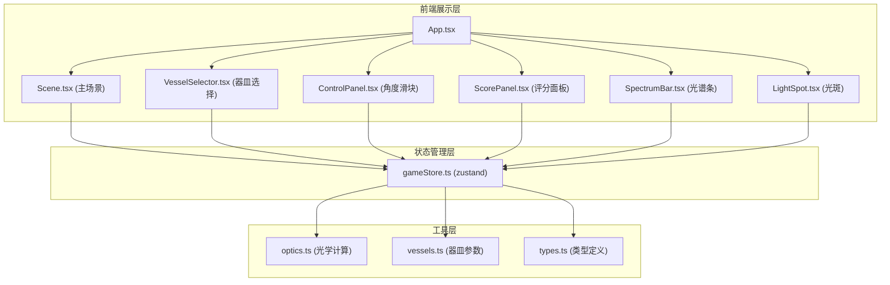
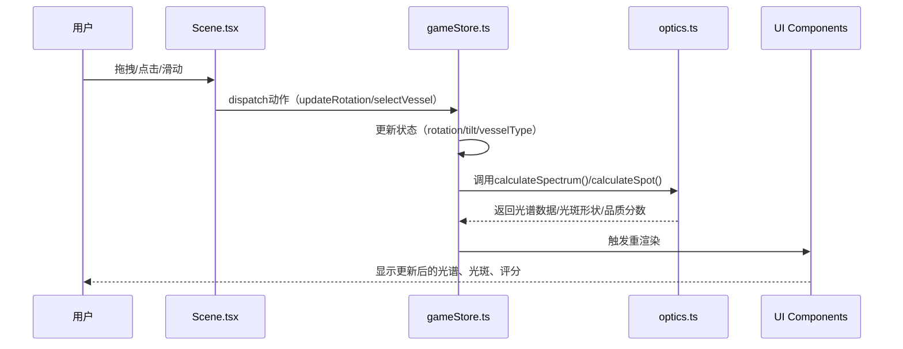

## 1. 架构设计



## 2. 技术描述

- **前端框架**：React@18 + TypeScript@5 + Vite@5
- **状态管理**：zustand@4
- **动画库**：framer-motion@11
- **构建工具**：Vite@5 + @vitejs/plugin-react@4
- **样式方案**：CSS Modules + 内联样式（动态计算部分）
- **无后端**：纯前端应用，所有计算在浏览器端完成

## 3. 数据流向



## 4. 核心模块说明

### 4.1 状态管理（gameStore.ts）
```typescript
interface GameState {
  // 器皿状态
  selectedVessel: 'ehu' | 'goblet' | 'flatBottle';
  rotation: number;      // 水平旋转 0-360°
  tilt: number;          // 垂直倾斜 0-90°
  
  // 光源状态
  lightSource: { x: number; y: number };
  
  // 计算结果
  spectrum: SpectrumBand[];
  spotShape: string;     // CSS clip-path 多边形
  spotBlur: number;      // 0-8px
  qualityScore: number;  // 0-100
  
  // 动作
  setVessel: (v: VesselType) => void;
  setRotation: (r: number) => void;
  setTilt: (t: number) => void;
  calculateOptics: () => void;
}
```

### 4.2 光学计算（utils/optics.ts）
- **`calculateRefractionAngle(incidentAngle: number, refractiveIndex: number): number`**
  - 基于斯涅尔定律计算折射角
- **`calculateSpectrum(wallThickness: number, incidentAngle: number): SpectrumBand[]`**
  - 计算380nm-780nm各波长的色带宽度
  - 色带宽度公式：`wallThickness × sin(incidentAngle)` 乘以波长系数
- **`calculateSpotShape(vesselType: VesselType, rotation: number, tilt: number): string`**
  - 生成CSS clip-path多边形坐标
- **`calculateQualityScore(spectrum: SpectrumBand[], blur: number): number`**
  - 光谱丰满度权重60%，光斑清晰度权重40%

### 4.3 器皿参数（utils/vessels.ts）
```typescript
const VESSELS: Record<VesselType, VesselConfig> = {
  ehu: {      // 执壶
    wallThickness: 0.3,
    transparency: 0.5,
    baseShape: [[...]], // 底部轮廓点集
    refractiveIndex: 1.5,
  },
  goblet: {   // 高足杯
    wallThickness: 0.2,
    transparency: 0.7,
    baseShape: [[...]],
    refractiveIndex: 1.52,
  },
  flatBottle: { // 扁瓶
    wallThickness: 0.4,
    transparency: 0.3,
    baseShape: [[...]],
    refractiveIndex: 1.48,
  }
};
```

## 5. 文件结构与调用关系

```
src/
├── main.tsx              # 入口 → 挂载App，初始化store
├── App.tsx               # 根组件 → 组合所有子组件
├── store/
│   └── gameStore.ts      # zustand状态管理 → 被所有组件读取/写入
├── components/
│   ├── Scene.tsx         # 主场景 → 读取store，处理拖拽，调用光学计算
│   ├── VesselSelector.tsx # 器皿选择 → 调用setVessel
│   ├── ControlPanel.tsx   # 角度滑块 → 调用setRotation/setTilt
│   ├── ScorePanel.tsx     # 评分面板 → 读取qualityScore
│   ├── SpectrumBar.tsx    # 光谱条 → 读取spectrum
│   └── LightSpot.tsx      # 光斑 → 读取spotShape/spotBlur
├── utils/
│   ├── optics.ts         # 光学计算 → 被store调用
│   ├── vessels.ts        # 器皿参数 → 被optics和组件读取
│   └── types.ts          # 类型定义 → 全局引用
└── styles/
    └── global.css        # 全局样式
```

## 6. 性能优化

1. **计算缓存**：使用useMemo缓存光谱和光斑计算结果，仅当依赖变化时重算
2. **requestAnimationFrame**：拖拽时使用RAF批量更新，避免阻塞主线程
3. **CSS硬件加速**：使用transform而非left/top，开启GPU加速
4. **防抖处理**：滑块变化时防抖16ms，确保60FPS
5. **组件拆分**：各组件独立，仅当自身依赖的状态变化时重渲染
