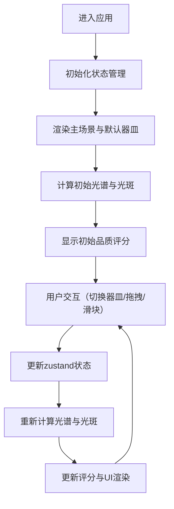

## 1. 产品概述

基于浏览器的唐代长安西市琉璃器皿铺透光折射模拟Web应用，让用户以琉璃鉴赏家身份，通过调整器皿角度观察色散光谱与光斑变化，判定琉璃品质等级。

- **核心目标**：沉浸式体验古代琉璃鉴赏过程，通过物理光学模拟实现教育与娱乐结合
- **目标用户**：历史文化爱好者、光学知识学习者、普通网页游戏玩家
- **市场价值**：创新的文化+科技交互体验，将传统文化与现代Web技术结合

## 2. 核心功能

### 2.1 用户角色
| 角色 | 注册方式 | 核心权限 |
|------|----------|----------|
| 鉴赏者 | 无需注册，直接访问 | 完整操作所有功能，切换器皿、调整角度、查看评分 |

### 2.2 功能模块
1. **主场景页面**：胡商铺子3D场景、琉璃器皿展示、色散光谱条、墙面光斑
2. **器皿选择面板**：三种琉璃器皿图标切换（执壶、高足杯、扁瓶）
3. **角度控制面板**：旋转角度与倾斜角度滑块控制
4. **品质评分面板**：实时评分数字滚动动画显示

### 2.3 页面详情
| 页面名称 | 模块名称 | 功能描述 |
|-----------|-------------|---------------------|
| 主场景页 | 器皿选择面板 | 点击切换三种琉璃器皿，选中状态外发光效果 |
| 主场景页 | 拖拽交互区 | 鼠标/触摸拖拽器皿水平旋转(0-360°)和垂直倾斜(0-90°) |
| 主场景页 | 色散光谱条 | 根据入射角和壁厚实时计算并渲染紫到红的连续渐变 |
| 主场景页 | 墙面光斑 | 使用CSS clip-path动态多边形模拟折射扭曲的光斑 |
| 主场景页 | 品质评分面板 | 综合光谱丰满度和光斑清晰度计算分数，数字滚动动画 |
| 主场景页 | 角度滑块 | 底部滑块精确控制旋转和倾斜角度 |

## 3. 核心流程

用户进入应用后，系统默认选中执壶器皿，展示初始角度下的光谱和光斑。用户可通过左侧面板切换器皿类型，通过拖拽或底部滑块调整角度，系统实时计算光学效果并更新评分。

## 4. 用户界面设计

### 4.1 设计风格
- **主色调**：土黄色#c4a882（背景墙）、青砖灰#6b7b6b（地面）、古铜色#b87333（控件）
- **强调色**：金色#ffd700（选中发光）、深褐色#5d3a1a（窗框）
- **字体**：使用具有古韵的衬线字体搭配现代无衬线字体，标题用楷体风格，正文用清晰易读字体
- **布局**：非对称布局，左侧器皿选择、中央操作区、右侧评分面板，营造胡商铺子的空间感
- **按钮样式**：圆角矩形，古铜色描边，悬停时放大1.05倍并加深阴影

### 4.2 页面设计概述
| 页面名称 | 模块名称 | UI元素 |
|-----------|-------------|----------|
| 主场景页 | 场景背景 | 土黄墙面、青砖地面、木质窗框、径向渐变光源 |
| 主场景页 | 器皿选择面板 | 竖排三个图标，80px×120px，选中时#ffd700外发光 |
| 主场景页 | 3D器皿展示 | CSS perspective + rotateX/Y模拟3D视角，0.3s ease-out过渡 |
| 主场景页 | 光谱条 | 紫#8b00ff到红#ff0000的连续渐变，色带宽度动态变化 |
| 主场景页 | 墙面光斑 | 灰色#b0b0b0区域300px×200px，clip-path多边形，blur值0-8px |
| 主场景页 | 评分面板 | 右上角固定，framer-motion数字滚动动画 |
| 主场景页 | 底部滑块 | 古铜#b87333色，范围0-360和0-90 |

### 4.3 响应式设计
- **桌面端（≥768px）**：左侧选择面板、中央操作区、右侧评分面板水平布局
- **移动端（<768px）**：面板垂直堆叠，器皿旋转支持触摸拖拽，滑块改为紧凑布局
- **触摸优化**：增大触摸热区，支持多指操作，禁用不必要的文本选择

### 4.4 伪3D场景设计
- **环境**：暖色调胡商铺子，径向渐变光源从右侧木窗透入
- **光照**：#fff8dc到#ffe4b5的径向渐变模拟午后阳光
- **相机**：CSS perspective(1000px)，器皿用rotateX/Y模拟3D旋转
- **构图**：器皿位于视觉中心，光谱条在器皿下方，光斑在右侧墙面
- **交互动画**：拖拽时0.3s ease-out过渡，悬停时scale(1.05)加深阴影
- **后处理**：器皿透明度0.3-0.7，光斑模糊度根据品质动态变化
