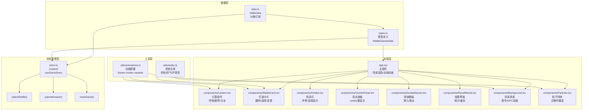

## 1. 架构设计



## 2. 技术描述

- **前端框架**：React 18 + TypeScript 5
- **构建工具**：Vite 5 + @vitejs/plugin-react
- **动画库**：framer-motion 11（呼吸、翻转、粒子、滑入滑出）
- **状态管理**：zustand 4（全局游戏状态）
- **路径别名**：`@/` 指向 `src/` 目录
- **CSS方案**：CSS Modules + CSS Variables 主题色
- **音效引擎**：Web Audio API（AudioContext 合成音效）

## 3. 路由定义

| 路由 | 用途 |
|------|------|
| `/` | 主游戏页面，单页应用无多路由 |

## 4. 文件结构与调用关系

```
src/
├── types.ts
│   └── 导出 Riddle / GameState 类型
├── data.ts
│   └── 导出 riddleData: Riddle[]（20条灯谜）
├── store.ts
│   └── useGameStore（依赖 types.ts / data.ts）
├── utils/
│   ├── audio.ts（Web Audio API 音效合成）
│   └── animations.ts（framer-motion variants 配置）
├── components/
│   ├── Lantern.tsx（依赖 store.ts / animations.ts）
│   ├── RiddleCard.tsx（依赖 store.ts / animations.ts / audio.ts）
│   ├── InfoBar.tsx（依赖 store.ts）
│   ├── ComboPanel.tsx（依赖 store.ts / animations.ts）
│   ├── DoubleBanner.tsx（依赖 store.ts / animations.ts）
│   ├── ResultModal.tsx（依赖 store.ts / animations.ts）
│   ├── Background.tsx（依赖 audio.ts）
│   └── Particles.tsx（依赖 animations.ts）
├── App.tsx（组合所有组件，依赖 store.ts）
├── main.tsx（React 入口）
└── index.css（全局样式、CSS变量）
```

**数据流向**：
```
data.ts → store.ts → App.tsx → 各子组件
                      ↑
              子组件 action 回调（selectRiddle / submitAnswer）
```

## 5. 数据模型

### 5.1 类型定义

```typescript
// types.ts
export type RiddleCategory = '字谜' | '物谜' | '地名谜';

export interface Riddle {
  id: number;
  title: string;
  category: RiddleCategory;
  question: string;
  options: string[];
  correctIndex: number;
  isSolved: boolean;
}

export interface GameState {
  riddles: Riddle[];
  activeRiddleId: number | null;
  score: number;
  comboCount: number;
  maxCombo: number;
  reputation: number;
  isDoubleMode: boolean;
  answeredCount: number;
  correctCount: number;
  isGameOver: boolean;
}
```

### 5.2 Store Actions

```typescript
// store.ts
interface GameActions {
  selectRiddle: (id: number) => void;
  submitAnswer: (riddleId: number, selectedIndex: number) => boolean;
  resetGame: () => void;
}
```

## 6. 性能优化策略

| 优化点 | 方案 |
|--------|------|
| 动画性能 | framer-motion layout 动画、transform3d 硬件加速、will-change |
| 粒子控制 | 最多50个粒子同时存活，使用 AnimatePresence 自动销毁 |
| 音效性能 | Web Audio API BufferSource 预渲染，避免主线程重复计算 |
| 渲染性能 | 灯笼组件 memo 优化，状态更新按需触发重渲染 |
| 初始化 | 懒加载组件，首屏渲染 < 500ms |
| 帧率保障 | 所有动画使用 requestAnimationFrame，避免阻塞主线程 |

## 7. 核心技术实现要点

### 7.1 动画配置（animations.ts）
- 灯笼呼吸：`animate={{ opacity: [1, 0.7, 1] }}` loop 循环
- 卡片翻转：`rotateY: [0, 90, 0]` 配合 `backface-visibility`
- 粒子爆发：10个元素 `x/y` 随机方向，`opacity: 0` 淡出
- 双倍横幅：`y: [-100, 0, -100]` 滑入滑出

### 7.2 音效合成（audio.ts）
- 铃铛：3个 800/1000/1200Hz 方波脉冲，间隔 200ms
- 叹气：低频噪声 + 音量衰减 500ms
- 环境音：粉红噪声 + 低通滤波 1kHz，音量 -20dB 循环

### 7.3 响应式布局
- CSS Grid + `@media (max-width: 768px)` 断点
- CSS Variables 控制字体大小、间距缩放
- 触控设备 `hover: none` 适配
