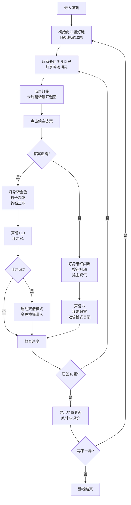

## 1. 产品概述

宋代灯谜会是一款基于浏览器的古风交互模拟游戏，让用户化身宋代临安夜市中的游灯人，在虚拟长街中体验猜灯谜的传统民俗乐趣。通过精美的视觉效果和沉浸式的音效设计，重现宋代夜市的繁华景象。

- **核心玩法**：从悬挂的绢灯中挑选灯谜，猜中获得声誉值与奖励
- **目标用户**：对中国传统文化感兴趣、喜爱休闲益智游戏的玩家
- **市场价值**：以游戏化方式传播传统文化，提供沉浸式的古风体验

## 2. 核心功能

### 2.1 用户角色
| 角色 | 注册方式 | 核心权限 |
|------|----------|----------|
| 游灯人 | 无需注册，直接进入 | 猜灯谜、查看得分、重玩游戏 |

### 2.2 功能模块
1. **主游戏界面**：夜市背景、20盏绢灯网格、顶部信息栏、右侧连击面板
2. **灯谜交互系统**：灯身呼吸动画、悬停放大、点击翻转展开谜面
3. **答题判定系统**：选项点击、正误判定、粒子光效、音效反馈
4. **连击奖励系统**：连续答对计数、双倍奖励模式、金色横幅提示
5. **进度结算系统**：10题关卡进度、结算界面、评价等级、重玩功能
6. **氛围营造系统**：夜市背景动画、NPC徘徊、环境白噪音

### 2.3 页面详情
| 页面名称 | 模块名称 | 功能描述 |
|---------|---------|----------|
| 主游戏页 | 绢灯网格 | 3行7列灯笼布局，随机呼吸动画，悬停交互 |
| 主游戏页 | 信息栏 | 显示声誉值、连击数、当前进度1/10 |
| 主游戏页 | 灯谜卡片 | 翻转展开谜面，4个选项按钮，答题反馈 |
| 主游戏页 | 连击面板 | Combo数字显示，缩放动画，桔色高亮 |
| 主游戏页 | 背景场景 | CSS绘制夜市街道，NPC徘徊动画，环境音 |
| 结算界面 | 统计面板 | 答对数、总得分、最高连击、最终声誉、评价等级 |
| 结算界面 | 重玩按钮 | 点击重新开始游戏，重置所有状态 |

## 3. 核心流程

## 4. 界面设计

### 4.1 设计风格
- **主色调**：灯笼红 `#ff6b6b` → `#ee5a24` 渐变，夜空深蓝 `#0a192f`
- **辅助色**：奖励金色 `#ffd700`，古典米色 `#f5deb3`，夜色深灰 `#2a2a2a`
- **字体**：楷体（谜面）、黑体（UI文字），古典书法风格
- **布局**：卡片式灯笼网格，顶部固定信息栏，右侧连击面板
- **动画风格**：流畅的呼吸、翻转、粒子特效，贴合古风意境

### 4.2 页面设计概览
| 页面名称 | 模块名称 | UI元素 |
|---------|---------|--------|
| 主游戏页 | 绢灯网格 | 3行7列，渐变红灯笼，灯柄棕色，每3秒呼吸，悬停1秒呼吸+放大1.05倍 |
| 主游戏页 | 信息栏 | 半透明黑条 `backdrop-filter: blur(2px)`，显示声誉值S、进度x/10 |
| 主游戏页 | 灯谜卡片 | 翻转动画，楷体墨色 `#2b1a0a` 谜面16px，米色圆角选项按钮120x30px |
| 主游戏页 | 连击面板 | Combo数字桔色 `#ff8c00` 16px，每次+1时scale 1.2→1动画 |
| 主游戏页 | 背景场景 | CSS绘制夜空、青石板街道、木制店铺剪影，NPC左右平移徘徊 |
| 主游戏页 | 双倍横幅 | 金色 `#ffd700` 横幅，黑体"双倍奖励!"20px，上滑入3秒后上滑出 |
| 结算界面 | 统计面板 | 居中卡片，展示各项数据与评价等级，"再来一局"按钮 |

### 4.3 响应式设计
- **桌面端（≥768px）**：3行7列灯笼网格，标准字体尺寸
- **移动端（<768px）**：2行5列灯笼网格，字体和按钮缩小至80%
- **触控优化**：按钮最小触控区域44x44px，点击反馈清晰

### 4.4 微交互规范
- 所有按钮点击：`scale 0.95→1`，0.1-0.3秒过渡
- 卡片阴影偏移：悬停时阴影加深、偏移增加
- 透明度变化：选中/未选中状态区分
- 粒子特效：正确时10个金色圆点从灯心随机飞出，1秒后消失
