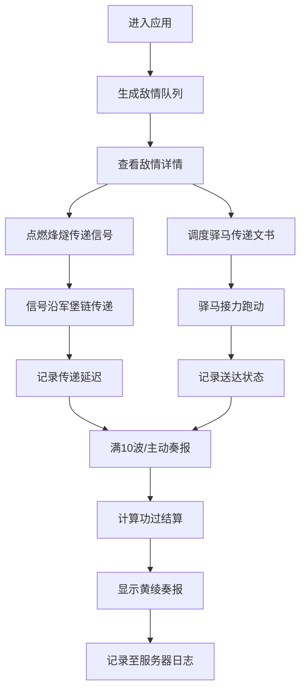

## 1. 产品概述

本产品是一款古代驿站烽燧传警与驿马接力调度模拟Web应用，让用户扮演明代九边重镇的塘报驿丞，通过点燃烽燧传递敌情信号、调度驿马接力传递军情文书，体验古代军事通信系统的运作机制。

- 核心目标：模拟古代烽燧传警和驿马接力系统，让用户体验军事通信调度的策略性和紧迫感
- 目标用户：历史爱好者、策略游戏玩家、教育场景学习者
- 产品价值：寓教于乐，通过互动模拟了解古代军事通信体系

## 2. 核心功能

### 2.1 用户角色

| 角色 | 登录方式 | 核心权限 |
|------|----------|----------|
| 塘报驿丞 | 直接进入 | 点燃烽燧、调度驿马、查看功过结算 |

### 2.2 功能模块

1. **敌情生成系统**：随机生成鞑靼骑兵入侵敌情，包含人数、距离、方向信息
2. **烽燧传警系统**：点击烽燧台点燃1-5炷烽火，信号沿军堡链逐级传递
3. **驿马调度系统**：拖拽驿马至目标军堡，驿马沿路线接力跑动传递文书
4. **功过结算系统**：根据报警及时率和文书送达率计算功过，生成奏报

### 2.3 页面详情

| 页面名称 | 模块名称 | 功能描述 |
|---------|---------|---------|
| 主界面 | 敌情列表 | 左侧显示待处理敌情队列，仿明代塘报折子样式 |
| 主界面 | 军堡沙盘 | 中间展示九边军堡链地图，可点击查看烽燧状态 |
| 主界面 | 驿马管理 | 右侧显示马厩驿马列表，支持拖拽调度 |
| 奏报弹窗 | 功过结算 | 显示烽燧及时率、文书送达率和功过评定 |

## 3. 核心流程

用户进入应用后，系统自动生成敌情队列。用户根据敌情人数点燃对应烽燧，同时调度驿马传递军情文书。每处理10波敌情后自动结算功过，用户也可主动奏报。

## 4. 用户界面设计

### 4.1 设计风格

- **主色调**：土黄(#d4a574)、赭石(#8b4513)、灰蓝(#708090)、深红(#8b0000)、青色(#00bfff)
- **背景**：羊皮纸纹理，使用CSS repeating-linear-gradient实现
- **字体**：楷体类字体，正文#2b1a0a深褐色
- **按钮风格**：仿古木牌样式，圆角4px，悬停微弹性动画
- **布局**：三栏式布局，左敌情、中军堡、右驿马
- **图标**：使用SVG绘制烽燧、驿马、军堡等明代军事元素

### 4.2 页面设计概述

| 页面名称 | 模块名称 | UI元素 |
|---------|---------|--------|
| 主界面 | 敌情列表 | 泛黄宣纸底色#f0e6c8，楷体字迹，折子边框装饰 |
| 主界面 | 军堡沙盘 | CSS Grid弧形布局，军堡灰色#8b7a6a，烽燧深红#8b0000，虚线驿路连接 |
| 主界面 | 驿马管理 | 木纹底色#c8a46e，马匹卡片带体力条动画，支持拖拽 |
| 奏报弹窗 | 功过结算 | 黄绫卷轴样式，红黑字体标注功过，印章装饰 |

### 4.3 响应式

- **桌面端**：三栏并列布局，军堡沙盘弧形排列
- **平板端**：两栏布局，敌情列表和驿马面板可折叠
- **移动端**：单栏竖屏布局，军堡沙盘转为竖直列表，支持滑动切换面板

### 4.4 动画效果

- **烽燧点燃**：颜色从浅灰渐变到橙红，烟雾粒子飘散动画
- **驿马跑动**：framer-motion路径动画，虚线驿路变青色实线
- **军堡受击**：红色脉冲环闪烁
- **交互反馈**：所有点击、拖拽操作0.2秒spring弹性动画
