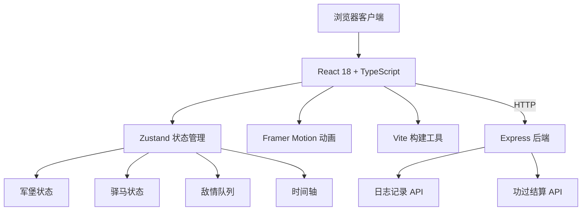
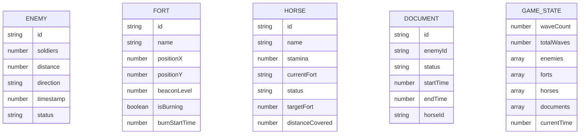

## 1. 架构设计



## 2. 技术描述

- **前端**：React@18 + TypeScript + Vite + Zustand + Framer Motion
- **构建工具**：Vite@5
- **后端**：Express@4
- **状态管理**：Zustand@4
- **动画库**：Framer Motion@11
- **样式方案**：CSS Modules + CSS 变量
- **包管理器**：npm

## 3. 目录结构

```
.
├── package.json
├── vite.config.js
├── tsconfig.json
├── index.html
├── src/
│   ├── App.tsx
│   ├── stores/
│   │   └── gameStore.ts
│   ├── components/
│   │   ├── FortMap.tsx
│   │   ├── EnemyList.tsx
│   │   ├── HorseManager.tsx
│   │   ├── BeaconTower.tsx
│   │   ├── HorseCard.tsx
│   │   └── ReportModal.tsx
│   ├── types/
│   │   └── index.ts
│   └── utils/
│       ├── constants.ts
│       └── helpers.ts
└── server/
    └── index.ts
```

## 4. 路由定义

| 路由 | 用途 |
|------|------|
| / | 主应用页面 |
| /api/log | 记录驿站日志 |
| /api/report | 功过结算 |

## 5. API 定义

### 5.1 日志记录 API

**POST /api/log**

请求体：
```typescript
interface LogEntry {
  timestamp: number;
  type: 'beacon' | 'horse' | 'enemy' | 'report';
  data: Record<string, unknown>;
}
```

响应：
```typescript
interface LogResponse {
  success: boolean;
  id: string;
}
```

### 5.2 功过结算 API

**POST /api/report**

请求体：
```typescript
interface ReportRequest {
  waveCount: number;
  beaconTimelyRate: number;
  documentDeliveryRate: number;
  details: {
    beaconDelays: number[];
    documentStatuses: ('delivered' | 'delayed')[];
  };
}
```

响应：
```typescript
interface ReportResponse {
  success: boolean;
  merit: number;
  demerit: number;
  comment: string;
}
```

## 6. 数据模型

### 6.1 数据模型定义



### 6.2 类型定义

```typescript
// 敌情
interface Enemy {
  id: string;
  soldiers: number; // 1-5000
  distance: number; // 10-100 里
  direction: '东' | '西' | '南' | '北' | '东北' | '西北' | '东南' | '西南';
  timestamp: number;
  status: 'pending' | 'alerted' | 'reported';
  beaconLevel: number; // 1-5
}

// 军堡
interface Fort {
  id: string;
  name: string;
  positionX: number;
  positionY: number;
  beaconLevel: number; // 0-5，0表示未点燃
  isBurning: boolean;
  burnStartTime: number | null;
  nextFortId: string | null;
  prevFortId: string | null;
}

// 驿马
interface Horse {
  id: string;
  name: string;
  stamina: number; // 0-100
  currentFortId: string;
  status: 'idle' | 'running' | 'resting';
  targetFortId: string | null;
  distanceCovered: number;
  documentId: string | null;
}

// 军情文书
interface Document {
  id: string;
  enemyId: string;
  status: 'pending' | 'delivering' | 'delivered' | 'delayed';
  startTime: number;
  endTime: number | null;
  horseIds: string[];
  currentHorseIndex: number;
}

// 游戏状态
interface GameState {
  waveCount: number;
  enemies: Enemy[];
  forts: Fort[];
  horses: Horse[];
  documents: Document[];
  beaconDelays: number[];
  isPaused: boolean;
  selectedFortId: string | null;
}
```

## 7. 核心算法

### 7.1 烽燧传递延迟计算
```typescript
function calculateBeaconDelay(beaconLevel: number): number {
  // 基础延迟1-3秒，烽火炷数越少延迟越长
  const baseDelay = 1 + Math.random() * 2;
  const levelMultiplier = (6 - beaconLevel) / 3; // 1炷=1.67x，5炷=0.33x
  return baseDelay * levelMultiplier;
}
```

### 7.2 驿马体力消耗计算
```typescript
function calculateStaminaCost(distance: number): number {
  // 每50里消耗20点体力
  return Math.floor(distance / 50) * 20;
}
```

### 7.3 烽燧及时率计算
```typescript
function calculateBeaconTimelyRate(delays: number[]): number {
  const maxTotalDelay = 15; // 最大总延时15秒
  const onTimeCount = delays.filter(d => d <= maxTotalDelay).length;
  return delays.length > 0 ? onTimeCount / delays.length : 1;
}
```

### 7.4 文书送达率计算
```typescript
function calculateDeliveryRate(documents: Document[]): number {
  const delivered = documents.filter(d => d.status === 'delivered').length;
  return documents.length > 0 ? delivered / documents.length : 1;
}
```

## 8. 性能优化

- **动画性能**：使用 Framer Motion 的 transform 和 opacity 属性进行动画，避免触发重排
- **路径计算**：预计算军堡间的路径点，单次计算不超过2ms
- **状态更新**：使用 Zustand 的批量更新，减少不必要的重渲染
- **时间调度**：使用 requestAnimationFrame 进行游戏循环，确保帧率稳定在50fps以上
- **后端日志**：使用异步写入，避免阻塞UI线程
