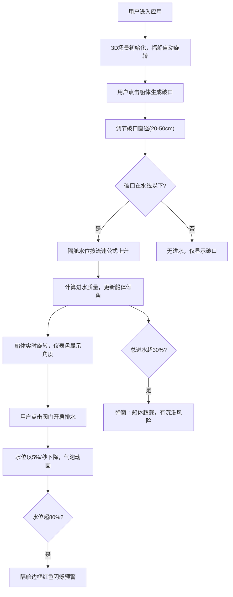

## 1. 产品概述

宋代泉州造船司水密隔舱进水模拟3D可视化应用，让用户以船匠视角在虚拟船坞中观察福船横剖面，通过交互模拟船体破损进水、水密隔舱工作原理及手动排水修复过程。

- **核心价值**：教育性展示古代造船技术智慧，提供沉浸式物理模拟体验
- **目标用户**：历史爱好者、学生、博物馆参观者、对古代造船技术感兴趣的公众

## 2. 核心特性

### 2.1 用户角色
| 角色 | 注册方式 | 核心权限 |
|------|----------|----------|
| 船匠（用户） | 无需注册 | 完整交互权限，可设置破损、开关阀门、观察物理模拟 |

### 2.2 功能模块
1. **3D船体场景**：福船横剖面展示、自动旋转、鼠标交互视角控制
2. **破损交互系统**：点击生成破口、大小调节、水花粒子效果
3. **流体模拟系统**：水位上升动画、舱壁水位均衡、物理流速计算
4. **浮态物理系统**：横倾/纵倾计算、船体旋转响应、仪表盘显示
5. **排水控制系统**：阀门开关、排水动画、气泡效果
6. **安全预警系统**：舱室水位预警、超载预警、视觉闪烁效果
7. **控制面板UI**：参数调节、状态显示、隔舱水位进度条

### 2.3 页面详情
| 页面名称 | 模块名称 | 功能描述 |
|----------|----------|----------|
| 主场景页面 | 3D船体展示 | 半透明剖切面福船，12个水密隔舱，水线标注，自动旋转+鼠标拖拽 |
| 主场景页面 | 破损交互 | 点击船体生成红色脉动破口，滑块调节直径20-50cm，水花粒子效果 |
| 主场景页面 | 进水模拟 | 破口水线以下时水位按流体力学公式上升，水位面波动动画 |
| 主场景页面 | 浮态响应 | 根据进水质量计算倾角，船体实时旋转，双仪表盘显示 |
| 主场景页面 | 排水控制 | 点击铜质阀门开关，开启后5%/秒排水，气泡动画 |
| 主场景页面 | 安全预警 | 水位超80%红色闪烁，进水超30%弹窗预警 |
| 控制面板 | 左侧面板 | 破口参数滑块、隔舱水位条、阀门状态图标、倾角仪表盘 |
| 控制面板 | 状态栏 | 底部显示总进水量、横倾角、纵倾角数值 |

## 3. 核心流程

用户进入应用后，首先看到3D福船横剖面在虚拟船坞中缓慢旋转。用户可：
1. 点击船体任意位置创建破口
2. 通过左侧面板调节破口大小
3. 观察水流入对应隔舱，水位上升
4. 观察船体因进水产生横倾和纵倾
5. 点击阀门开启排水，观察浮态恢复
6. 注意安全预警提示，防止超载沉没

## 4. 用户界面设计

### 4.1 设计风格
- **主色调**：木色#8b6f4e、深褐色#5a3e1a、浅木色#c4a46c
- **强调色**：蓝色#1e90ff（水）、红色#ff0000（破口/预警）、橙色#ff8c00（指针）、黄铜色#b8860b（阀门）
- **文字色**：米黄色#f5deb3
- **按钮风格**：圆角4px，木纹渐变背景，悬停变亮10%，点击缩放0.95->1.0
- **字体**：使用"Noto Serif SC"宋体类字体体现古典风格，标题粗体，正文常规
- **布局**：左侧固定控制面板260px宽，右侧全屏3D场景，底部状态栏
- **图标**：使用lucide-react图标，保持简洁线条风格

### 4.2 页面设计概览
| 页面名称 | 模块名称 | UI元素 |
|----------|----------|--------|
| 主页面 | 3D场景 | 半透明木质船体、蓝色水线、12隔舱结构、铜质阀门、水位波动面、破口脉动动画 |
| 主页面 | 左侧控制面板 | 渐变木纹背景、破口直径滑块、破口位置坐标显示、12个水位进度条、阀门圆形图标、倾角仪表盘 |
| 主页面 | 底部状态栏 | 深色半透明条、总进水量/横倾角/纵倾角数值 |
| 主页面 | 预警弹窗 | 红色边框、半透明黑色背景、警告文字 |

### 4.3 响应式设计
- **桌面端**（≥768px）：左侧固定260px控制面板，右侧3D场景
- **移动端**（<768px）：控制面板折叠为悬浮按钮，点击展开为半透明浮层，支持拖拽移动
- **触控优化**：按钮最小尺寸44px，滑块增大触控区域

### 4.4 3D场景设计
- **环境**：虚拟船坞背景，柔和冷色调环境光+方向光模拟日光
- **光照**：环境光强度0.6，方向光强度0.8，阴影开启
- **相机**：初始位置(0, 5, 15)，fov=50，近裁剪0.1，远裁剪1000
- **动画**：船体每10秒自动旋转一周，鼠标拖拽使用OrbitControls，阻尼系数0.05
- **后处理**：轻微泛光效果，增强水面质感
- **性能**：控制draw call数量，粒子对象池复用，目标帧率30+FPS
