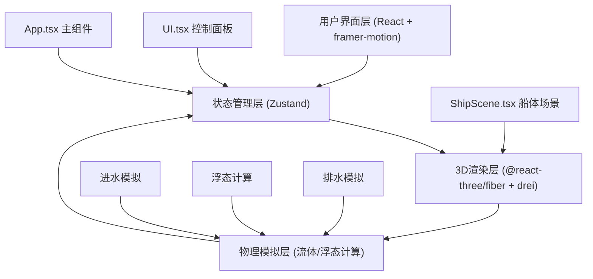

## 1. 架构设计



## 2. 技术描述

- **前端框架**：React@18 + TypeScript
- **构建工具**：Vite@5 + @vitejs/plugin-react
- **3D引擎**：Three.js + @react-three/fiber + @react-three/drei
- **状态管理**：Zustand@4
- **动画库**：framer-motion@11
- **后端**：无（纯前端应用）
- **数据库**：无

## 3. 目录结构

```
src/
├── App.tsx          # 主组件，整合3D场景、UI面板
├── store.ts         # Zustand状态仓库
├── ShipScene.tsx    # Three.js 3D场景组件
├── UI.tsx           # React控制面板组件
└── types.ts         # TypeScript类型定义
```

## 4. 数据模型

### 4.1 状态定义（Zustand Store）

```typescript
interface Compartment {
  id: number;
  waterLevel: number;      // 0-1，相对容积
  position: [number, number, number];  // 中心坐标
  valveOpen: boolean;
}

interface Breach {
  id: number;
  position: [number, number, number];
  diameter: number;        // cm
  compartmentId: number;
  belowWaterline: boolean;
}

interface ShipState {
  compartments: Compartment[];
  breaches: Breach[];
  heelAngle: number;       // 横倾角，度
  trimAngle: number;       // 纵倾角，度
  totalWaterMass: number;  // 吨
  breachDiameter: number;  // 当前设置的破口直径
  autoRotate: boolean;
  warningActive: boolean;
  overloadWarning: boolean;
}
```

### 4.2 物理常量

```typescript
// 船体参数
const SHIP_LENGTH = 30;       // 米
const SHIP_WIDTH = 8;         // 米
const SHIP_DEPTH = 4;         // 米
const COMPARTMENT_COUNT = 12;
const COMPARTMENT_LENGTH = 2.5; // 米
const WATERLINE_HEIGHT = 2.5;  // 米（吃水深度）

// 流体参数
const SEA_WATER_DENSITY = 1025; // kg/m³
const GRAVITY = 9.81;           // m/s²
const COMPARTMENT_VOLUME = 4.5; // m³ (2.5 * 8 * 0.225)
const VALVE_DIAMETER = 0.15;    // 米
const DRAIN_RATE = 0.05;        // 每秒5%

// 安全阈值
const WARNING_THRESHOLD = 0.8;  // 80%容积预警
const OVERLOAD_THRESHOLD = 15;  // 15吨超载预警
const MAX_ANGLE = 45;           // 最大倾角
```

## 5. 核心算法

### 5.1 进水流速计算
```
流速 = 破口面积 × √(重力加速度 × 水头高度)
破口面积 = π × (直径/2)²
水头高度 = 水线高度 - 破口Y坐标（破口在水线下为正）
```

### 5.2 水位更新
每帧更新：
```
进水速率 = 流速 × 时间增量
新增水量 = 进水速率 × 破口面积
隔舱水位 += 新增水量 / 隔舱容积
```

### 5.3 舱壁水位均衡
```
当同一舱壁两侧水位差 > 0.01 且持续0.5秒：
  均衡流量 = 水位差 × 均衡系数 × 时间增量
  高水位舱 -= 均衡流量 / 2
  低水位舱 += 均衡流量 / 2
```

### 5.4 浮态计算
```
横倾力矩 = Σ(隔舱进水质量 × 横向偏移距离)
纵倾力矩 = Σ(隔舱进水质量 × 纵向偏移距离)
横倾角 = 横倾力矩 / 回复力矩系数 （限制在0-45度）
纵倾角 = 纵倾力矩 / 回复力矩系数 （限制在0-45度）
```

### 5.5 排水计算
```
当阀门开启：
  若为船侧阀门（边缘舱室）：直接排出船外
  若为舱壁阀门：排向相邻隔舱
  排水量 = 当前水位 × DRAIN_RATE × 时间增量
```

## 6. 性能优化策略

1. **状态更新节流**：Zustand状态更新限制在30Hz（每33ms一次）
2. **对象池**：水花粒子、气泡粒子使用对象池复用，避免频繁创建销毁
3. **材质复用**：相同材质的几何体共享Material实例
4. **几何合并**：静态船体部件使用BufferGeometryUtils.mergeGeometries合并
5. **视锥剔除**：确保Three.js frustumCulling开启
6. **LOD**：远处粒子系统降低粒子数量
7. **requestAnimationFrame**：使用useFrame钩子，deltaTime控制动画速度
8. **React.memo**：UI组件使用memo避免不必要重渲染

## 7. 启动配置

- **package.json**：包含react、react-dom、typescript、vite、@vitejs/plugin-react、three、@react-three/fiber、@react-three/drei、zustand、framer-motion
- **启动命令**：npm run dev
- **构建命令**：npm run build
