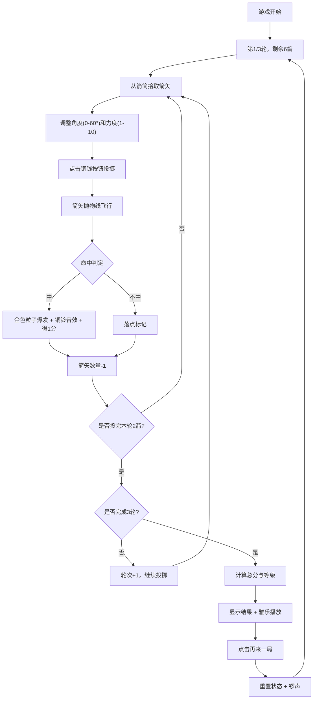

## 1. 产品概述

本项目是一款基于浏览器的唐代投壶游戏交互模拟应用，用户可在虚拟宫廷场景中体验古代"投壶"礼仪游戏。通过调整投掷角度和力度，将箭矢投入远处铜壶，获得分数和等级评价，配以古典雅乐和粒子特效，营造沉浸式的唐代宫廷游戏体验。

- **核心目的**：还原唐代投壶游戏的文化体验，提供娱乐性与文化传播价值
- **目标用户**：对中国传统文化感兴趣的游戏玩家、历史文化爱好者
- **产品价值**：以互动游戏形式传承中华传统文化，提供寓教于乐的体验

## 2. 核心功能

### 2.1 用户角色

| 角色 | 注册方式 | 核心权限 |
|------|----------|----------|
| 玩家 | 无需注册 | 完整游戏体验，投掷箭矢，查看分数 |

### 2.2 功能模块

1. **游戏主场景**：宫廷帷幔背景、青砖地面、青铜壶、箭筒等视觉元素
2. **箭矢交互系统**：从箭筒拾取箭矢，支持鼠标拖拽或点击拾取
3. **投掷控制系统**：弧形角度滑块(0-60度)、横向力度滑块(1-10)、铜钱样式投掷按钮
4. **物理模拟系统**：抛物线轨迹计算、壶口碰撞判定
5. **特效与音效系统**：金色粒子特效、铜铃音效、落点标记、五声音阶雅乐
6. **计分与轮次系统**：三轮共六箭的游戏规则、分数统计、等级评定
7. **游戏重置功能**：结束后显示成绩，支持再来一局

### 2.3 页面详情

| 页面名称 | 模块名称 | 功能描述 |
|---------|---------|---------|
| 游戏主界面 | 游戏场景 | 渲染深宫红帷背景、青砖地面、青铜壶、左侧箭筒 |
| 游戏主界面 | 控制面板 | 角度滑块、力度滑块、投掷按钮、分数轮次显示 |
| 游戏主界面 | 箭矢列表 | 右侧显示已投和待投箭矢图标状态 |
| 游戏结束界面 | 结果展示 | 金色楷体显示总分和等级，呼吸发光动画 |
| 游戏结束界面 | 重置功能 | 檀红色"再来一局"按钮，重置所有状态 |

## 3. 核心流程

## 4. 用户界面设计

### 4.1 设计风格

- **主色调**：深宫红(#4a0000渐变至#2a0000)、青铜色(#cd853f)、竹木色(#b8860b)、檀红色(#8b4513)、金色(#ffd700)、青砖色(#6b6b6b)
- **按钮样式**：铜钱样式圆形按钮(外圆内方)，悬停放大并反转颜色
- **字体**：楷体（KaiTi）作为主要展示字体，搭配衬线字体
- **布局风格**：居中对称布局，壶位于视觉中心，控件分布两侧
- **视觉元素**：雷纹浮雕暗纹、渐变帷幔纹理、粒子光效

### 4.2 页面设计概述

| 页面名称 | 模块名称 | UI元素 |
|---------|---------|---------|
| 游戏主界面 | 游戏场景 | 深宫红帷幔渐变背景、青砖地面底部1/3、青铜壶居中距底部150px、雷纹暗纹 |
| 游戏主界面 | 左侧箭筒 | 半透明木框，竖排箭矢小图标，已投中空显示 |
| 游戏主界面 | 控制面板 | 右侧弧形角度滑块(刻度0-60，每10度标记)、横向力度滑块(圆形铜色滑块) |
| 游戏主界面 | 投掷按钮 | 圆形铜钱样式，直径50px，#cd853f外圆，#2a0000内方孔 |
| 游戏主界面 | 状态显示 | 左上角显示轮次(第X/3轮)和总分，右侧箭矢状态列表 |
| 游戏主界面 | 动画效果 | 箭矢抛物线飞行、命中金色粒子(20个，半径30px，0.5秒淡出)、落点灰点 |
| 游戏结束界面 | 结果展示 | 屏幕中央金色大号楷体总分和等级，呼吸发光动画(0.5s周期) |
| 游戏结束界面 | 重置按钮 | 檀红色#8b4513按钮，悬停变亮至#a0522d |

### 4.3 响应式

- **桌面优先**：最小宽度800px
- **宽屏适配**：>1200px时壶与控件间距增大20%
- **触控优化**：滑块支持鼠标和触控操作，按钮最小44px可点击区域

### 4.4 性能要求

- **动画帧率**：所有动画保持60FPS
- **物理计算**：每帧计算时间<1ms
- **粒子数量**：不超过30个
- **音效延迟**：<50ms
- **音效合成耗时**：<5ms
