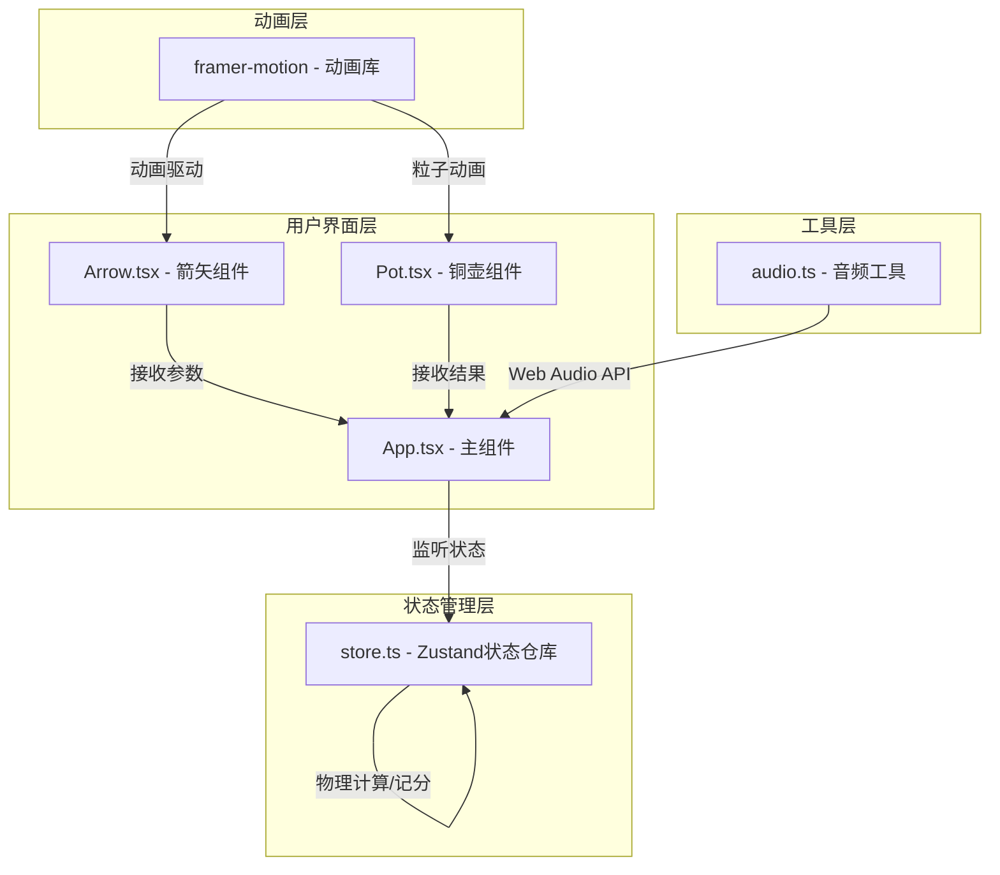

## 1. 架构设计



## 2. 技术描述

- **前端框架**：React@18 + TypeScript@5
- **构建工具**：Vite@5 + @vitejs/plugin-react
- **状态管理**：zustand@4
- **动画库**：framer-motion@11
- **音频处理**：Web Audio API (原生)
- **样式方案**：CSS Modules + CSS Variables
- **类型规范**：TypeScript 严格模式，target ES2020

## 3. 项目结构

```
auto68/
├── index.html              # 入口HTML，标题：唐代投壶游戏
├── package.json            # 依赖配置
├── vite.config.js          # Vite配置
├── tsconfig.json           # TypeScript配置
└── src/
    ├── App.tsx             # 主组件，集成场景、状态、UI
    ├── store.ts            # Zustand状态仓库
    ├── components/
    │   ├── Arrow.tsx       # 箭矢组件(抛物线飞行动画)
    │   └── Pot.tsx         # 铜壶组件(粒子特效+音效)
    └── utils/
        └── audio.ts        # Web Audio音频工具
```

## 4. 状态模型定义

### 4.1 游戏状态接口

```typescript
interface GameState {
  // 游戏进度
  currentRound: number;      // 当前轮次 1-3
  arrowsPerRound: number;    // 每轮箭数 = 2
  totalRounds: number;       // 总局数 = 3
  totalArrows: number;       // 总箭数 = 6
  remainingArrows: number;   // 剩余箭数
  arrowsInCurrentRound: number; // 当前轮已投箭数
  
  // 投掷参数
  angle: number;             // 角度 0-60度
  power: number;             // 力度 1-10
  isArrowSelected: boolean;  // 是否已拾取箭矢
  isFlying: boolean;         // 是否正在飞行
  
  // 分数
  score: number;             // 总分
  results: boolean[];        // 每箭结果
  
  // 特效数据
  landingMarks: Array<{x: number, y: number, success: boolean}>;
  activeParticles: Particle[];
  
  // 游戏状态
  isGameOver: boolean;
  grade: '上等' | '中等' | '下等' | null;
  
  // Actions
  selectArrow: () => void;
  setAngle: (angle: number) => void;
  setPower: (power: number) => void;
  throwArrow: () => void;
  calculateTrajectory: (angle: number, power: number) => {x: number, y: number}[];
  checkHit: (landingX: number, landingY: number) => boolean;
  resetGame: () => void;
  playBellSound: () => void;
  playGongSound: () => void;
  playCeremonialMusic: () => void;
}
```

### 4.2 物理计算参数

```typescript
interface PhysicsConfig {
  gravity: number;           // 重力加速度 9.8 m/s²
  scale: number;             // 物理坐标到屏幕坐标比例
  potCenterX: number;        // 壶中心X坐标(屏幕中央)
  potCenterY: number;        // 壶中心Y坐标(距底部150px)
  potRadius: number;         // 壶口半径 20px
  hitTolerance: number;      // 命中容差 15px
  arrowDiameter: number;     // 箭簇直径 2px
  startX: number;            // 箭矢起始X
  startY: number;            // 箭矢起始Y
}
```

## 5. 核心技术实现

### 5.1 抛物线物理计算

```typescript
// 抛物线运动公式
// x(t) = v0 * cos(θ) * t
// y(t) = v0 * sin(θ) * t - 0.5 * g * t²
// v0 = power * velocityScale
// θ = angle * π / 180
```

### 5.2 碰撞判定算法

```typescript
// 计算箭矢落点与壶中心的距离
// distance = sqrt((x - potCenterX)² + (y - potCenterY)²)
// 命中条件: distance <= hitTolerance + arrowDiameter/2
```

### 5.3 粒子系统

- 粒子数量：约20个金色粒子
- 扩散半径：30px
- 生命周期：0.5秒
- 使用framer-motion的AnimatePresence实现淡入淡出

### 5.4 Web Audio 音效合成

- **铜铃声**：800Hz正弦波，指数衰减，200ms
- **锣声**：100Hz低频方波，100ms
- **雅乐**：五声音阶(宫商角徵羽)循环旋律，约80BPM

## 6. 性能优化

1. **动画优化**：使用transform和opacity属性，触发GPU加速
2. **粒子池化**：复用粒子组件，避免频繁创建销毁
3. **节流计算**：物理计算限制在每帧一次，使用requestAnimationFrame
4. **内存管理**：及时清理过期粒子和落点标记
5. **音频预计算**：雅乐音符序列预先生成，减少运行时计算

## 7. 组件数据流

```
用户交互 → App.tsx → store.ts Actions → State Update → 组件重渲染
              ↓
          Arrow.tsx (接收angle, power, isFlying)
              ↓
          framer-motion 抛物线动画
              ↓
          物理计算落点 → checkHit()
              ↓
          Pot.tsx (接收hit结果)
              ↓
          粒子特效 + audio.ts 音效
```
