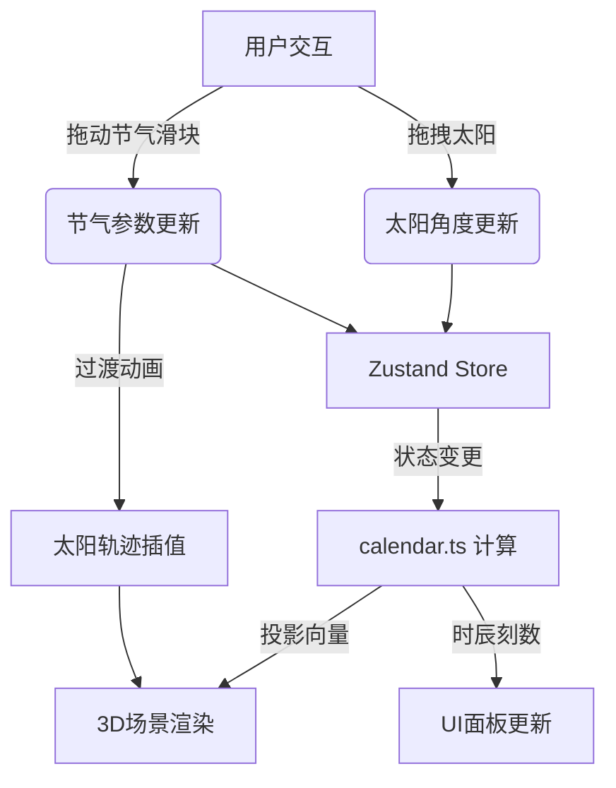

# 周髀日晷模拟 - 技术架构文档

## 1. 技术选型决策

### 1.1 核心技术栈

| 技术 | 选型理由 |
|-----|---------|
| **React 18** | 组件化UI开发，配合react-three-fiber实现声明式3D场景 |
| **TypeScript** | 严格类型检查，确保天文计算的准确性 |
| **Three.js** | 成熟的WebGL 3D渲染引擎，支持复杂的光照和阴影 |
| **@react-three/fiber** | React渲染器，将Three.js场景融入React生命周期 |
| **@react-three/drei** | 提供现成的3D组件（OrbitControls、Text、Effects等） |
| **Zustand** | 轻量级状态管理，共享节气、太阳位置等全局状态 |
| **Vite** | 快速的开发服务器和构建工具，支持HMR |

### 1.2 架构原则

1. **关注点分离**：纯计算逻辑（calendar.ts）与渲染逻辑（Sundial.tsx）完全分离
2. **单向数据流**：状态集中管理，通过Zustand store分发到各组件
3. **性能优先**：使用useMemo/useCallback减少不必要的重渲染
4. **类型安全**：全面的TypeScript类型定义，避免运行时错误

## 2. 系统架构

### 2.1 模块划分

```
┌─────────────────────────────────────────────────────────┐
│                        渲染层                           │
│  ┌──────────────┐  ┌──────────────┐  ┌──────────────┐  │
│  │ Sundial.tsx  │  │  UI 面板     │  │  刻度标记    │  │
│  │  (3D场景)    │  │  (HTML/CSS)  │  │  (SVG/Canvas)│  │
│  └──────┬───────┘  └──────┬───────┘  └──────┬───────┘  │
└─────────┼─────────────────┼─────────────────┼──────────┘
          │                 │                 │
          ▼                 ▼                 ▼
┌─────────────────────────────────────────────────────────┐
│                      状态管理层                         │
│                  Zustand Store                         │
│  ┌──────────┬──────────┬──────────┬──────────────────┐  │
│  │  节气    │  太阳角  │  投影    │  时辰/刻数        │  │
│  └──────────┴──────────┴──────────┴──────────────────┘  │
└─────────┬───────────────────────────────────────────────┘
          │
          ▼
┌─────────────────────────────────────────────────────────┐
│                      计算层                             │
│                src/utils/calendar.ts                    │
│  ┌──────────────┬──────────────┬─────────────────────┐  │
│  │ 投影向量计算 │ 时辰换算     │ 节气太阳轨迹参数     │  │
│  └──────────────┴──────────────┴─────────────────────┘  │
└─────────────────────────────────────────────────────────┘
```

### 2.2 数据流图



## 3. 核心数据结构

### 3.1 状态管理 (Zustand Store)

```typescript
interface SundialState {
  // 节气索引 (0-23, 0=冬至, 12=夏至)
  solarTermIndex: number;
  // 目标节气索引（用于平滑过渡）
  targetSolarTermIndex: number;
  // 太阳在半圆弧上的角度 (0-180度，0=东，90=正午，180=西)
  sunAngle: number;
  // 计算结果
  projection: {
    x: number;
    z: number;
    length: number;
    direction: number;
  } | null;
  // 时辰信息
  timeInfo: {
    shichenIndex: number;    // 0-11 (子到亥)
    shichenName: string;     // 子丑寅卯...
    ke: number;              // 0-7 (刻数)
    modernTime: string;      // 现代时刻范围
    dayProgress: number;     // 白天进度 0-1
  } | null;
  
  // Actions
  setSolarTerm: (index: number) => void;
  setSunAngle: (angle: number) => void;
  snapSunToNearest: () => void;
  updateProjection: () => void;
}
```

### 3.2 节气数据结构

```typescript
interface SolarTermData {
  name: string;           // 节气名称
  gnomonAngle: number;    // 表杆与地面夹角（度）
  sunMaxAltitude: number; // 太阳最大高度角（度）
  sunAzimuthRange: number; // 太阳方位角范围（度）
  lightColor: string;     // 光照颜色
}
```

### 3.3 时辰数据结构

```typescript
interface ShichenData {
  index: number;          // 0-11
  name: string;           // 子丑寅卯辰巳午未申酉戌亥
  modernStart: number;    // 现代开始时间（小时）
  modernEnd: number;      // 现代结束时间（小时）
  zodiac: string;         // 对应生肖
}
```

## 4. 核心算法

### 4.1 投影向量计算

```
已知：
- 表杆高度 h = 8 单位
- 表杆与地面夹角 α (67.5° - 112.5°)
- 太阳高度角 β (根据太阳位置)
- 太阳方位角 γ (东=-90°, 南=0°, 西=90°)

计算：
1. 表杆顶端坐标相对于底部：
   top.x = h * cos(α) * sin(杆朝向角)
   top.y = h * sin(α)
   top.z = h * cos(α) * cos(杆朝向角)

2. 太阳光线方向向量：
   sunDir.x = -cos(β) * sin(γ)
   sunDir.y = -sin(β)
   sunDir.z = -cos(β) * cos(γ)

3. 求光线与地面（y=0）的交点 P：
   参数 t = top.y / sin(β)
   P.x = top.x + t * sunDir.x
   P.z = top.z + t * sunDir.z

4. 投影长度 = sqrt(P.x² + P.z²)
   投影方向 = atan2(P.x, P.z)
```

### 4.2 时辰与刻数换算

```
白天总时长对应太阳角度范围：0°(日出) - 180°(日落)
每时辰对应角度：180° / 12 = 15°
每刻对应角度：15° / 8 = 1.875°
步长：7.5°（4刻 = 半个时辰）

时辰索引 = floor(太阳角度 / 15°)
刻数 = floor((太阳角度 % 15°) / 1.875°)

时辰名称映射：
0: 子, 1: 丑, 2: 寅, 3: 卯, 4: 辰, 5: 巳
6: 午, 7: 未, 8: 申, 9: 酉, 10: 戌, 11: 亥

注意：古代时辰从子时（23:00-01:00）开始，
但日晷只测量白天，所以实际显示从卯时到酉时。
```

### 4.3 节气过渡动画

```
使用线性插值 (LERP) 在 0.5 秒内平滑过渡：

current = previous + (target - previous) * (deltaTime / 0.5s)

过渡参数包括：
- 表杆夹角 α
- 太阳最大高度角 β_max
- 太阳方位角范围 γ_range
- 光照颜色（RGB插值）
- 阴影透明度
```

## 5. 组件设计

### 5.1 Sundial.tsx 组件结构

```tsx
function Sundial() {
  // 状态引用
  const state = useSundialStore();
  
  // Three.js 对象引用
  const gnomonRef = useRef<THREE.Group>(null);
  const sunRef = useRef<THREE.Mesh>(null);
  const projectionRef = useRef<THREE.Line>(null);
  const projectionDotRef = useRef<THREE.Mesh>(null);
  
  // 交互处理
  const handleSunDrag = useCallback(...);
  const handleSolarTermChange = useCallback(...);
  
  // 动画帧更新
  useFrame((state, delta) => {
    // 节气过渡动画
    // 投影更新
    // 光照颜色更新
  });
  
  return (
    <Canvas>
      {/* 光照 */}
      <ambientLight />
      <directionalLight ref={sunLightRef} />
      
      {/* 地平面 */}
      <GroundPlane />
      
      {/* 表盘刻度 */}
      <DialMarkings />
      
      {/* 表杆 */}
      <Gnomon ref={gnomonRef} />
      
      {/* 太阳 */}
      <Sun ref={sunRef} onDrag={handleSunDrag} />
      
      {/* 投影线 */}
      <ProjectionLine ref={projectionRef} />
      
      {/* 投影点 */}
      <ProjectionDot ref={projectionDotRef} />
    </Canvas>
  );
}
```

### 5.2 子组件职责

| 组件 | 职责 |
|-----|------|
| `GroundPlane` | 圆形地面、网格线、方位标记 |
| `DialMarkings` | 96条刻度线（SVG或LineSegments） |
| `Gnomon` | 青铜色表杆（圆柱体+圆锥体） |
| `Sun` | 金色太阳球体，带光晕，支持拖拽 |
| `ProjectionLine` | 半透明投影线，带渐隐效果 |
| `ProjectionDot` | 红色投影终点标记 |
| `TimeDisplay` | 左上角时辰显示面板 |
| `SolarTermSlider` | 右侧节气滑块 |
| `ShichenReference` | 右侧时辰对照表 |

## 6. 性能优化策略

### 6.1 渲染优化
- 使用 `useMemo` 缓存刻度线几何体
- 使用 `InstancedMesh` 渲染大量重复的刻度元素
- 投影计算只在太阳角度或节气变化时执行
- 使用 `Object3D.matrixAutoUpdate = false` 手动控制更新

### 6.2 交互优化
- 太阳拖拽使用 `raycaster` 精确拾取
- 使用 `requestAnimationFrame` 批量更新
- 节气过渡动画使用 `deltaTime` 归一化速度

### 6.3 内存管理
- 组件卸载时清理事件监听器
- 及时释放 Three.js 几何体和材质
- 避免在 useFrame 中创建新对象

## 7. 构建与部署

### 7.1 构建命令
```bash
npm install      # 安装依赖
npm run dev      # 启动开发服务器
npm run build    # 生产构建
npm run preview  # 预览生产构建
```

### 7.2 依赖清单
```json
{
  "react": "^18.2.0",
  "react-dom": "^18.2.0",
  "typescript": "^5.0.0",
  "vite": "^5.0.0",
  "@vitejs/plugin-react": "^4.2.0",
  "three": "^0.160.0",
  "@react-three/fiber": "^8.15.0",
  "@react-three/drei": "^9.92.0",
  "zustand": "^4.4.0"
}
```
