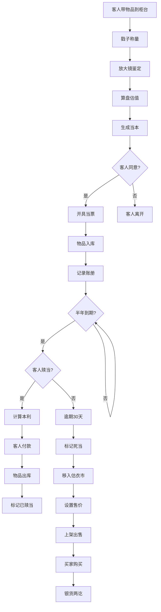

## 1. 产品概述

"恒升当"是一款模拟清末北京大栅栏当铺经营的全栈web应用，用户扮演当铺掌柜，通过收当、估价、赎当与死当处理等核心玩法，体验古代当铺经营的乐趣。

- 核心玩法：通过戥子称量、放大镜鉴定、算盘估值三个交互步骤完成当物估价，开具当票，管理库房，处理死当物品
- 目标用户：对历史文化、模拟经营类游戏感兴趣的玩家
- 市场价值：融合传统文化与互动游戏，提供沉浸式的当铺经营体验

## 2. 核心特性

### 2.1 用户角色

| 角色 | 注册方式 | 核心权限 |
|------|----------|----------|
| 掌柜 | 无需注册，直接进入 | 收当、估价、赎当、死当处理、账册管理、市场交易 |

### 2.2 功能模块

1. **柜台收当**：客人带物品出现，通过戥子、放大镜、算盘三个工具完成鉴定估价
2. **账册管理**：记录所有收当和赎当交易，支持筛选搜索和详情查看
3. **死当市场（估衣市）**：展示逾期死当物品，支持重新标价出售

### 2.3 页面详情

| 页面名称 | 模块名称 | 功能描述 |
|----------|----------|----------|
| 柜台页面 | 工具交互区 | 戥子称重动画、放大镜鉴定效果、算盘拨珠估价 |
| 柜台页面 | 物品展示区 | 当前当物放大图、估值参数滑块、当票预览 |
| 柜台页面 | 客人交互区 | 客人形象、对话气泡、同意/拒绝按钮 |
| 账册页面 | 交易表格 | 日期、客人、物品、当本、状态列展示 |
| 账册页面 | 筛选搜索 | 按日期、姓名、物品类别筛选 |
| 账册页面 | 详情面板 | 当票扫描件风格的交易详情 |
| 估衣市页面 | 物品网格 | 死当物品卡片展示，含SVG图标、标价 |
| 估衣市页面 | 上架管理 | 死当物品移入市场、设置售价、发布 |
| 估衣市页面 | 购买交互 | 买家点击购买、余额扣除、物品移除 |

## 3. 核心流程

### 3.1 收当流程
客人带物品来到柜台 → 掌柜点击戥子称量重量 → 点击放大镜观察细节 → 点击算盘拨动珠子计算估值 → 生成当本（原价30%-60%）→ 客人同意 → 打印当票 → 物品入库

### 3.2 赎当流程
客人前来赎当 → 账册查找记录 → 计算当本+利息（月利2分）→ 客人付款 → 物品出库 → 记录更新为"已赎当"

### 3.3 死当处理流程
当期半年到期 → 30天逾期未赎 → 自动标记为死当 → 掌柜移入估衣市 → 设置售价（原当本+40%~100%）→ 上架出售 → 买家购买 → 银货两讫

## 4. 用户界面设计

### 4.1 设计风格
- **主色调**：老木色#8b5e3c、宣纸黄#f5e6c8、朱砂红#c04040
- **柜台背景**：深色背景#2a1f18，煤油灯光晕效果（径向渐变）
- **按钮样式**：铜钱造型（圆形外框+方孔镂空），悬停上浮变色
- **字体**：标题用楷体/宋体类书法字体，正文用清晰易读的衬线字体
- **布局风格**：左右分栏（左侧60%柜台区，右侧40%信息面板）
- **装饰元素**：水墨晕染过渡效果、木质纹理、宣纸质感

### 4.2 页面设计概览

| 页面名称 | 模块名称 | UI元素 |
|----------|----------|--------|
| 柜台页面 | 柜台区 | 深色木柜台CSS绘制（竖向纹理#6b4226）、煤油灯呼吸动画、翻开的账册 |
| 柜台页面 | 工具栏 | 戥子、放大镜、算盘三个铜钱造型按钮，点击触发动画 |
| 柜台页面 | 物品区 | 物品放大图（放大镜下1.5倍显示细节）、估值参数滑块 |
| 账册页面 | 表格区 | 宣纸黄底色表格，朱砂红表头，行悬停效果 |
| 账册页面 | 详情面板 | 当票扫描件风格，朱砂红印章，毛笔字体 |
| 估衣市页面 | 卡片网格 | 宣纸黄卡片、朱砂红边框，hover左倾5度放大阴影 |
| 估衣市页面 | 物品卡片 | SVG图标（按物品类型生成）、名称、标价、购买按钮 |

### 4.3 响应式
- 桌面端（>768px）：左右分栏布局，左侧60%柜台区，右侧40%信息面板
- 移动端（≤768px）：上下排列布局，柜台区在上，信息面板在下
- 触摸优化：按钮最小尺寸44x44px，增加触摸反馈

### 4.4 动画与交互
- **煤油灯**：呼吸动画（明暗变化）
- **戥子**：托盘上下摆动动画
- **放大镜**：移动时物品区域1.5倍放大
- **算盘**：珠子拨动帧动画，伴随click声效
- **页面切换**：水墨晕染效果（box-shadow + blur滤镜）
- **卡片hover**：左倾5度，阴影放大
- **死当提醒**：每30秒检查一次，不阻塞UI
