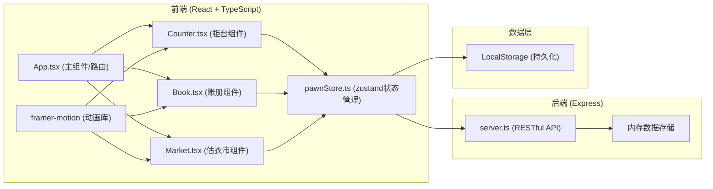
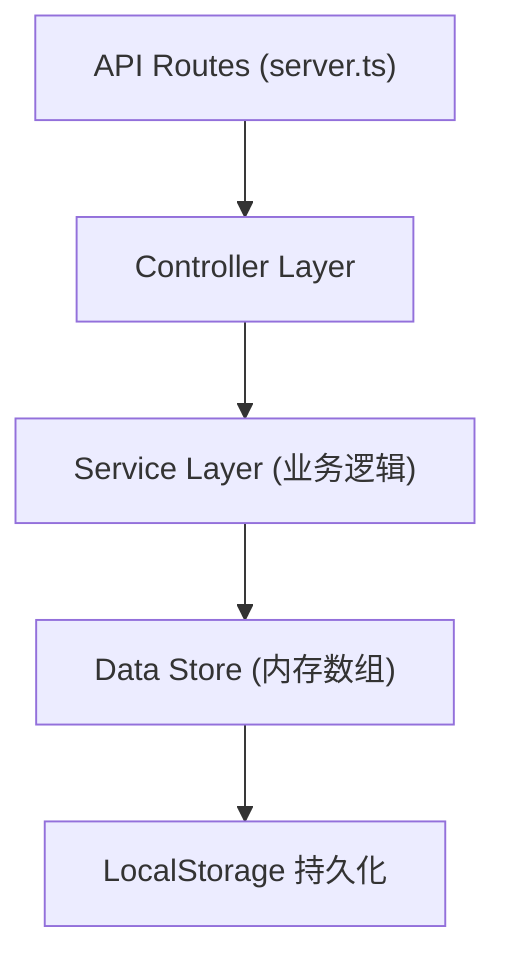
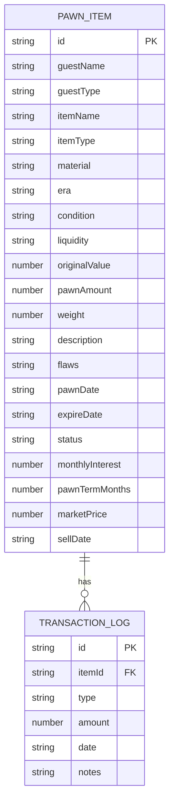

## 1. 架构设计



## 2. 技术描述

- **前端框架**：React@18 + TypeScript@5
- **构建工具**：Vite@5 + @vitejs/plugin-react@4
- **状态管理**：zustand@4
- **动画库**：framer-motion@11
- **后端框架**：Express@4
- **唯一ID**：uuid@9
- **数据存储**：内存数组 + LocalStorage持久化
- **HTTP客户端**：原生fetch API

## 3. 路由定义

| 路由 | 用途 |
|------|------|
| / | 柜台收当页面 |
| /book | 账册管理页面 |
| /market | 估衣市死当市场 |

## 4. API 定义

### 4.1 类型定义

```typescript
// 物品材质
type Material = 'gold' | 'silver' | 'jade' | 'porcelain' | 'wood';

// 物品年代
type Era = 'ming' | 'qing' | 'song';

// 品相等级
type Condition = 'excellent' | 'good' | 'poor';

// 流通性
type Liquidity = 'high' | 'medium' | 'low';

// 交易状态
type PawnStatus = 'active' | 'redeemed' | 'dead' | 'sold';

// 当物信息
interface PawnItem {
  id: string;
  guestName: string;
  guestType: 'scholar' | 'noble' | 'peddler';
  itemName: string;
  itemType: string;
  material: Material;
  era: Era;
  condition: Condition;
  liquidity: Liquidity;
  originalValue: number;
  pawnAmount: number;
  weight?: number;
  description: string;
  flaws: string[];
  pawnDate: string;
  expireDate: string;
  status: PawnStatus;
  monthlyInterest: number;
  pawnTermMonths: number;
  marketPrice?: number;
  sellDate?: string;
}

// 估值维度权重
interface ValuationWeights {
  material: number;
  era: number;
  condition: number;
  liquidity: number;
}

// 估值结果
interface ValuationResult {
  baseValue: number;
  weightedValue: number;
  pawnAmount: number;
  weights: ValuationWeights;
}
```

### 4.2 API 接口

| 方法 | 路径 | 说明 | 请求体 | 响应 |
|------|------|------|--------|------|
| POST | /api/pawn | 收当（创建当物记录） | `{ guestName, guestType, itemName, ... }` | `{ success: boolean, item: PawnItem }` |
| POST | /api/redeem | 赎当 | `{ itemId, redeemAmount }` | `{ success: boolean, item: PawnItem }` |
| GET | /api/items | 获取所有当物列表 | N/A | `{ items: PawnItem[] }` |
| POST | /api/deadpawn | 死当上架 | `{ itemId, marketPrice }` | `{ success: boolean, item: PawnItem }` |
| GET | /api/buy/:itemId | 购买死当物品 | N/A | `{ success: boolean, item: PawnItem }` |
| GET | /api/market | 获取市场在售物品 | N/A | `{ items: PawnItem[] }` |

## 5. 服务端架构



## 6. 数据模型

### 6.1 实体关系图



### 6.2 估值算法

```typescript
// 材质基础价格系数
const materialMultipliers: Record<Material, number> = {
  gold: 100,      // 金
  silver: 20,     // 银
  jade: 80,       // 玉
  porcelain: 50,  // 瓷
  wood: 10        // 木
};

// 年代系数
const eraMultipliers: Record<Era, number> = {
  song: 1.5,   // 宋
  ming: 1.3,   // 明
  qing: 1.0    // 清
};

// 品相系数
const conditionMultipliers: Record<Condition, number> = {
  excellent: 1.0,  // 上品
  good: 0.7,       // 中品
  poor: 0.4        // 下品
};

// 流通性系数
const liquidityMultipliers: Record<Liquidity, number> = {
  high: 1.0,    // 流通性好
  medium: 0.8,  // 流通性中
  low: 0.6      // 流通性差
};

// 估值权重
const weights: ValuationWeights = {
  material: 0.35,
  era: 0.25,
  condition: 0.25,
  liquidity: 0.15
};

// 当本比例范围 (30% - 60%)
const PAWN_RATE_MIN = 0.3;
const PAWN_RATE_MAX = 0.6;

// 月利率 (2分利 = 2%)
const MONTHLY_INTEREST = 0.02;

// 当期 (半年)
const PAWN_TERM_MONTHS = 6;

// 死当宽限期 (30天)
const DEAD_PAWN_GRACE_DAYS = 30;

// 死当售价浮动 (原当本 + 40% ~ 100%)
const DEAD_PAWN_MARKUP_MIN = 1.4;
const DEAD_PAWN_MARKUP_MAX = 2.0;
```

### 6.3 性能优化

1. **估值计算**：纯函数计算，时间复杂度O(1)，目标响应时间<50ms
2. **死当检查**：使用`setInterval`每30秒检查一次，使用requestIdleCallback避免阻塞UI
3. **动画性能**：使用CSS transform和opacity属性，避免触发重排重绘
4. **状态管理**：zustand轻量级状态，使用selector避免不必要重渲染
5. **本地存储**：使用防抖机制，避免频繁写入LocalStorage
