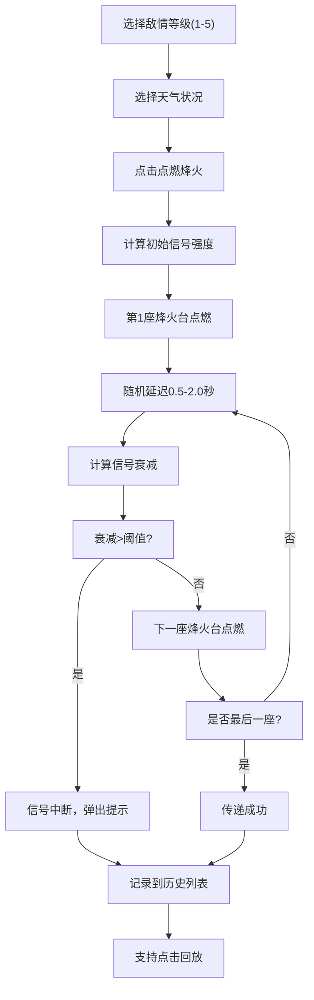

## 1. 产品概述

古代烽火传警模拟系统，是一款基于3D可视化的边防军情预警模拟应用。通过模拟五座烽火台沿丘陵地带的信号接力传递过程，直观展示天气、地形、人为误判等因素对军情传递的影响，为历史军事研究和教学提供可视化交互工具。

## 2. 核心功能

### 2.1 用户角色
| 角色 | 注册方式 | 核心权限 |
|------|-----------|------------|
| 使用者 | 无需注册 | 完整使用所有模拟功能、查看历史记录、回放传递过程 |

### 2.2 功能模块
1. **主场景页面：3D烽火台场景、左侧控制面板、右侧历史记录边栏
2. **信号模拟模块：敌情等级设定、天气状况选择、点燃烽火触发
3. **信号传递模块：火焰粒子动画、光轨效果、衰减计算、中断判断
4. **历史记录模块：传递详情记录、动画回放功能

### 2.3 页面详情
| 页面名称 | 模块名称 | 功能描述 |
|----------|----------|------------|
| 主场景 | 3D场景模块 | 五座等距排列的烽火台、起伏丘陵地形、火焰粒子系统、传递光轨动画、鼠标交互（拖拽旋转、滚轮缩放 |
| 主场景 | 左侧控制面板 | 敌情等级选择器(1-5级)、天气下拉框(晴/阴/雾/雨)、点燃烽火按钮 |
| 主场景 | 右侧历史记录 | 滚动列表展示历史传递记录、点击回放功能 |
| 主场景 | 中断提示 | 竹简样式中断提示框、楷体字体、浅黄色背景 |

## 3. 核心流程

用户在左侧控制面板选择敌情等级和天气状况，点击"点燃烽火"按钮触发信号传递。系统从第一座烽火台开始，按照随机延迟依次向后传递，每座烽火台根据衰减规则计算信号强度，动态调整火焰亮度和高度。若累计衰减超过阈值则信号中断，弹出中断提示框。每次传递的详细信息记录到右侧历史列表，支持点击回放。

## 4. 用户界面设计

### 4.1 设计风格
- **主色调**：黄褐色#8b7355（土地）、绿色#6b8e23（草地）、铜色#b87333（按钮）
- **火焰颜色**：等级5为#ff4500（100%亮度），等级1为#ff8c00（20%亮度）
- **字体**：中文使用楷体（竹简提示）、整体使用现代无衬线字体
- **布局**：左侧半透明控制面板、中间3D主场景、右侧历史记录边栏
- **按钮风格**：仿金属铜色#b87333，带0.5px高光边，圆角设计

### 4.2 页面设计概述
| 页面名称 | 模块名称 | UI元素 |
|----------|----------|---------|
| 主场景 | 3D场景 | 黄褐色土地与绿色草地相间纹理、起伏丘陵、五座砖石色烽火台、黑色火盆、动态火焰粒子系统、山脊光轨动画 |
| 主场景 | 左侧控制面板 | 毛玻璃效果(rgba(0,0,0,0.6))、圆角12px、敌情等级单选按钮组、天气下拉选择框、铜色点燃按钮 |
| 主场景 | 右侧历史记录 | 深色#2a2a2a背景行、悬停亮度提升15%、滚动列表、显示出发时间/接收时间/衰减比例/到达状态 |
| 主场景 | 中断提示 | 竹简样式、浅黄#f5deb3背景、楷体字体、"传警中断"文字 |

### 4.3 响应性
- 桌面端优先设计，支持窗口自适应
- 3D场景随窗口大小自动调整
- 控制面板和历史记录边栏固定宽度，中间场景自适应

### 4.4 3D场景指导
- **环境**：古风战场氛围，暖色调环境光，方向光模拟日光
- **光照**：主方向光+环境光，烽火台火焰作为点光源
- **相机**：透视相机，初始位置可俯瞰全局，支持OrbitControls拖拽旋转和滚轮缩放
- **构图**：五座烽火台沿山脊等距排列，形成对角线构图
- **交互**：鼠标拖拽旋转视角、滚轮缩放、右键平移
- **动画**：火焰粒子系统（2-6px大小，100-300数量）、传递光轨沿山脊移动
- **性能**：帧率稳定50fps以上，粒子总数不超过600
