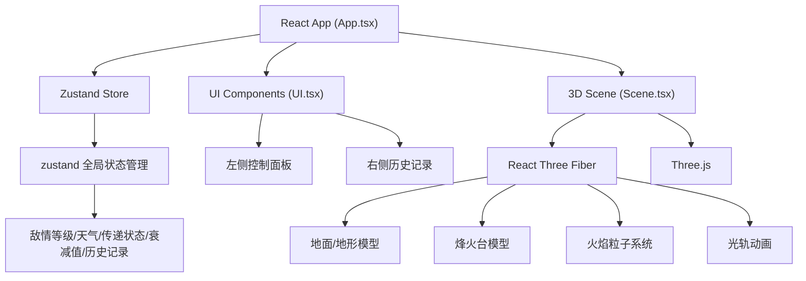

## 1. 技术架构



## 2. 技术描述

- **前端**：React@18 + TypeScript@5 + Vite@5
- **3D渲染**：Three.js@0.160 + @react-three/fiber@8 + @react-three/drei@9
- **状态管理**：zustand@4
- **初始化工具**：vite-init
- **后端**：无（纯前端应用）
- **构建工具**：Vite
- **CSS方案**：原生CSS + CSS变量

## 3. 数据模型与类型定义

### 3.1 全局状态类型
```typescript
type WeatherType = 'sunny' | 'cloudy' | 'foggy' | 'rainy';
type SignalStatus = 'idle' | 'transmitting' | 'success' | 'interrupted';

interface BeaconState {
  id: number;
  position: [number, number, number];
  signalStrength: number;
  isLit: boolean;
  isInterrupted: boolean;
  receivedAt: number | null;
}

interface HistoryRecord {
  id: string;
  startTime: number;
  enemyLevel: number;
  weather: WeatherType;
  beacons: BeaconState[];
  finalStatus: SignalStatus;
  totalAttenuation: number;
  interruptedAt: number | null;
}

interface AppState {
  enemyLevel: number;
  weather: WeatherType;
  transmitting: boolean;
  beacons: BeaconState[];
  history: HistoryRecord[];
  currentAttenuation: number;
  signalStatus: SignalStatus;
  interruptedBeacon: number | null;
  setEnemyLevel: (level: number) => void;
  setWeather: (weather: WeatherType) => void;
  startTransmission: () => void;
  resetTransmission: () => void;
  addHistoryRecord: (record: HistoryRecord) => void;
  replayHistory: (recordId: string) => void;
}
```

### 3.2 衰减计算配置
```typescript
interface AttenuationConfig {
  sunny: number;      // 每站衰减比例
  threshold: number; // 中断阈值
}

const ATTENUATION_CONFIG: Record<WeatherType, AttenuationConfig> = {
  sunny: { attenuation: 0.1, threshold: 0.8 },
  cloudy: { attenuation: 0.15, threshold: 0.65 },
  foggy: { attenuation: 0.25, threshold: 0.4 },
  rainy: { attenuation: 0.2, threshold: 0.5 },
};
```

## 4. 项目文件结构

```
auto71/
├── package.json
├── index.html
├── vite.config.js
├── tsconfig.json
└── src/
│   ├── main.tsx
│   ├── App.tsx
│   ├── Scene.tsx
│   ├── UI.tsx
│   └── store.ts
│   └── types.ts
│   └── utils/
│   │   └── signal.ts
│   └── components/
│       ├── BeaconTower.tsx
│       ├── FireParticles.tsx
│       ├── LightTrail.tsx
│       ├── ControlPanel.tsx
│       ├── HistoryList.tsx
│       └── InterruptionModal.tsx
```

## 5. 核心算法说明

### 5.1 信号强度计算
```
初始强度 = 敌情等级 / 5 * 100%
每站衰减 = 基础衰减 * 天气系数
累计强度 = 上一站强度 * (1 - 衰减比例)
雾天额外衰减50%，雨天额外衰减30%

### 5.2 传递延迟计算
```
延迟 = 0.5 + Math.random() * 1.5 秒

### 5.3 中断判断
```
若累计衰减 > 天气对应阈值 → 信号中断
```

## 6. 性能优化策略

1. **粒子系统优化**：使用InstancedMesh或BufferGeometry管理粒子，避免频繁创建销毁对象
2. **动画帧管理**：使用requestAnimationFrame，逻辑更新控制在50fps以上
3. **状态更新**：合并渲染循环中只更新必要的Uniform
4. **粒子数量控制**：动态调整粒子数量，总数控制在600以内
5. **按需渲染**：使用frustumCulling启用，不可见对象跳过渲染

## 7. 核心组件划分

| 组件 | 职责 | 文件 |
|------|------|------|
| App | 主组件，整合场景和UI | App.tsx |
| Scene | Three.js 3D场景主组件 | Scene.tsx |
| UI | UI主组件，整合控制面板和历史列表 | UI.tsx |
| BeaconTower | 单座烽火台模型 | components/BeaconTower.tsx |
| FireParticles | 火焰粒子系统 | components/FireParticles.tsx |
| LightTrail | 传递光轨动画 | components/LightTrail.tsx |
| ControlPanel | 左侧控制面板 | components/ControlPanel.tsx |
| HistoryList | 右侧历史记录列表 | components/HistoryList.tsx |
| InterruptionModal | 中断提示模态框 | components/InterruptionModal.tsx |
