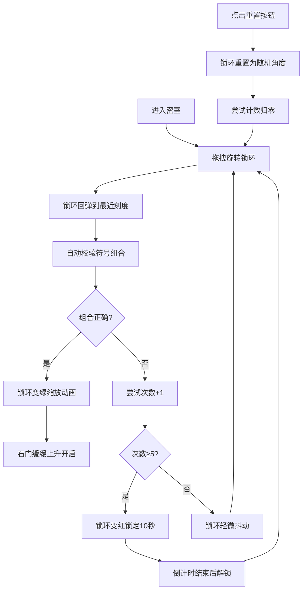

## 1. 产品概述

模拟古代青铜连环锁机关的交互解谜应用，让用户体验明代机关匠人的解谜乐趣。通过旋转三个刻有天干地支符号的青铜锁环，按正确组合解开密室机关，感受古代机械智慧的魅力。

## 2. 核心功能

### 2.1 用户角色
| 角色 | 注册方式 | 核心权限 |
|------|----------|----------|
| 机关匠人 | 无需注册 | 旋转锁环解谜、重置机关、查看尝试次数 |

### 2.2 功能模块
1. **主交互区**：三个同心青铜锁环，支持鼠标拖拽旋转
2. **解谜逻辑**：自动校验锁环角度组合，触发成功/失败动画
3. **反馈面板**：显示尝试次数、锁定状态、倒计时
4. **重置功能**：一键重置锁环角度和尝试计数

### 2.3 页面详情
| 页面名称 | 模块名称 | 功能描述 |
|----------|----------|----------|
| 主页面 | 锁环交互区 | 三个同心青铜锁环，拖拽旋转，符号高亮，回弹到最近刻度 |
| 主页面 | 反馈面板 | 显示当前符号组合、尝试次数（X/5）、锁定倒计时 |
| 主页面 | 铜质铭牌 | 展示当前三个锁环指向的天干地支符号 |
| 主页面 | 重置按钮 | 古风卷轴样式，点击重置所有状态 |
| 主页面 | 石门动画 | 解谜成功后中央石门缓缓上升开启 |

## 3. 核心流程

用户进入密室 → 拖拽旋转青铜锁环 → 锁环回弹到最近刻度 → 自动校验组合 → 匹配成功：触发齿轮传动动画+石门开启 → 不匹配：尝试次数+1 → 5次错误：锁环变红锁定10秒 → 可随时点击重置按钮重新开始

## 4. 用户界面设计

### 4.1 设计风格
- **主色调**：深色石墙背景 #1a1a2e，青铜锁环 #b87333 至 #8b6f47 渐变
- **强调色**：金色高亮 #ffd700，成功翠绿 #2ecc71，失败深红 #e74c3c
- **按钮风格**：古风卷轴样式，铜质铆钉边框
- **字体**：古风楷体，符号颜色 #d4a76a
- **布局风格**：居中对称，锁环区域最小 400x400px
- **质感**：金属线性渐变 + 内阴影高光，石墙纹理用 radial-gradient 模拟

### 4.2 页面设计概述
| 页面名称 | 模块名称 | UI元素 |
|----------|----------|--------|
| 主页面 | 锁环交互区 | 三个同心圆环（外径120px/内径80px），12个天干地支符号均匀分布，悬停外发光 #f1c40f blur 8px |
| 主页面 | 铜质铭牌 | 背景 #8b4513，铆钉边框，显示当前符号组合和尝试次数（红字） |
| 主页面 | 重置按钮 | 右上角古风卷轴样式，悬停动画 |
| 主页面 | 石门效果 | 中央石门，成功时用 clip-path 和 transition 实现上升开启 |
| 主页面 | 反馈动画 | 成功：锁环逐个变绿+缩放1.2秒；失败：抖动0.5秒；锁死：变色0.5秒 |

### 4.3 响应式
- 桌面优先设计，1024px 以上视口良好显示
- 锁环整体区域居中，最小尺寸 400x400px
- 触摸设备优化拖拽交互

### 4.4 动画设计
- **锁环旋转**：framer-motion spring 动画，刚度 200，阻尼 20
- **成功动画**：三个锁环逐个变翠绿，缩小至 90% 后弹回，持续 1.2 秒
- **失败动画**：锁环 x 轴偏移 2px，抖动 3 次
- **锁死动画**：锁环变深红色，持续 0.5 秒，锁定 10 秒
- **石门开启**：CSS clip-path + transition 实现缓缓上升
