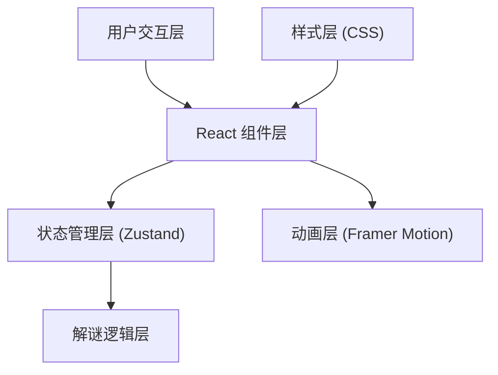

## 1. 架构设计



## 2. 技术描述

- **前端框架**：React 18 + TypeScript 5
- **构建工具**：Vite 5 + @vitejs/plugin-react
- **状态管理**：Zustand 4
- **动画库**：Framer Motion 11
- **样式方案**：原生 CSS + CSS 变量
- **初始化方式**：手动搭建项目结构

## 3. 目录结构

```
auto72/
├── package.json
├── vite.config.js
├── tsconfig.json
├── index.html
└── src/
    ├── App.tsx              # 主组件，组合所有模块
    ├── store/
    │   └── useGameStore.ts  # Zustand 状态管理
    ├── components/
    │   ├── LockRing.tsx     # 单个锁环组件
    │   ├── FeedbackPanel.tsx # 反馈面板组件
    │   ├── StoneDoor.tsx    # 石门组件
    │   └── ResetButton.tsx  # 重置按钮组件
    └── utils/
        └── puzzleLogic.ts   # 解谜逻辑核心
```

## 4. 核心数据模型

### 4.1 锁环状态
```typescript
interface LockRingState {
  id: number;
  angle: number;           // 当前角度 (0-360)
  currentSymbol: string;   // 当前指向的符号
  isLocked: boolean;       // 是否锁定
  isSuccess: boolean;      // 是否成功
  isFailed: boolean;       // 是否失败
}
```

### 4.2 游戏状态
```typescript
interface GameState {
  rings: LockRingState[];
  attempts: number;        // 当前尝试次数
  maxAttempts: number;     // 最大尝试次数 (5)
  isLocked: boolean;       // 全局锁定状态
  lockTimer: number;       // 锁定倒计时
  isSolved: boolean;       // 是否已解开
  targetCombination: string[]; // 目标符号组合
}
```

### 4.3 天干地支符号
```typescript
const CELESTIAL_SYMBOLS = ['子', '丑', '寅', '卯', '辰', '巳', '午', '未', '申', '酉', '戌', '亥'];
```

## 5. 核心算法

### 5.1 角度转符号
```typescript
function angleToSymbol(angle: number): string {
  const normalizedAngle = ((angle % 360) + 360) % 360;
  const index = Math.round(normalizedAngle / 30) % 12;
  return CELESTIAL_SYMBOLS[index];
}
```

### 5.2 最近刻度回弹
```typescript
function snapToNearestTick(angle: number): number {
  return Math.round(angle / 30) * 30;
}
```

### 5.3 组合校验
```typescript
function validateCombination(current: string[], target: string[]): boolean {
  return current.every((symbol, index) => symbol === target[index]);
}
```

### 5.4 拖拽旋转计算
```typescript
function calculateRotation(centerX: number, centerY: number, startX: number, startY: number, currentX: number, currentY: number): number {
  const startAngle = Math.atan2(startY - centerY, startX - centerX) * (180 / Math.PI);
  const currentAngle = Math.atan2(currentY - centerY, currentX - centerX) * (180 / Math.PI);
  return currentAngle - startAngle;
}
```

## 6. 状态管理 (Zustand Store)

### Actions
- `initializeGame()`: 初始化游戏，随机角度
- `rotateRing(ringId: number, angle: number)`: 旋转指定锁环
- `snapRing(ringId: number)`: 锁环回弹到最近刻度
- `checkCombination()`: 校验当前组合
- `lockRings(seconds: number)`: 锁定所有锁环
- `unlockRings()`: 解锁所有锁环
- `resetGame()`: 重置游戏状态

## 7. 性能优化

- 使用 `requestAnimationFrame` 优化拖拽性能
- Framer Motion 硬件加速动画（transform 属性）
- 组合校验采用 O(n) 线性比较，确保 < 5ms
- 使用 React.memo 优化锁环组件重渲染
- 防抖处理旋转事件，减少校验次数
