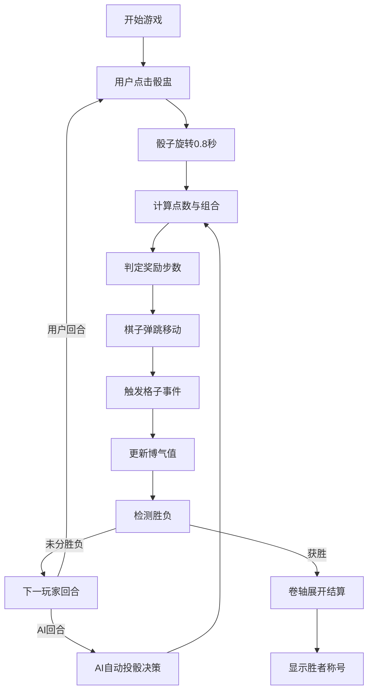

## 1. 产品概述
本产品是一款基于浏览器的唐代六博棋局交互游戏，模拟唐代长安西市胡商酒肆中的博戏场景。用户投掷三枚象牙骰子，根据点数与组合在十二宫棋盘上行棋，体验五行相克随机事件，与AI对手竞技，最终以先至终点者为胜。

- 核心目标：还原古代六博博戏文化，提供沉浸式唐代胡风唐韵游戏体验
- 目标用户：对中国古代文化、博弈游戏感兴趣的休闲玩家
- 市场价值：结合传统文化与现代游戏交互，打造独特的文化娱乐产品

## 2. 核心功能

### 2.1 用户角色
| 角色 | 登录方式 | 核心权限 |
|------|----------|----------|
| 玩家 | 无需登录，直接进入 | 投骰子、行棋、查看游戏状态 |
| AI对手 | 系统内置 | 自动投骰、策略决策、执行游戏规则 |

### 2.2 功能模块
1. **骰子投掷系统**：三枚象牙骰子3D旋转动画、组合判定（对子/顺子/豹子）、点数计算
2. **六博棋盘系统**：圆形十二宫格渲染、棋子spring弹跳动画、五行八卦符号展示
3. **格子事件系统**：吉凶格随机事件触发、浮动文字特效、粒子涟漪动画
4. **游戏状态管理**：玩家博气值、位置追踪、回合管理、胜负判定
5. **AI对手系统**：2-3名AI玩家、不同策略类型（激进/保守）、古文风格行动播报

### 2.3 页面详情
| 页面名称 | 模块名称 | 功能描述 |
|----------|----------|----------|
| 游戏主页面 | 骰子区域 | 镏金骰盅点击触发投掷、三枚骰子3D旋转动画0.8秒、点数组合判定 |
| 游戏主页面 | 棋盘区域 | 圆形十二宫格布局、棋子spring弹跳移动、吉凶格涟漪特效 |
| 游戏主页面 | 状态栏 | 墨锭条形展示玩家信息、博气值、骰子记录、当前位置 |
| 游戏主页面 | 结算弹窗 | 卷轴展开动画、胜者称号展示（博戏魁首/六博圣手/长安赌王） |

## 3. 核心流程
用户点击镏金骰盅→三枚骰子飞出旋转0.8秒→计算点数与组合→判定奖励步数→棋子spring弹跳移动→触发格子吉凶事件→更新博气值→检测胜负→下一玩家回合（AI自动执行）→有人绕行十二宫一圈回到子宫获胜→弹出结算卷轴。

## 4. 用户界面设计

### 4.1 设计风格
- **主色调**：玄青#1a2a3a、深褐木色#4a2e1a、暗红#8b2500、镏金#d4af37
- **辅助色**：朱红#8b0000、碧青#4a7c59、骨白#f5f0dc、墨色#1a0a00
- **字体**：标题使用书法风格衬线字体，正文使用古典宋体
- **布局**：中央圆形棋盘为主视觉，顶部酒肆背景装饰，底部状态栏
- **动画**：framer-motion spring弹跳、CSS旋转模糊、涟漪扩散、卷轴展开
- **装饰元素**：竹帘半垂、西域几何纹毡毯、酒壶陶碗、金漆格线

### 4.2 页面设计概述
| 页面名称 | 模块名称 | UI元素 |
|----------|----------|----------|
| 游戏主页面 | 背景区域 | 深褐木色墙面、竹帘半垂、暗红几何纹毡毯、角落酒壶陶碗 |
| 游戏主页面 | 骰子区域 | 镏金高脚铜杯骰盅、骨白色#f5f0dc骰子、墨色#1a0a00汉字点数、旋转模糊滤镜、金属铿锵音效 |
| 游戏主页面 | 棋盘区域 | 玄青#1a2a3a圆形十二宫、金漆#d4af37格线、五行八卦符号、吉凶格边框闪耀、涟漪扩散动画 |
| 游戏主页面 | 棋子区域 | 阶梯跳跃spring动画、不同颜色区分玩家 |
| 游戏主页面 | 状态栏 | 墨锭#1a1a1a条形、玩家姓名、骰子记录、博气值、位置信息 |
| 游戏主页面 | 事件效果 | 浮动文字、金色/血色涟漪、粒子特效 |
| 游戏主页面 | 结算弹窗 | 卷轴展开动画、胜者称号书法字体 |

### 4.3 响应式设计
- **桌面端1920x1080**：棋盘直径700px，左右两侧展示AI气泡
- **平板端768x1024**：棋盘直径500px，状态栏移至右侧，AI气泡上下排列
- **触控优化**：骰盅点击区域≥80x80px，确保触控精准

### 4.4 视觉与动效设计
- **骰子投掷**：3D旋转translateY+rotateX+rotateZ组合动画，0.8秒时长，ease-out缓动
- **棋子移动**：framer-motion spring配置：stiffness=300, damping=20, mass=0.8
- **吉凶格涟漪**：CSS @keyframes scale+opacity动画，金色/血色渐变扩散
- **结算卷轴**：上下卷轴同步展开，背景纹理+古纸质感
- **AI气泡**：淡入+轻微上浮动画，古文风格文字

### 4.5 性能指标
- 骰子动画帧率≥50fps
- AI决策延迟≤100ms
- 棋盘渲染时间≤200ms
- 内存占用控制在中等配置设备流畅运行范围
