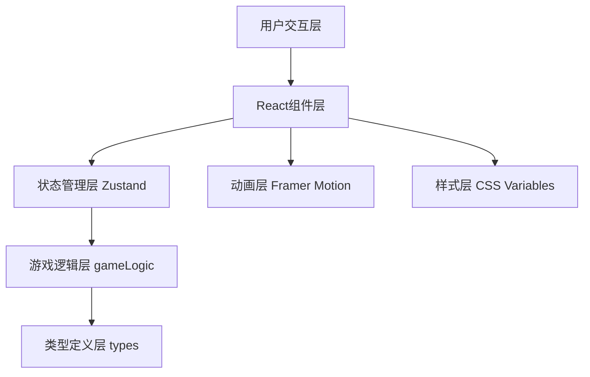

## 1. 架构设计
本项目采用纯前端架构，基于React + TypeScript + Vite构建，使用Zustand进行状态管理，Framer Motion实现动画效果。



## 2. 技术描述
- **前端框架**：React@18 + TypeScript@5
- **构建工具**：Vite@5 + @vitejs/plugin-react@4
- **状态管理**：Zustand@4
- **动画库**：Framer Motion@11
- **样式方案**：CSS Modules + CSS Variables
- **无后端**：纯前端游戏，所有逻辑在浏览器端执行

## 3. 项目文件结构

| 文件路径 | 职责描述 |
|----------|----------|
| `package.json` | 项目依赖配置：react、react-dom、typescript、vite、@vitejs/plugin-react、framer-motion、zustand |
| `vite.config.js` | Vite构建配置，使用React插件 |
| `tsconfig.json` | TypeScript配置，严格模式，target: ES2020 |
| `index.html` | 入口页面，标题'六博戏台' |
| `src/types.ts` | 核心类型定义：棋子类型、骰子点数、格子类型、游戏状态枚举 |
| `src/gameLogic.ts` | 核心游戏逻辑：骰子投掷、组合判定、位置更新、事件触发、胜负检测 |
| `src/board.tsx` | 博局UI组件：十二宫棋格渲染、棋子动画、接收gameState渲染棋盘 |
| `src/dice.tsx` | 骰子UI组件：三枚象牙骰子3D旋转投掷动画、调用gameLogic |
| `src/statusBar.tsx` | 状态栏组件：展示玩家信息、博气值、位置 |
| `src/aiPlayer.ts` | AI对手逻辑：不同策略类型、古文行动播报 |
| `src/store.ts` | Zustand状态管理：游戏全局状态 |
| `src/App.tsx` | 主应用组件：整合所有子组件 |
| `src/main.tsx` | 应用入口 |
| `src/index.css` | 全局样式：CSS Variables、主题配色 |

## 4. 数据模型

### 4.1 核心类型定义

```typescript
// 骰子点数类型
export type DiceValue = 1 | 2 | 3 | 4 | 5 | 6;

// 骰子组合类型
export type DiceCombo = 'normal' | 'pair' | 'straight' | 'leopard';

// 格子类型
export type CellType = 'normal' | 'lucky' | 'unlucky' | 'start' | 'end';

// 五行属性
export type Element = 'metal' | 'wood' | 'water' | 'fire' | 'earth' | 'qian' | 'kun' | 'zhen' | 'xun' | 'kan' | 'li' | 'gen' | 'dui';

// 十二宫名称
export type PalaceName = '子' | '丑' | '寅' | '卯' | '辰' | '巳' | '午' | '未' | '申' | '酉' | '戌' | '亥';

// 玩家类型
export type PlayerType = 'human' | 'ai_aggressive' | 'ai_conservative' | 'ai_balanced';

// 游戏状态
export type GameStatus = 'idle' | 'rolling' | 'moving' | 'event' | 'ai_thinking' | 'finished';

// 事件类型
export type EventType = 'bonus_steps' | 'immunity' | 'heal' | 'penalty_steps' | 'skip_turn' | 'damage';

// 玩家接口
export interface Player {
  id: string;
  name: string;
  type: PlayerType;
  position: number; // 0-11 对应十二宫
  qi: number; // 博气值 0-3
  color: string;
  hasImmunity: boolean;
  skipNextTurn: boolean;
  consecutiveOddRolls: number;
  diceHistory: DiceValue[][];
}

// 格子接口
export interface BoardCell {
  index: number;
  palace: PalaceName;
  element: Element;
  type: CellType;
  symbol: string; // 八卦/五行符号
}

// 投掷结果
export interface RollResult {
  dice: [DiceValue, DiceValue, DiceValue];
  sum: number;
  combo: DiceCombo;
  bonusSteps: number;
  totalSteps: number;
}

// 游戏事件
export interface GameEvent {
  type: EventType;
  value: number;
  message: string;
  affectedPlayerId: string;
}

// 游戏状态
export interface GameState {
  players: Player[];
  currentPlayerIndex: number;
  board: BoardCell[];
  lastRoll: RollResult | null;
  lastEvent: GameEvent | null;
  status: GameStatus;
  winner: Player | null;
  aiMessages: { playerId: string; message: string }[];
}
```

### 4.2 游戏常量

```typescript
// 十二宫名称
export const PALACES: PalaceName[] = ['子', '丑', '寅', '卯', '辰', '巳', '午', '未', '申', '酉', '戌', '亥'];

// 五行八卦符号
export const ELEMENT_SYMBOLS: Record<Element, string> = {
  metal: '金', wood: '木', water: '水', fire: '火', earth: '土',
  qian: '乾', kun: '坤', zhen: '震', xun: '巽', kan: '坎', li: '離', gen: '艮', dui: '兌'
};

// 骰子汉字
export const DICE_CHARS: Record<DiceValue, string> = {
  1: '一', 2: '二', 3: '三', 4: '四', 5: '五', 6: '六'
};

// 组合奖励步数
export const COMBO_BONUS: Record<DiceCombo, number> = {
  normal: 0,
  pair: 2,
  straight: 3,
  leopard: 99 // 直接送到终点前一格
};

// AI玩家名称
export const AI_NAMES: Record<PlayerType, string[]> = {
  human: ['玩家'],
  ai_aggressive: ['胡商阿里木', '波斯大贾'],
  ai_conservative: ['长安酒客', '文士书生'],
  ai_balanced: ['西域艺人', '六博高手']
};

// 胜者称号
export const WINNER_TITLES = ['博戏魁首', '六博圣手', '长安赌王', '西市赌神'];
```

## 5. 核心算法

### 5.1 骰子投掷算法
```
输入：无
输出：RollResult
流程：
1. 随机生成3个1-6的整数作为骰子点数
2. 计算点数之和sum
3. 判断组合类型：
   - 三枚相同 → leopard
   - 排序后连续三个数 → straight
   - 任意两枚相同 → pair
   - 否则 → normal
4. 根据组合类型计算bonusSteps
5. totalSteps = sum + bonusSteps
```

### 5.2 棋子移动算法
```
输入：playerId, steps
输出：newPosition, events[]
流程：
1. 获取玩家当前位置currentPos
2. 计算新位置：newPos = (currentPos + steps) % 12
3. 检查是否绕行完成一圈（回到子宫且有经过午宫记录）
4. 获取目标格子类型，触发对应事件
5. 返回新位置和触发的事件列表
```

### 5.3 格子事件算法
```
输入：cell, player
输出：GameEvent[]
流程：
1. 根据格子类型判定事件：
   - lucky格：随机选择增益事件（+2步、免退权、恢复1博气）
   - unlucky格：随机选择减益事件（-3步、跳过回合、-1博气）
2. 检查玩家是否有免退权，抵消减益事件
3. 生成事件消息（古文风格）
4. 返回事件列表
```

### 5.4 AI决策算法
```
输入：aiType, gameState
输出：decision
流程：
- 激进型(aggressive)：优先追求豹子，对凶格容忍度高
- 保守型(conservative)：避开凶格，优先保证安全
- 平衡型(balanced)：综合考虑收益和风险
- 决策延迟≤100ms
```

### 5.5 胜负判定算法
```
输入：player
输出：isWinner
流程：
1. 检查玩家博气值是否>0
2. 检查玩家是否绕行十二宫一圈回到子宫（位置0）
3. 检查是否有其他玩家已获胜
4. 满足条件则判定为胜，随机分配胜者称号
```

## 6. 状态管理（Zustand）

```typescript
import { create } from 'zustand';
import { GameState, Player, RollResult, GameEvent, GameStatus } from './types';
import { rollDice, movePlayer, triggerCellEvent, checkWinner, aiTurn } from './gameLogic';

interface GameStore extends GameState {
  rollDice: () => void;
  startNewGame: (playerCount: number) => void;
  processAiTurn: () => void;
  updateStatus: (status: GameStatus) => void;
}

export const useGameStore = create<GameStore>((set, get) => ({
  // 初始状态
  players: [],
  currentPlayerIndex: 0,
  board: [],
  lastRoll: null,
  lastEvent: null,
  status: 'idle',
  winner: null,
  aiMessages: [],

  // 投骰子
  rollDice: () => {
    const { players, currentPlayerIndex, board, status } = get();
    if (status !== 'idle' || players[currentPlayerIndex].type !== 'human') return;
    
    set({ status: 'rolling' });
    const roll = rollDice();
    
    setTimeout(() => {
      const { newPosition, events } = movePlayer(players[currentPlayerIndex], roll, board);
      const updatedPlayer = { ...players[currentPlayerIndex], position: newPosition };
      const finalEvents = events.map(e => triggerCellEvent(e, updatedPlayer));
      
      const winner = checkWinner(updatedPlayer, board);
      
      set(state => ({
        lastRoll: roll,
        lastEvent: finalEvents[0] || null,
        players: state.players.map((p, i) => 
          i === currentPlayerIndex ? applyEvents(updatedPlayer, finalEvents) : p
        ),
        status: winner ? 'finished' : 'event',
        winner
      }));
    }, 800); // 骰子动画0.8秒
  },

  // 开始新游戏
  startNewGame: (playerCount: number) => {
    const players = initializePlayers(playerCount);
    const board = initializeBoard();
    set({ players, board, currentPlayerIndex: 0, status: 'idle', winner: null, lastRoll: null });
  },

  // AI回合
  processAiTurn: () => {
    const { players, currentPlayerIndex, board } = get();
    const currentPlayer = players[currentPlayerIndex];
    if (currentPlayer.type === 'human') return;
    
    set({ status: 'ai_thinking' });
    
    setTimeout(() => {
      const result = aiTurn(currentPlayer, board);
      set(state => ({
        ...state,
        ...result,
        status: 'idle',
        currentPlayerIndex: (state.currentPlayerIndex + 1) % state.players.length
      }));
    }, 100); // AI决策≤100ms
  },

  updateStatus: (status) => set({ status })
}));
```

## 7. 性能优化策略

1. **动画性能**：
   - 使用transform和opacity属性动画，触发GPU加速
   - 骰子旋转使用will-change提示浏览器优化
   - 限制同时运行的动画数量，避免过度重绘

2. **渲染优化**：
   - 棋盘组件使用React.memo避免不必要重渲染
   - 棋子位置更新使用framer-motion的animate函数而非state驱动
   - 事件涟漪动画使用CSS keyframes而非JS动画

3. **内存管理**：
   - 骰子历史记录限制最多保存10条
   - AI消息队列限制最多保存5条
   - 组件卸载时清理动画定时器

4. **AI性能**：
   - AI决策使用同步算法，避免异步开销
   - 决策逻辑简化为查表+随机，确保≤100ms
   - 不使用复杂的博弈树搜索
