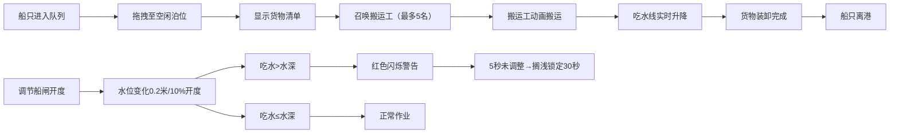

## 1. 产品概述

汴河码头调度系统是一个模拟唐代汴河漕运场景的全栈Web应用，旨在解决传统漕运管理中船只排队、仓廪登记、搬运工分配及船闸水位调节的协同调度问题，避免因调度混乱导致船只搁浅或装卸效率低下。

- **核心价值**：通过可视化模拟漕运全流程，直观展示调度协同的重要性，兼具教育意义与交互趣味性
- **目标用户**：历史文化爱好者、游戏玩家、教育工作者

## 2. 核心功能

### 2.1 功能模块

1. **码头泊位与船只管理**：5个泊位调度、船只拖拽停靠、自动排队等候
2. **装卸货交互系统**：货物清单展示、搬运工召唤分配、吃水线动态变化
3. **船闸水位模拟**：闸门开度控制、水位实时变化、搁浅警告与惩罚机制
4. **实时统计面板**：吞吐量数字动态刷新、系统状态监控

### 2.2 页面详情

| 页面名称 | 模块名称 | 功能描述 |
|-----------|-------------|---------------------|
| 主界面 | 船只队列区 | 左侧显示待靠泊货船列表（船名、载货量、吃水深度、目的地），支持拖拽至泊位 |
| 主界面 | 泊位区 | 5个泊位（宽8米，蓝色深水区标记），显示停靠船名与停留倒计时 |
| 主界面 | 装卸控制区 | 右侧面板显示货物清单，召唤搬运工按钮，搬运动画，吃水线实时变化 |
| 主界面 | 船闸控制区 | 右侧水门（宽12米），滑块控制闸门开度0%-100%，水位变化影响所有船只 |
| 主界面 | 统计面板 | 实时吞吐量统计，数字翻滚动画效果 |

## 3. 核心流程

## 4. 用户界面设计

### 4.1 设计风格

- **配色方案**：宋代《清明上河图》暖色调
  - 码头地面：米黄色 `#f5deb3`
  - 水体：青蓝色渐变 `#4682b4` 至 `#87ceeb`
  - 深水区：蓝色渐变 `#1e90ff`
  - 货船：木色 `#8b4513` 带深色船舷 `#5a3e1a`
  - 仓库屋顶：灰色瓦片 `#696969`

- **按钮交互**：悬停0.2s缩放+阴影加深，点击弹性回弹反馈

- **字体**：采用具有古典韵味的宋体/楷体风格，标题加大加粗，正文清晰易读

- **布局风格**：全景式码头场景布局，左侧船只队列，中央泊位区，右侧装卸与船闸控制，底部统计面板

### 4.2 页面设计概述

| 页面名称 | 模块名称 | UI元素 |
|-----------|-------------|-------------|
| 主界面 | 船只队列区 | 卡片式船只信息，拖拽把手，悬停高亮 |
| 主界面 | 泊位区 | 半透明虚线框标识泊位，蓝色深水区渐变，船只停靠状态指示 |
| 主界面 | 装卸控制区 | 货物清单列表，召唤搬运工按钮，搬运工小人动画，吃水线指示器 |
| 主界面 | 船闸控制区 | 水门视觉组件，滑块控制器，水位显示标尺，警告闪烁动画 |
| 主界面 | 统计面板 | 数字翻滚动画（framer-motion），吞吐量实时数据 |

### 4.3 响应式设计

- **桌面端（>768px）**：横向三栏布局（船只队列-泊位区-控制面板）
- **移动端（<768px）**：泊位列表纵向滚动卡片堆叠，船信息面板底部抽屉式弹窗
- **触控优化**：增大触控目标，滑动手势支持

### 4.4 动画与性能

- 搬运工动画帧率 ≥ 30fps
- 船吃水线更新延迟 < 50ms
- 船只搁浅红色闪烁警告动画
- 按钮悬停与点击微交互
- 数字翻滚统计动画
