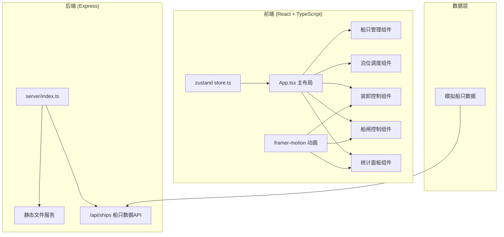
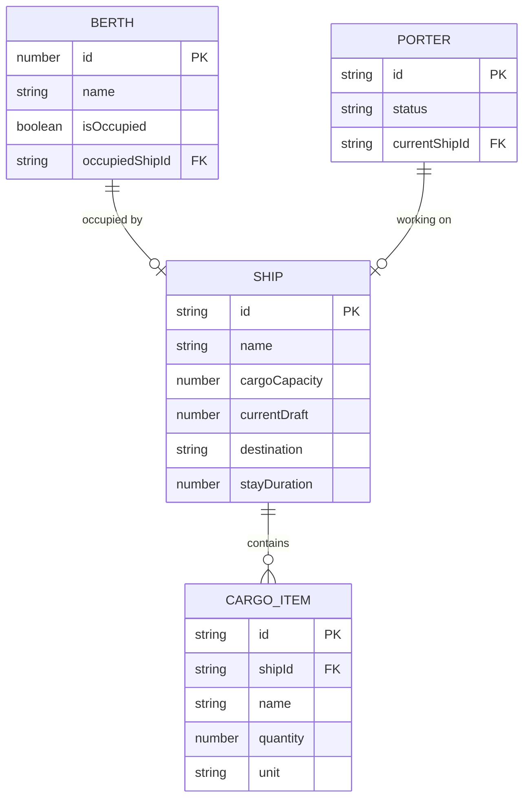

## 1. 架构设计



## 2. 技术说明

- **前端**：React 18 + TypeScript + Vite
- **状态管理**：zustand
- **动画库**：framer-motion
- **后端**：Express 4
- **构建工具**：Vite
- **初始化模板**：react-express-ts

## 3. 项目结构

```
.
├── package.json
├── vite.config.js
├── tsconfig.json
├── index.html
├── src/
│   ├── main.tsx
│   ├── App.tsx
│   ├── store.ts
│   ├── components/
│   │   ├── ShipList.tsx
│   │   ├── BerthArea.tsx
│   │   ├── CargoPanel.tsx
│   │   ├── WaterGate.tsx
│   │   ├── StatsPanel.tsx
│   │   └── Porter.tsx
│   ├── types/
│   │   └── index.ts
│   └── utils/
│       └── constants.ts
└── server/
    └── index.ts
```

## 4. 路由定义

| 路由 | 用途 |
|-------|---------|
| / | 主界面，码头调度全景 |
| /api/ships | GET - 获取初始船只列表 |

## 5. API 定义

### GET /api/ships
返回初始船只列表数据

**响应类型**：
```typescript
interface CargoItem {
  name: string;
  quantity: number;
  unit: string;
}

interface Ship {
  id: string;
  name: string;
  cargoCapacity: number;
  currentDraft: number;
  destination: string;
  cargo: CargoItem[];
  stayDuration: number;
}

type ShipListResponse = Ship[];
```

## 6. 数据模型

### 6.1 数据模型定义



### 6.2 全局状态 (zustand store)

```typescript
interface DockState {
  ships: Ship[];
  waitingQueue: Ship[];
  berths: Berth[];
  waterLevel: number;
  gateOpening: number;
  porters: Porter[];
  throughput: number;
  warningShips: string[];
  strandedShips: string[];
  
  actions: {
    assignShipToBerth: (shipId: string, berthId: number) => void;
    summonPorters: (shipId: string, count: number) => void;
    updateGateOpening: (opening: number) => void;
    moveCargo: (shipId: string, itemId: string) => void;
    departShip: (shipId: string) => void;
    checkWaterLevel: () => void;
  };
}
```

## 7. 核心常量定义

```typescript
// 物理常量
export const INITIAL_WATER_LEVEL = 2.5; // 初始水深2.5米
export const DRAFT_CHANGE_PER_10_UNITS = 0.1; // 每搬运10单位吃水变化0.1米
export const WATER_CHANGE_PER_10_PERCENT = 0.2; // 开度每10%水位变化0.2米
export const WARNING_DURATION = 5000; // 警告持续5秒
export const STRANDED_DURATION = 30000; // 搁浅锁定30秒
export const PORTER_CARGO_INTERVAL = 30000; // 搬运工每30秒搬运1件
export const MAX_PORTERS_PER_SHIP = 5; // 每船最多5名搬运工

// 尺寸常量
export const BERTH_WIDTH = 8; // 泊位宽8米
export const GATE_WIDTH = 12; // 水门宽12米
export const BERTH_COUNT = 5; // 5个泊位

// 颜色常量
export const COLORS = {
  dockGround: '#f5deb3',
  waterStart: '#4682b4',
  waterEnd: '#87ceeb',
  deepWater: '#1e90ff',
  shipBody: '#8b4513',
  shipTrim: '#5a3e1a',
  warehouseRoof: '#696969',
};
```
