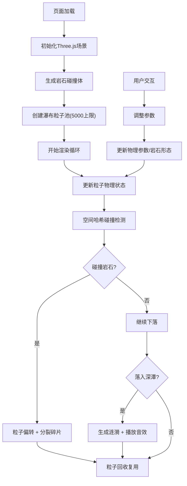

## 1. 产品概述

本项目是一个基于宋代马远《水图》美学风格的3D交互式瀑布粒子可视化系统。用户可以通过直观的控件调整瀑布参数，沉浸式体验水流与岩石碰撞的动态物理效果。

- 核心目的：将中国传统山水画意境与现代WebGL粒子物理技术融合，打造兼具艺术价值与交互趣味性的数字艺术作品
- 目标用户：艺术爱好者、交互设计研究者、技术美学欣赏者
- 市场价值：探索传统艺术数字化呈现的新形态，为文化遗产的创新表达提供技术参考

## 2. 核心特性

### 2.1 功能模块

| 模块名称 | 功能描述 |
|---------|---------|
| 瀑布粒子系统 | 3000+动态粒子模拟，重力物理，颜色渐变，碰撞分裂 |
| 岩石交互系统 | 5-8个随机岩石，悬停高亮，点击调整凸起程度 |
| 深潭涟漪系统 | 同心圆环涟漪动画，Web Audio水滴音效 |
| UI控制面板 | 流量滑块、风向转盘、岩石凸起滑块 |
| 背景与装饰 | 山峦渐变、宣纸纹理、毛笔字体题跋 |

### 2.2 页面详情

| 页面名称 | 模块名称 | 功能描述 |
|---------|---------|---------|
| 主场景 | 瀑布粒子系统 | 粒子从崖顶坠落，受重力和风力影响，碰撞岩石分裂 |
| 主场景 | 岩石交互系统 | 鼠标悬停高亮，点击增加凸起，影响粒子散射角度 |
| 主场景 | 深潭涟漪系统 | 粒子入水触发涟漪和音效，涟漪速度与流量相关 |
| 主场景 | 控制面板 | 流量（0-100%）、风向（0-360°）、岩石凸起（0-100%） |
| 主场景 | 背景装饰 | 左侧山峦、右上瀑布、右下深潭、题跋文字、宣纸纹理 |

## 3. 核心流程

## 4. 用户界面设计

### 4.1 设计风格

**宋代山水画意美学**
- 主色调：深灰#3a3a3a（崖壁）、岩石棕#6b5b4e、山峦绿#4a6741、深潭蓝#0b2b4a、瀑布白#ffffff、淡蓝#b0e0e6、古铜#b87333
- 字体：毛笔书法字体（标题）+ 宋体/楷体（说明文字）
- 布局：长卷式横向构图，左山右水，留白讲究
- 质感：宣纸纹理背景（透明度0.05），半透明控件，水墨晕染过渡
- 动画：惯性滑动（0.2s）、粒子缓动、涟漪扩散

### 4.2 页面设计概览

| 区域 | 模块 | UI元素 |
|------|------|--------|
| 全屏背景 | 宣纸纹理 | repeating-linear-gradient纤维纹路，opacity: 0.05 |
| 左侧25% | 山峦层叠 | CSS线性渐变#4a6741→#2b3f26，多层叠加营造景深 |
| 右上50% | 瀑布区域 | 崖壁#3a3a3a，CSS噪声纹理模拟岩层 |
| 右下30% | 深潭区域 | 圆形径向渐变#0b2b4a→#4a90d9，直径30%屏宽 |
| 右上角 | 题跋 | 悬浮毛笔字体"水图·瀑布"，半透明效果 |
| 底部中央 | 控制面板 | 三个控件水平排列，半透明古铜边框#b87333 |

### 4.3 控件设计

| 控件 | 样式 | 交互 |
|------|------|------|
| 流量滑块 | 横向，古铜色边框，半透明填充 | 拖拽调整，0-100%，实时影响粒子发射速率 |
| 风向转盘 | 圆形弧形，指针指示角度 | 旋转拖拽，0-360°，实时影响粒子水平加速度 |
| 岩石凸起滑块 | 横向，古铜色边框 | 拖拽调整，0-100%，200ms内重绘岩石形态 |

### 4.4 响应式设计

- 桌面优先（≥768px）
- 屏幕宽度<768px时：控件垂直排列，深潭直径调整为50%屏宽
- 所有交互支持触摸操作
- 粒子数量根据设备性能动态调整（低配设备降至2000）

### 4.5 3D场景设计

- **环境**：无外部HDRI，使用纯CSS渐变+Three.js雾化营造水墨氛围
- **光照**：
  - 环境光：0.6强度，暖白色#fff5e6，模拟自然光
  - 方向光：0.8强度，从左上45°照射，模拟阳光
  - 点光源：岩石悬停时临时添加0.5强度高光
- **相机**：正交相机，固定视角，匹配2D长卷构图
- **材质**：
  - 粒子：PointsMaterial，透明，AdditiveBlending
  - 岩石：MeshStandardMaterial，法线贴图模拟粗糙质感
  - 水面：半透明MeshBasicMaterial，涟漪用圆环几何体
- **后处理**：轻微Bloom效果增强粒子光晕，0.3强度
- **性能预算**：Draw Call < 50，三角形 < 10万，内存占用 < 200MB

## 5. 性能指标

- 粒子更新频率 ≥ 30fps
- 碰撞检测优化：空间哈希网格（Spatial Hash Grid），将场景划分为8×8×8网格
- 岩石重绘延迟 ≤ 200ms
- 粒子总数上限：5000（基础粒子3000 + 碎片粒子2000）
