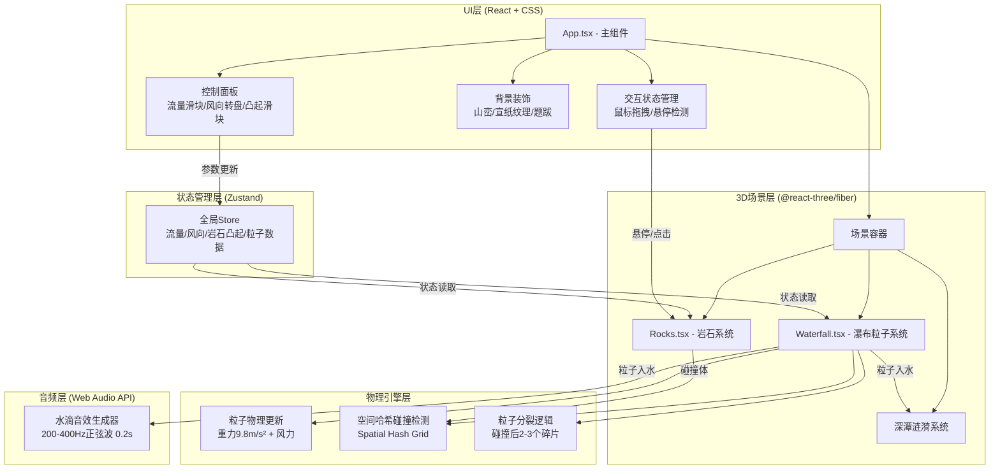

## 1. 架构设计



## 2. 技术栈说明

| 层级 | 技术选型 | 版本 | 用途 |
|------|---------|------|------|
| 构建工具 | Vite | ^5.0 | 快速开发与构建 |
| 前端框架 | React | ^18.2 | UI组件化开发 |
| 语言 | TypeScript | ^5.3 | 类型安全 |
| 3D引擎 | Three.js | ^0.160 | WebGL渲染 |
| React-Three绑定 | @react-three/fiber | ^8.15 | Three.js React封装 |
| 3D辅助库 | @react-three/drei | ^9.92 | 常用3D组件 |
| 状态管理 | Zustand | ^4.4 | 轻量级全局状态 |

## 3. 目录结构

```
auto75/
├── index.html                    # 入口HTML
├── package.json                  # 依赖配置
├── tsconfig.json                 # TS配置
├── vite.config.js                # Vite配置
├── src/
│   ├── App.tsx                   # 主应用组件
│   ├── Waterfall.tsx             # 瀑布粒子系统
│   ├── Rocks.tsx                 # 岩石交互组件
│   └── store.ts                  # Zustand状态管理 (新增)
└── .trae/
    └── documents/
        ├── PRD.md
        └── TechArch.md
```

## 4. 数据模型定义

### 4.1 粒子数据结构

```typescript
interface Particle {
  id: number;
  position: THREE.Vector3;
  velocity: THREE.Vector3;
  size: number;           // 2-6px
  life: number;           // 0-1 生命周期
  isFragment: boolean;    // 是否为碎片粒子
  color: THREE.Color;     // 从上白到下蓝渐变
}
```

### 4.2 岩石数据结构

```typescript
interface Rock {
  id: number;
  position: THREE.Vector3;
  radius: number;         // 0.5-2.0 随机
  roughness: number;      // 0-1 凸起程度
  isHovered: boolean;
}
```

### 4.3 全局状态 (Zustand Store)

```typescript
interface WaterfallState {
  flowRate: number;       // 0-100 流量百分比
  windDirection: number;  // 0-360 风向角度
  windStrength: number;   // 风力强度
  rockRoughness: number;  // 0-100 岩石凸起百分比
  maxParticles: number;   // 5000 粒子上限
  baseParticleCount: number; // 3000 基础粒子数
  rocks: Rock[];          // 岩石数组
  // Actions
  setFlowRate: (v: number) => void;
  setWindDirection: (v: number) => void;
  setRockRoughness: (v: number) => void;
  incrementRockRoughness: (rockId: number) => void;
  setRockHover: (rockId: number, hovered: boolean) => void;
}
```

### 4.4 涟漪数据结构

```typescript
interface Ripple {
  id: number;
  position: THREE.Vector2;
  radius: number;
  maxRadius: number;
  opacity: number;
  speed: number;
}
```

## 5. 核心算法

### 5.1 空间哈希网格 (Spatial Hash Grid)

```typescript
class SpatialHashGrid {
  private cellSize: number = 2;
  private grid: Map<string, number[]> = new Map();
  
  // 根据位置计算网格索引
  private getKey(pos: THREE.Vector3): string {
    const x = Math.floor(pos.x / this.cellSize);
    const y = Math.floor(pos.y / this.cellSize);
    const z = Math.floor(pos.z / this.cellSize);
    return `${x},${y},${z}`;
  }
  
  // 查询附近粒子（只检查相邻9个网格）
  query(pos: THREE.Vector3, radius: number): number[] {
    const results: number[] = [];
    const range = Math.ceil(radius / this.cellSize);
    // 检查周围网格...
    return results;
  }
}
```

### 5.2 粒子物理更新

```typescript
// 每帧更新 (delta ~ 16ms)
const GRAVITY = new THREE.Vector3(0, -9.8, 0);
const windVector = new THREE.Vector3(
  Math.cos(windDirRad) * windStrength,
  0,
  Math.sin(windDirRad) * windStrength
);

// 速度更新: v = v0 + a*t
particle.velocity.addScaledVector(GRAVITY, delta);
particle.velocity.addScaledVector(windVector, delta);
// 位置更新: p = p0 + v*t
particle.position.addScaledVector(particle.velocity, delta);
```

### 5.3 岩石碰撞检测与分裂

```typescript
function checkCollision(particle: Particle, rock: Rock): boolean {
  const dist = particle.position.distanceTo(rock.position);
  const collisionRadius = rock.radius * (1 + rock.roughness * 0.3);
  return dist < collisionRadius + particle.size * 0.01;
}

function splitParticle(particle: Particle): Particle[] {
  const fragments: Particle[] = [];
  const count = 2 + Math.floor(Math.random() * 2); // 2-3个碎片
  for (let i = 0; i < count; i++) {
    fragments.push({
      id: generateId(),
      position: particle.position.clone(),
      velocity: new THREE.Vector3(
        (Math.random() - 0.5) * 3,
        Math.random() * 2,
        (Math.random() - 0.5) * 3
      ),
      size: particle.size * 0.5,
      life: 0,
      isFragment: true,
      color: particle.color.clone()
    });
  }
  return fragments;
}
```

### 5.4 颜色渐变计算

```typescript
function getParticleColor(normalizedHeight: number): THREE.Color {
  // normalizedHeight: 1 = 崖顶, 0 = 深潭
  const topColor = new THREE.Color(0xffffff);
  const bottomColor = new THREE.Color(0xb0e0e6);
  return topColor.clone().lerp(bottomColor, 1 - normalizedHeight);
}
```

## 6. 性能优化策略

| 优化点 | 策略 |
|--------|------|
| 粒子对象池 | 预分配5000个粒子，激活/回收复用，避免GC |
| 碰撞检测 | 空间哈希网格，O(n)复杂度，每帧只检查相邻网格 |
| 渲染优化 | 使用BufferGeometry存储粒子数据，一次性GPU上传 |
| 岩石重绘 | 只更新顶点位置，不重建几何体，延迟≤200ms |
| 帧率控制 | requestAnimationFrame，固定物理步长16ms |
| 透明度渲染 | 使用AdditiveBlending，避免深度排序开销 |
| 音频节流 | 同一帧最多触发3个音效，避免音频上下文过载 |

## 7. 关键交互实现

### 7.1 风向转盘拖拽

```typescript
// 计算鼠标相对于转盘中心的角度
function handleDialDrag(e: React.MouseEvent) {
  const rect = dialRef.current.getBoundingClientRect();
  const centerX = rect.left + rect.width / 2;
  const centerY = rect.top + rect.height / 2;
  const angle = Math.atan2(e.clientY - centerY, e.clientX - centerX);
  const degrees = ((angle * 180 / Math.PI) + 360) % 360;
  setWindDirection(degrees);
}
```

### 7.2 岩石点击凸起

```typescript
function handleRockClick(rockId: number) {
  // 增加对应岩石的roughness，上限1.0
  incrementRockRoughness(rockId);
  // 触发200ms内的顶点更新
  debouncedUpdateRockGeometry(rockId);
}
```

### 7.3 惯性滑动动画

```typescript
// 使用requestAnimationFrame实现惯性
let velocity = 0;
let lastX = 0;

function onDrag(e) {
  const delta = e.clientX - lastX;
  velocity = delta; // 记录速度用于惯性
  lastX = e.clientX;
}

function onDragEnd() {
  // 惯性衰减动画 0.2秒
  const startTime = performance.now();
  const startVel = velocity;
  function animate() {
    const t = (performance.now() - startTime) / 200;
    if (t < 1) {
      const inertia = startVel * (1 - t) * 0.3;
      sliderValue += inertia;
      requestAnimationFrame(animate);
    }
  }
  animate();
}
```
