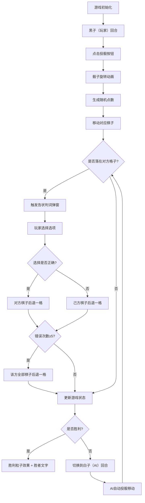

## 1. 产品概述

双陆双局是一款基于浏览器的古代西域龟兹风格对弈游戏，玩家扮演唐代安西都护府戍边棋手，在虚拟毡帐内与胡商进行失传的双陆棋局对弈。游戏融合策略、运气与文化元素，通过掷骰移动棋子、告状判词等机制，还原古代丝绸之路的商贸与文化碰撞。

## 2. 核心功能

### 2.1 用户角色
| 角色 | 注册方式 | 核心权限 |
|------|----------|----------|
| 玩家 | 无需注册，直接进入 | 操控黑子进行对弈、投掷骰子、选择判词选项 |
| AI对手 | 系统内置 | 操控白子，自动决策移动、自动应答判词 |

### 2.2 功能模块
1. **游戏主界面**：阴阳双界棋盘、棋子展示、城池图标
2. **骰子系统**：3D骰子投掷动画、点数计算、回合指示
3. **告状判词系统**：随机判词生成、二选一选项、退格逻辑
4. **胜负判定系统**：声望值统计、城池计数、胜利粒子效果
5. **信息展示区**：双方状态面板、回合信息、操作提示

### 2.3 页面详情
| 页面名称 | 模块名称 | 功能描述 |
|---------|----------|----------|
| 游戏主页面 | 棋盘渲染 | 8x8阴阳双界网格，阳界褐色、阴界墨蓝，城池图标展示 |
| 游戏主页面 | 骰子面板 | 两枚3D骰子，点击投掷触发旋转动画，显示点数和 |
| 游戏主页面 | 告状弹窗 | 毛玻璃半透明弹窗，随机判词展示，二选一选项按钮 |
| 游戏主页面 | 信息栏 | 左侧展示双方声望值、已夺城池数、当前回合 |
| 游戏主页面 | 胜利画面 | 全屏粒子撒花效果，金色"胜者"文字展示 |

## 3. 核心流程

玩家进入游戏后，棋盘初始化（双方各15枚棋子分别置于阴阳两界），黑子先手。玩家点击投骰按钮，骰子旋转后显示点数，系统根据点数移动对应棋子。若棋子落在对方领地格子上，触发告状判词，玩家选择认罚或辩驳，根据预设正确答案决定后退方向。错误判词累计5次后，该方全部棋子后退一格。当一方棋子走满12个城池或声望值达到100时，触发胜利画面。

## 4. 用户界面设计

### 4.1 设计风格
- **主色调**：褐色#8b4513（阳界）、墨蓝#2f4f4f（阴界）、青铜色#cd7f32（按钮）、金色#ffd700（文字/边框）、银白#c0c0c0（阴界边框）
- **按钮风格**：青铜色圆角按钮，悬停变亮#d4a574，尺寸60x30px
- **字体**：标题楷体KaiTi 28px，数字24px，胜者48px金色楷体
- **布局风格**：水平三栏布局（左信息栏150px + 中棋盘600px + 右骰子区150px），深色毡帐纹理背景
- **视觉元素**：棋子径向渐变、3D骰子CSS变换、毛玻璃弹窗、粒子撒花效果

### 4.2 页面设计概述
| 页面名称 | 模块名称 | UI元素 |
|---------|----------|--------|
| 游戏主页面 | 棋盘区域 | 8x8网格，阴阳分界，城池图标（方形塔楼/圆形穹顶），棋子平滑移动动画 |
| 游戏主页面 | 骰子区域 | 两枚3D立方体骰子，自动缓慢旋转，投骰触发0.3秒快速旋转动画 |
| 游戏主页面 | 告状弹窗 | 半透明rgba(0,0,0,0.6)背景，模糊10px，判词文字，左右选项按钮 |
| 游戏主页面 | 信息栏 | 垂直排列，双方声望进度条，城池计数，当前回合指示 |
| 游戏主页面 | 胜利画面 | 200个随机彩色粒子下落3秒淡出，金色"胜者"二字居中 |

### 4.3 响应式
- 桌面端（≥800px）：水平三栏布局，棋盘600x600px
- 移动端（<800px）：垂直列布局，棋盘缩小至400x400px，左右栏折叠到棋盘下方
- 触摸优化：按钮尺寸适配触摸操作，弹窗区域足够大便于点击

### 4.4 动画与交互
- 棋子移动：0.2秒缓动动画，从原格平滑移至目标格
- 骰子动画：未点击时0.5秒一圈缓慢旋转，投骰时0.3秒快速旋转
- 弹窗动画：0.2秒淡入淡出，背景变暗并禁止操作
- 胜利动画：framer-motion生成200个彩色粒子，下落3秒后淡出
