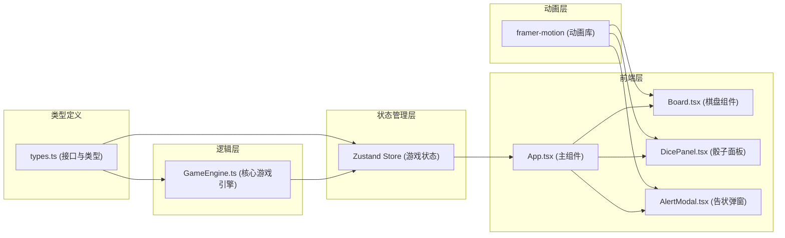

## 1. 架构设计



## 2. 技术描述
- **前端框架**：React@18 + TypeScript@5
- **构建工具**：Vite@5 + @vitejs/plugin-react@4
- **状态管理**：zustand@4
- **动画库**：framer-motion@11
- **样式方案**：CSS Modules + CSS Variables
- **初始化方式**：Vite + React + TypeScript 模板

## 3. 项目文件结构
```
auto76/
├── package.json
├── vite.config.js
├── tsconfig.json
├── index.html
└── src/
    ├── types.ts          # 类型定义
    ├── GameEngine.ts     # 游戏核心逻辑
    ├── Board.tsx         # 棋盘组件
    ├── DicePanel.tsx     # 骰子面板组件
    ├── AlertModal.tsx    # 告状弹窗组件
    └── App.tsx           # 主应用组件
```

## 4. 数据模型

### 4.1 核心类型定义

```typescript
// 棋盘格子类型
interface Cell {
  id: string;
  row: number;
  col: number;
  realm: 'yang' | 'yin'; // 阳界/阴界
  cityIndex: number; // 城池编号 0-11
  isCity: boolean;
}

// 棋子类型
interface Piece {
  id: string;
  player: 'black' | 'white';
  position: { row: number; col: number };
  currentCityIndex: number;
  isActive: boolean;
}

// 骰子类型
interface Dice {
  id: number;
  value: number; // 1-6
  isRolling: boolean;
}

// 判词类型
interface Verdict {
  id: string;
  text: string;
  options: {
    left: string;
    right: string;
  };
  correctAnswer: 'left' | 'right';
}

// 游戏状态类型
type GamePhase = 'waiting' | 'rolling' | 'moving' | 'verdict' | 'ended';
type PlayerTurn = 'black' | 'white';

interface GameState {
  phase: GamePhase;
  currentTurn: PlayerTurn;
  board: Cell[][];
  pieces: Piece[];
  dice: [Dice, Dice];
  diceTotal: number;
  selectedPiece: Piece | null;
  currentVerdict: Verdict | null;
  verdictWrongCount: { black: number; white: number };
  reputation: { black: number; white: number };
  citiesCaptured: { black: number; white: number };
  winner: PlayerTurn | null;
}
```

### 4.2 游戏引擎方法
```typescript
// GameEngine.ts 核心方法
- initializeBoard(): Cell[][]        // 初始化8x8棋盘
- initializePieces(): Piece[]         // 初始化30枚棋子
- rollDice(): [number, number]        // 掷骰生成随机点数
- calculateDiceTotal(dice: [number, number]): number  // 计算点数和
- getValidMoves(piece: Piece, steps: number): { row: number; col: number }[]  // 获取有效移动
- movePiece(piece: Piece, target: { row: number; col: number }): Piece  // 移动棋子
- isOpponentTerritory(piece: Piece, target: { row: number; col: number }, pieces: Piece[]): boolean  // 判断是否对方领地
- generateRandomVerdict(): Verdict   // 生成随机判词
- processVerdictAnswer(verdict: Verdict, answer: 'left' | 'right', currentPlayer: PlayerTurn): { retreatPlayer: PlayerTurn }  // 处理判词选择
- checkWinCondition(state: GameState): PlayerTurn | null  // 检测胜负
- applyPenaltyIfNeeded(state: GameState): GameState  // 5次错误后全体退格
```

## 5. 状态管理（Zustand Store）

```typescript
// Store actions
interface GameStore extends GameState {
  initializeGame: () => void;
  rollDice: () => void;
  selectPiece: (piece: Piece) => void;
  moveSelectedPiece: (target: { row: number; col: number }) => void;
  answerVerdict: (answer: 'left' | 'right') => void;
  skipVerdict: () => void;
  resetGame: () => void;
}
```

## 6. 组件Props定义

### Board.tsx
```typescript
interface BoardProps {
  board: Cell[][];
  pieces: Piece[];
  currentTurn: PlayerTurn;
  selectedPiece: Piece | null;
  validMoves: { row: number; col: number }[];
  onCellClick: (row: number, col: number) => void;
  onPieceClick: (piece: Piece) => void;
}
```

### DicePanel.tsx
```typescript
interface DicePanelProps {
  dice: [Dice, Dice];
  diceTotal: number;
  currentTurn: PlayerTurn;
  isRolling: boolean;
  onRollDice: () => void;
  disabled: boolean;
}
```

### AlertModal.tsx
```typescript
interface AlertModalProps {
  verdict: Verdict;
  currentTurn: PlayerTurn;
  onAnswer: (answer: 'left' | 'right') => void;
  isVisible: boolean;
}
```

## 7. 性能约束实现方案

- **帧率优化**：使用CSS transform和opacity实现动画，避免重排重绘
- **棋盘渲染**：使用React.memo优化单元格组件，仅在状态变化时重渲染
- **骰子动画**：纯CSS动画，通过class切换控制状态，避免JS动画卡顿
- **弹窗性能**：预渲染弹窗组件，通过CSS visibility控制显示，减少DOM操作
- **粒子效果**：framer-motion的AnimatePresence批量管理200个粒子，GPU加速
- **首次加载**：Vite构建按需加载，代码分割，总bundle控制在200KB以内
