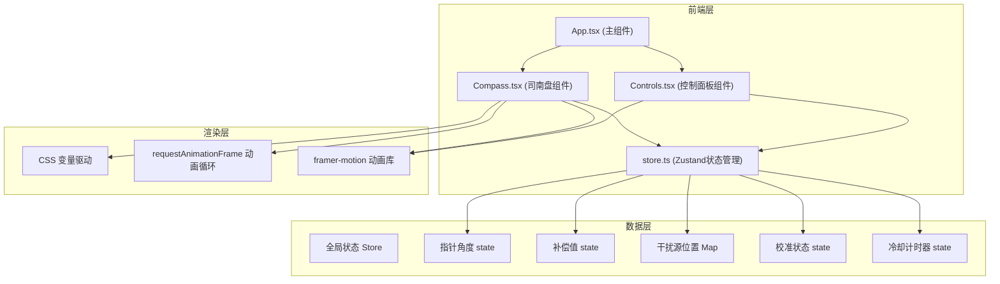

## 1. 架构设计



## 2. 技术描述

- **前端框架**：React@18 + TypeScript@5
- **构建工具**：Vite@5 + @vitejs/plugin-react@4
- **状态管理**：zustand@4
- **动画库**：framer-motion@11
- **样式方案**：CSS Modules + CSS Variables + Tailwind CSS
- **图标方案**：Unicode字符 + 纯CSS绘制，无外部图标库依赖

## 3. 目录结构

```
auto77/
├── index.html              # 入口页面，标题"司南校准器"
├── package.json            # 项目依赖与脚本
├── vite.config.js          # Vite构建配置
├── tsconfig.json           # TypeScript严格模式配置
└── src/
    ├── App.tsx             # 主组件，布局与状态整合
    ├── Compass.tsx         # 司南盘组件
    ├── Controls.tsx        # 控制面板组件
    └── store.ts            # Zustand全局状态管理
```

## 4. 数据模型

### 4.1 状态类型定义

```typescript
interface InterferenceSource {
  id: string;
  type: 'iron' | 'wall' | 'bronze';
  x: number;  // 相对于盘心的x坐标
  y: number;  // 相对于盘心的y坐标
}

type CalibrationStatus = 'idle' | 'success' | 'warning' | 'cooldown';

interface CompassState {
  // 指针角度（度，0为正南，顺时针为正）
  needleAngle: number;
  // 初始随机角度
  initialAngle: number;
  // 磁偏角补偿值（度，范围-15至+15）
  compensation: number;
  // 干扰源映射表
  interferences: Map<string, InterferenceSource>;
  // 校准状态
  calibrationStatus: CalibrationStatus;
  // 当前误差值
  currentError: number;
  // 连续失败次数
  failCount: number;
  // 冷却剩余时间（秒）
  cooldownRemaining: number;
  // 是否正在冷却
  isCoolingDown: boolean;
}

interface CompassActions {
  // 调整补偿值（步进0.5度）
  adjustCompensation: (delta: number) => void;
  // 放置干扰源
  placeInterference: (source: InterferenceSource) => void;
  // 移除干扰源
  removeInterference: (id: string) => void;
  // 重置司南
  resetCompass: () => void;
  // 检查校准状态
  checkCalibration: () => void;
  // 计算总偏移量（含干扰）
  calculateTotalOffset: () => number;
  // 开始冷却
  startCooldown: () => void;
  // 减少冷却时间
  decrementCooldown: () => void;
}

type CompassStore = CompassState & CompassActions;
```

### 4.2 干扰源类型

| 类型 | 颜色 | 形状 | 磁扰强度 |
|-----|------|------|---------|
| iron（铁矿堆） | `#6a6a6a` 灰色 | 正方块 | 强 |
| wall（古城墙） | `#4a4a4a` 深灰 | 长条 | 中 |
| bronze（铜像） | `#c9a84c` 金色 | 球体 | 强 |

## 5. Actions 逻辑说明

### 5.1 adjustCompensation(delta: number)
- 限制范围：-15° ≤ compensation ≤ +15°
- 步进精度：0.5°（四舍五入到最近的0.5倍数）
- 副作用：调用 checkCalibration() 更新校准状态

### 5.2 placeInterference(source: InterferenceSource)
- 验证放置位置：距离盘心 50-150px
- 格点吸附：坐标吸附到最近的10px网格点
- 副作用：重新计算 totalOffset，调用 checkCalibration()

### 5.3 removeInterference(id: string)
- 从 Map 中删除指定干扰源
- 副作用：重新计算 totalOffset，调用 checkCalibration()

### 5.4 calculateTotalOffset(): number
```
totalOffset = initialAngle + compensation + Σ(each interference's offset)

单个干扰源偏移量计算：
distance = sqrt(x² + y²)
angleToCenter = atan2(y, x)  // 相对于盘心的角度
sectorAngle = 30° + (150 - distance) * 0.6°  // 距离越近，覆盖角度越大
offsetMagnitude = (150 - distance) / 10  // 每近10px增加1°偏移
needleAngleDiff = needleAngle - angleToCenter
if |needleAngleDiff| < sectorAngle / 2:
    offset = offsetMagnitude * (1 - 2 * |needleAngleDiff| / sectorAngle)
else:
    offset = 0
```

### 5.5 checkCalibration()
```
finalAngle = initialAngle + compensation + interferenceOffset
currentError = |finalAngle - 0°|  // 与正南的绝对误差

if currentError < 1°:
    status = 'success'
    failCount = 0
elif currentError > 2.5°:
    status = 'warning'
    failCount += 1
    if failCount >= 3:
        startCooldown()
else:
    status = 'idle'
```

### 5.6 startCooldown()
- isCoolingDown = true
- cooldownRemaining = 10
- compensation = 0（自动归零）
- 启动1秒间隔的定时器调用 decrementCooldown()

### 5.7 resetCompass()
- 生成新的随机 initialAngle (0-360°)
- compensation = 0
- 清空 interferences Map
- calibrationStatus = 'idle'
- failCount = 0
- isCoolingDown = false

## 6. 组件划分

### 6.1 Compass.tsx（司南盘组件）
**Props**：无需，直接使用 store
**职责**：
- 绘制盘面：320px圆形、深青铜色背景、云雷纹外圈
- 绘制刻度：二十四山向篆书文字、刻度线
- 绘制天池：40px圆形、水面波纹动画
- 绘制指针：磁勺形状、CSS渐变磁极
- 绘制磁扰区：半透明橙色扇形遮罩
- 绘制反馈动画：金色成功光环、红色警示闪烁
- 使用 CSS 变量 `--needle-rotation` 驱动指针旋转

### 6.2 Controls.tsx（控制面板组件）
**Props**：无需，直接使用 store
**职责**：
- 渲染左侧干扰源工具栏：3种可拖拽图标
- 渲染右侧补偿旋钮：拖拽旋转交互
- 渲染补偿值显示：+x.x° / -x.x°
- 渲染校准信息面板：误差值、状态提示、失败次数
- 拖拽放置逻辑：计算位置、格点吸附、验证距离
- 旋钮旋转逻辑：计算拖拽角度、更新补偿值

### 6.3 App.tsx（主组件）
**职责**：
- 响应式布局：根据视口宽度切换布局模式
- 冷却定时器管理：useEffect 处理倒计时
- 初始化：组件挂载时调用 resetCompass() 生成随机初始角度
- 整合所有子组件

## 7. 性能优化策略

1. **CSS 变量驱动动画**：指针角度通过 `--needle-rotation` CSS 变量传递，避免频繁 JS 操作 style
2. **requestAnimationFrame**：指针旋转动画使用 rAF 保证60fps
3. **framer-motion**：复杂动画（光环、波纹、拖拽）交由 framer-motion 处理
4. **状态选择器**：使用 zustand 的 selectors 避免不必要的重渲染
5. **CSS transform**：所有动画使用 transform 属性，触发 GPU 加速
6. **will-change**：对频繁变化的元素添加 will-change 提示
7. **防抖处理**：拖拽事件使用 requestAnimationFrame 节流

## 8. 关键 CSS 类与变量

```css
:root {
  --compass-diameter: 320px;
  --compass-color: #5a4a32;
  --gold-color: #d4af37;
  --bronze-color: #b87333;
  --table-color: #3a5a3a;
  --south-red: #cc3333;
  --north-black: #222222;
  --interference-orange: #ff8c00;
  --needle-rotation: 0deg;
  --knob-rotation: 0deg;
}

/* 移动端 */
@media (max-width: 767px) {
  :root {
    --compass-diameter: 240px;
  }
}
```
