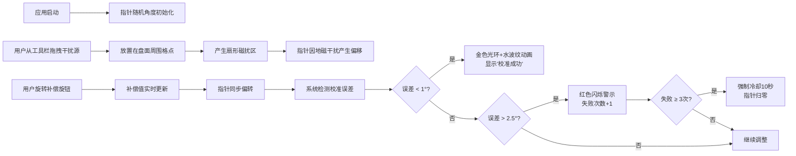

## 1. 产品概述
司南校准器是一款基于浏览器的古代指南针模拟与校准交互应用，让用户体验传统司南在复杂地磁环境中的定向与校准过程。通过模拟磁偏角补偿机制和多种地磁干扰源，用户可以学习如何调整补偿旋钮、放置干扰源，并最终校准司南指向正南方向。

- 核心问题：传统指南车在山地、城郭、金属矿脉附近因地磁异常导致指针偏转，无法精准指向正南
- 目标用户：历史爱好者、科普教育工作者、对古代科技感兴趣的大众用户
- 产品价值：寓教于乐，通过交互体验了解中国古代导航技术与现代地磁学原理

## 2. 核心 Features

### 2.1 功能模块
1. **司南盘模拟模块**：绘制青铜质地司南盘、二十四山向刻度、天池与磁石勺形指针
2. **磁偏角补偿模块**：机械式补偿旋钮，支持-15°至+15°范围的精细调整（步进0.5°）
3. **地磁干扰模拟模块**：3种可拖拽干扰源（铁矿堆、古城墙、铜像），产生扇形磁扰区
4. **校准判定模块**：误差检测、成功/失败反馈动画、连续失败强制冷却机制
5. **响应式布局模块**：桌面端三栏布局、平板端上下布局、移动端单列布局

### 2.2 页面详情
| 页面名称 | 模块名称 | 功能描述 |
|---------|---------|---------|
| 主页面 | 司南盘组件 | 绘制320px直径青铜盘面、二十四山向篆书刻度、天池水波纹、磁勺指针、磁扰区遮罩、成功/失败光环动画 |
| 主页面 | 控制面板组件 | 左侧干扰源工具栏（拖拽选取）、右侧补偿旋钮（旋转调整）、补偿值数字显示、校准状态信息面板 |
| 主页面 | 全局状态管理 | 指针角度、补偿值、干扰源位置映射、校准状态、冷却计时器 |

## 3. 核心流程

### 3.1 校准操作流程

### 3.2 交互细节
- 指针初始角度：0-360°随机
- 补偿旋钮：鼠标拖拽旋转，步进0.5°，范围±15°
- 干扰源：从左侧工具栏拖拽至盘面周围50-150px范围的可吸附格点
- 磁扰区：以盘心为圆心的半透明橙色扇形，覆盖角度30-90°，线性偏移量随距离递增
- 冷却机制：连续失败3次触发，禁用所有交互10秒，指针自动归零

## 4. 用户界面设计

### 4.1 设计风格
- **设计基调**：唐代青铜器风格，古风典雅，精致拟物化
- **主色调**：深青铜咖啡色 `#5a4a32`（盘面）、墨绿 `#3a5a3a`（桌案底色）
- **强调色**：暖金色 `#d4af37`（刻度、光环、成功提示）、古铜色 `#b87333`（指针）
- **功能色**：南端红色 `#cc3333`、北端黑色 `#222222`、磁扰橙色 `#ff8c00`、警示红色
- **字体**：楷体（提示文字）、系统字体（数字显示）
- **动效**：平滑过渡 `transition: 0.3s ease`、指针旋转60fps流畅动画、金色光环扩散收缩循环、天池水波纹ripple动画

### 4.2 页面设计概述
| 页面名称 | 模块名称 | UI元素 |
|---------|---------|---------|
| 主页面 | 司南盘 | 320px圆形盘面、云雷纹外圈（repeating-conic-gradient）、二十四山向篆书刻度（每山15°，刻度线长6px，间隔3°）、直径40px天池（水面波纹动画）、60px磁勺指针（CSS渐变模拟磁极）、金色成功光环、红色警示闪烁、半透明橙色磁扰区 |
| 主页面 | 左侧工具栏 | 垂直排列3种干扰源图标（铁矿堆正方块、古城墙长条、铜像球体），拖拽时显示半透明预览，放置吸附格点提示 |
| 主页面 | 右侧控制面板 | 60px直径铜色补偿旋钮（dashed border滚花纹理）、补偿值数字显示（+x.x°/-x.x°）、校准状态信息面板、当前误差显示 |

### 4.3 响应式设计
- **桌面端（≥1024px）**：三栏布局 - 左侧工具栏（垂直）、中间司南盘（居中）、右侧旋钮+信息面板
- **平板端（768-1023px）**：上下布局 - 顶部工具栏、中间司南盘、底部旋钮+信息面板
- **移动端（<768px）**：单列纵向布局 - 司南盘、工具栏、旋钮，所有尺寸缩放至75%

### 4.4 动画与交互
- 指针旋转：CSS `transform: rotate()` + `requestAnimationFrame`，60fps
- 旋钮旋转：拖拽时实时更新角度，`transform: rotate()`
- 干扰源拖拽：HTML5 Drag & Drop API + 自定义拖拽预览，格点吸附
- 成功动画：金色光环 `scale` 扩散→收缩循环（1.5秒），天池 `ripple` 波纹动画
- 失败动画：红色警示 `opacity` 淡入淡出（周期0.6秒）
- 冷却效果：盘面整体 `opacity` 降低，禁用鼠标事件

## 5. 性能要求
- 旋钮每0.5°调整的UI响应时间 < 16ms（60fps）
- 干扰源拖拽时磁扰区重绘无明显卡顿
- 使用 `requestAnimationFrame` 优化动画循环
- 使用 CSS 变量驱动动画，减少 JS 操作 DOM
