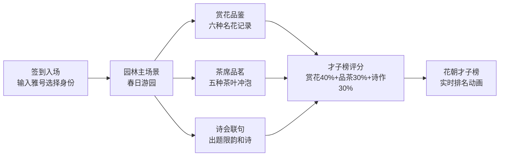

## 1. 产品概述

花朝节赏花品茗社集活动全栈Web应用，模拟古代文人墨客在花朝节相聚园林，赏花品茗、赋诗联句的雅集场景。

- 面向传统文化爱好者，提供沉浸式古代文人雅集体验
- 通过游戏化的签到、赏花、品茗、诗会流程，评定"花朝才子榜"
- 融合艺术表现力与交互趣味性，传承中华传统文化美学

## 2. 核心功能

### 2.1 用户角色

| 角色 | 注册方式 | 核心权限 |
|------|----------|----------|
| 主宾 | 输入雅号选择身份 | 参与全部活动，可出题 |
| 客卿 | 输入雅号选择身份 | 参与赏花、品茗、诗会 |
| 侍者 | 输入雅号选择身份 | 协助活动，记录品鉴 |

### 2.2 功能模块

1. **签到入场**：雅号输入、身份选择、花朝题壁展示
2. **赏花园**：六种名花品鉴、花语记录、进度追踪
3. **茶席品茗**：茶叶冲泡动画、品鉴笔记、水波特效
4. **诗会联句**：出题限韵、平仄校验、押韵检查、诗作特效
5. **才子榜**：实时排行、动画刷新、评分计算

### 2.3 页面详情

| 页面名称 | 模块名称 | 功能描述 |
|----------|----------|----------|
| 签到页 | 入场模块 | 输入雅号、选择身份、确认入场 |
| 主场景 | 园林背景 | 春日园林、漆案插花、题壁板、粒子系统 |
| 赏花园 | 花品卡片 | 六种名花手绘卡片、花瓣动画、金边镶框 |
| 赏花园 | 品鉴侧栏 | 四维评分、文字赏析、提交记录 |
| 茶席品茗 | 茶叶拖拽 | 五种茶叶拖拽冲泡、温度计动画 |
| 茶席品茗 | 品鉴记录 | 茶汤颜色、香气、口感记录 |
| 诗会联句 | 出题限韵 | 随机诗题与韵部展示 |
| 诗会联句 | 平仄校验 | 自动检查平仄押韵、错误标注、toast提示 |
| 才子榜 | 排行展示 | 前五名排名、动画刷新、分数计算 |

## 3. 核心流程

## 4. 用户界面设计

### 4.1 设计风格

- **主色调**：米白#faf0e6背景，赭石#8b5e3c、石绿#4a7c59、胭脂#c23b22、藤黄#d4a017为辅色
- **整体风格**：宋明文人画风格，纸纹质感，细边框#8b4513
- **按钮样式**：凸起/凹陷点击反馈，0.2秒过渡
- **字体**：思源宋体（展示）搭配系统宋体（正文）
- **布局**：CSS Grid三栏布局（左导航、中内容、右榜单）
- **动效**：framer-motion实现所有过渡动画

### 4.2 页面设计概览

| 页面名称 | 模块名称 | UI元素 |
|----------|----------|--------|
| 签到页 | 入场模块 | 宣纸纹理输入框、身份选择木牌、确认按钮 |
| 主场景 | 园林背景 | 粉绿渐变#fce4ec至#c8e6c9、青石板纹理、红木漆案#8d6e63、随风轻摇的插花、木制题壁板手写诗句、花瓣粒子系统 |
| 赏花园 | 花品卡片 | 宣纸背景#f5f0e1卡片120x160px、径向渐变绘制花瓣、hover膨胀发光动画、完成后金边镶框 |
| 赏花园 | 品鉴侧栏 | 毛玻璃效果#f8e8d0透明度0.8、四维评分滑动条、赏析文本域、渐变进度条#e8a87c至#d4a373 |
| 茶席品茗 | 冲泡场景 | 竹影背景repeating-linear-gradient、紫砂茶壶#6d4c41、青瓷茶杯#90a4ae、蒸汽上升动画、温度计变色动画 |
| 茶席品茗 | 品鉴记录 | 颜色选择器、香气关键词多选、口感四选一+评分、水波涟漪特效 |
| 诗会联句 | 古槐场景 | 圆形渐变树冠#4caf50至#2e7d32、石桌笔墨、五言/七言输入检测 |
| 诗会联句 | 校验模块 | 平仄错误红色波浪线、押韵错误蓝色虚线、深蓝toast#1a237e、诗句飞升星辰特效 |
| 才子榜 | 排行展示 | 古卷轴纹理#e8dcc8、隶书榜头#8b0000、名次动画（升绿降红） |

### 4.3 响应式设计

- **桌面端**：三栏Grid布局（左20% + 中55% + 右25%）
- **平板端**：双栏布局（导航+内容 / 榜单折叠为抽屉）
- **移动端**：单栏卷轴布局，底部Tab导航切换模块
- 所有触摸交互优化，点击区域≥44px

### 4.4 动画与性能

- 花瓣粒子系统：~20个微小花瓣随机漂浮，requestAnimationFrame驱动，CPU占用≤15%
- 所有动画保持60FPS
- 加载状态展示随机诗词过渡（共10句，每句停留2秒）
