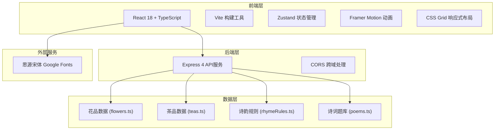
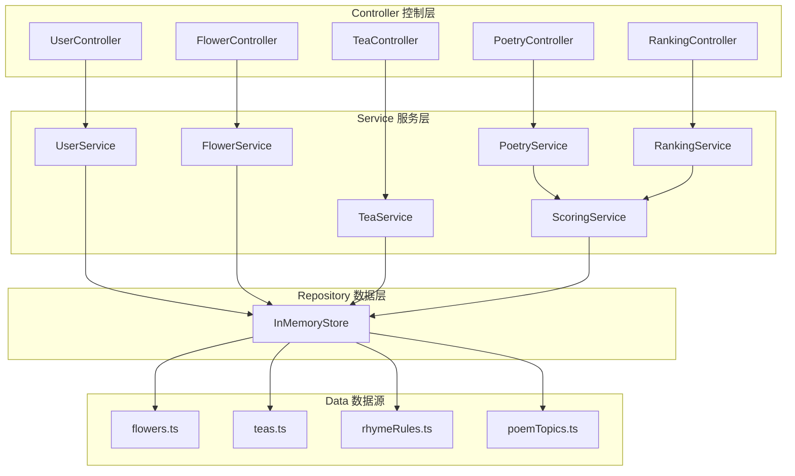
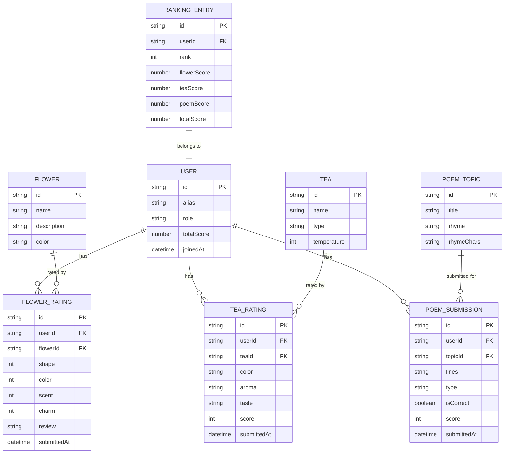

## 1. 架构设计



## 2. 技术描述

- **前端框架**：React 18 + TypeScript 5
- **构建工具**：Vite 5 + @vitejs/plugin-react
- **状态管理**：Zustand 4
- **动画库**：Framer Motion 11
- **后端**：Express 4 + CORS
- **开发语言**：TypeScript（严格模式）
- **样式方案**：原生CSS + CSS变量 + CSS Grid
- **初始化方式**：手动创建项目结构

## 3. 路由定义

| 路由 | 用途 |
|------|------|
| / | 签到入场页 |
| /garden | 赏花园 |
| /tea | 茶席品茗 |
| /poetry | 诗会联句 |
| /api/flowers | 获取花品数据 |
| /api/teas | 获取茶品数据 |
| /api/poetry/rules | 获取平仄押韵规则 |
| /api/poetry/topics | 获取诗题韵部 |
| /api/poetry/submit | 提交诗作并评分 |
| /api/ranking | 获取才子榜排名 |
| /api/user/register | 用户签到注册 |
| /api/flower/rate | 提交花品评分 |
| /api/tea/rate | 提交茶品评分 |

## 4. API 定义

### 4.1 类型定义

```typescript
interface User {
  id: string;
  alias: string;
  role: '主宾' | '客卿' | '侍者';
  flowerScores: Record<string, FlowerRating>;
  teaScores: Record<string, TeaRating>;
  poems: PoemSubmission[];
  totalScore: number;
  joinedAt: Date;
}

interface Flower {
  id: string;
  name: string;
  description: string;
  color: string;
  imageStyle: string;
}

interface FlowerRating {
  shape: number;
  color: number;
  scent: number;
  charm: number;
  review: string;
  submittedAt: Date;
}

interface Tea {
  id: string;
  name: string;
  type: '绿茶' | '红茶' | '乌龙茶' | '普洱茶';
  temperature: number;
}

interface TeaRating {
  color: string;
  aroma: string[];
  taste: '甘' | '醇' | '涩' | '滑';
  score: number;
  notes: string;
  submittedAt: Date;
}

interface PoemTopic {
  id: string;
  title: string;
  rhyme: string;
  rhymeChars: string[];
}

interface PoemSubmission {
  id: string;
  topicId: string;
  lines: string[];
  type: '五言' | '七言';
  isCorrect: boolean;
  errors: PoemError[];
  score: number;
  submittedAt: Date;
}

interface PoemError {
  line: number;
  charIndex: number;
  type: '平仄' | '押韵';
  expected: string;
  actual: string;
}

interface RankingEntry {
  userId: string;
  alias: string;
  role: string;
  flowerScore: number;
  teaScore: number;
  poemScore: number;
  totalScore: number;
  rank: number;
  rankChange: 'up' | 'down' | 'same';
}
```

### 4.2 请求响应结构

```typescript
// POST /api/user/register
interface RegisterRequest { alias: string; role: string; }
interface RegisterResponse { userId: string; success: boolean; }

// GET /api/flowers
interface FlowersResponse { flowers: Flower[]; }

// POST /api/flower/rate
interface FlowerRateRequest { userId: string; flowerId: string; rating: FlowerRating; }
interface FlowerRateResponse { success: boolean; progress: number; newScore: number; }

// POST /api/poetry/submit
interface PoetrySubmitRequest { userId: string; topicId: string; lines: string[]; }
interface PoetrySubmitResponse {
  success: boolean;
  isCorrect: boolean;
  errors: PoemError[];
  score: number;
  newRanking: RankingEntry[];
}

// GET /api/ranking
interface RankingResponse { rankings: RankingEntry[]; }
```

## 5. 服务端架构图



## 6. 数据模型

### 6.1 数据模型定义



### 6.2 初始数据

- **花品数据**：牡丹、芍药、海棠、玉兰、紫藤、茉莉共6种
- **茶品数据**：龙井、碧螺春、铁观音、普洱、正山小种共5种
- **平仄规则**：仄起平收式五言/七言绝句平仄格式
- **韵部数据**：平水韵东韵、阳韵、萧韵等常用韵部
- **诗题题库**：春山访友、月下闻笛、落花感怀等10+诗题
- **加载诗词**：10首唐宋诗词用于加载过渡展示
