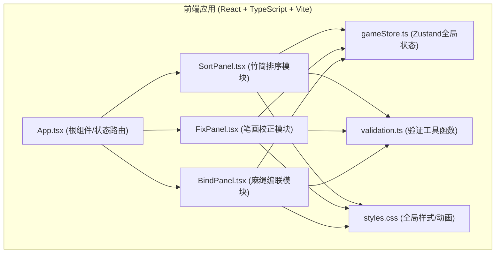
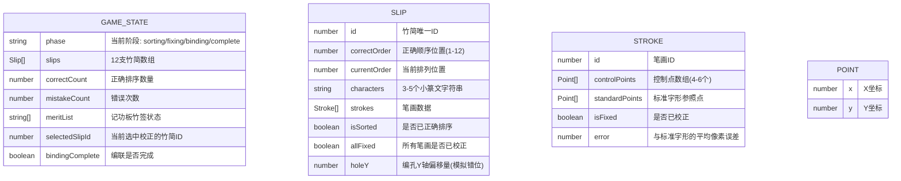

## 1. 架构设计



## 2. 技术描述

- **前端框架**: React@18 + TypeScript@5 + Vite@5
- **状态管理**: Zustand@4（轻量级全局状态）
- **动画库**: Framer Motion@11（流畅动画与交互反馈）
- **拖拽库**: react-dnd@16 + react-dnd-html5-backend@16（竹简拖拽）
- **构建工具**: Vite@5（极速开发与构建）
- **路径别名**: @ → src/（简化模块导入）
- **字体**: Google Fonts 小篆字体（Noto Serif SC + 自定义小篆字体）
- **后端**: 无（纯前端交互应用）
- **数据库**: 无（所有数据为Mock数据，存储在内存中）

## 3. 路由定义

| 路由 | 用途 |
|------|------|
| / (根路由) | 单页应用，通过gameStore中的phase状态切换三个阶段视图 |

阶段状态机：
- `sorting` → 竹简排序阶段
- `fixing` → 笔画校正阶段  
- `binding` → 麻绳编联阶段
- `complete` → 完成展示阶段

## 4. 数据模型

### 4.1 数据模型定义



### 4.2 TypeScript类型定义

```typescript
// 点坐标
interface Point {
  x: number;
  y: number;
}

// 笔画
interface Stroke {
  id: number;
  controlPoints: Point[];
  standardPoints: Point[];
  isFixed: boolean;
  error: number;
}

// 竹简
interface Slip {
  id: number;
  correctOrder: number;
  currentOrder: number;
  characters: string;
  strokes: Stroke[];
  isSorted: boolean;
  allFixed: boolean;
  holeY: number;
}

// 游戏阶段
type GamePhase = 'sorting' | 'fixing' | 'binding' | 'complete';

// 游戏状态
interface GameState {
  phase: GamePhase;
  slips: Slip[];
  correctCount: number;
  mistakeCount: number;
  meritList: string[]; // 'green' | 'red'
  selectedSlipId: number | null;
  boundHoles: number[]; // 已穿绳的孔位ID
  bindingComplete: boolean;
}
```

## 5. 核心模块职责

### 5.1 stores/gameStore.ts
- 管理全局游戏状态
- 提供actions：setPhase, updateSlipOrder, fixStroke, bindHole等
- 计算衍生状态：allSorted, allFixed等

### 5.2 modules/SortPanel.tsx
- 渲染散乱竹简和编联区
- 处理竹简拖拽逻辑（react-dnd）
- 调用validation.ts验证简距和孔位
- 渲染记功板
- 错误/正确反馈动画

### 5.3 modules/FixPanel.tsx
- 竹简放大视图（2倍）
- 渲染笔画控制点（红色圆点）
- 处理控制点拖拽
- 实时计算校正误差
- 墨痕渐变效果
- 标准字形半透明参照

### 5.4 modules/BindPanel.tsx
- 渲染线轴和麻绳
- 处理麻绳拖动画布
- 孔位发光效果
- 穿绳验证逻辑
- 打结动画（framer-motion）
- 简册卷起动画
- 完成印章与粒子效果

### 5.5 utils/validation.ts
- `calculateGapDeviation()`: 计算简距偏差（标准2px，>1px提示）
- `calculateHoleOffset()`: 计算上下孔位垂直偏移（>3px判定错位）
- `calculateStrokeError()`: 计算笔画与标准字形的平均像素误差（<5px合格）

### 5.6 styles.css
- 全局CSS变量（颜色、尺寸）
- 麻布纹理背景
- 木质边框样式
- 绢帛标题样式
- 火漆封印装饰
- 动画关键帧（抖动、发光、卷起、粒子等）
