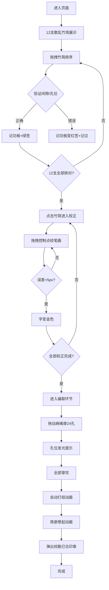

## 1. 产品概述
汉代简牍修复交互工具，让用户以虚拟刀笔吏的身份完成《仓颉篇》残卷的竹简排序、刻字校正与编联成册，体验汉代校勘流程。

- 核心目标：通过沉浸式交互体验汉代简牍制作工艺，兼具文化教育与游戏性
- 目标用户：历史文化爱好者、书法爱好者、教育场景学习者
- 市场价值：文化传播类交互产品，可用于博物馆数字化展示、在线教育等场景

## 2. 核心特性

### 2.1 用户角色
| 角色 | 注册方式 | 核心权限 |
|------|----------|----------|
| 刀笔吏（用户） | 无需注册，直接进入 | 完成竹简排序、笔画校正、麻绳编联三个环节 |

### 2.2 功能模块
1. **竹简排序模块**：12支散乱竹简，根据篆字字形连贯性和编绳孔位拖拽排序
2. **笔画校正模块**：点击竹简展开放大视图，拖拽控制点校正歪斜笔画
3. **麻绳编联模块**：拖动麻绳穿过所有编孔，完成简册编联与最终卷起

### 2.3 页面详情
| 页面名称 | 模块名称 | 功能描述 |
|----------|----------|----------|
| 主页面 | 竹简排序模块 | 展示散乱竹简，拖拽到编联区排序，实时计算间隙和孔位偏差，记功板记录成绩 |
| 主页面 | 笔画校正模块 | 点击竹简进入放大视图，拖拽控制点校正笔画，与标准字形对比计算误差 |
| 主页面 | 麻绳编联模块 | 拖动麻绳穿过编孔，孔位发光提示，完成后打结卷起，弹出完成印章 |
| 主页面 | 全局装饰 | 麻布背景、木质边框、绢帛标题、火漆封印等汉代风格装饰元素 |

## 3. 核心流程

用户进入页面 → 看到12支散乱竹简 → 拖拽竹简到编联区排序 → 系统验证间隙和孔位偏差 → 正确则记功板加绿色竹签，错误则变红记过 → 12支全部排对 → 点击任意竹简进入笔画校正 → 拖拽控制点拉直笔画 → 误差小于5px则合格变金色 → 所有字校正完成 → 进入编联环节 → 拖动麻绳穿过24个编孔 → 孔位发光 → 全部穿完自动打结 → 简册卷起动画 → 弹出"校勘已讫"印章 → 完成。

## 4. 用户界面设计

### 4.1 设计风格
- **主色调**：棕黄（#c4a46c）、墨黑（#1a0a00）、朱红（#b22222）、铜绿（#2e4a2e）四种主色
- **背景**：老旧麻布纹理（#c4a46c，带横向细线）
- **边框**：磨损木质边框（#5a3e1a，宽10px，带木纹）
- **标题**：绢帛横幅（#e8d5b7），小篆字体，墨色#2b1a0a，两侧垂绸带
- **装饰**：火漆封印（圆形，直径40px，红色#b22222，印文"汉·校书"）
- **竹简**：正面浅黄#d4c294，背面淡青#a8b5a0，长60px宽15px
- **交互反馈**：悬停时0.3px暖黄光晕（#ffa500），点击缩放动画，拖拽弹性形变，错误时抖动闪烁

### 4.2 页面设计概览
| 页面名称 | 模块名称 | UI元素 |
|----------|----------|--------|
| 主页面 | 竹简排序模块 | 12支散乱竹简（带隐藏序号）、编联区、记功板（右侧竖排竹签）、间隙/孔位偏差提示 |
| 主页面 | 笔画校正模块 | 放大竹简视图（2倍）、篆字笔画控制点（红色圆点）、标准字形参照线（半透灰）、墨痕渐变效果、误差计算显示 |
| 主页面 | 麻绳编联模块 | 上方线轴、麻绳（#8b6f47，双股纹理）、编孔（孔径4px）、孔位发光效果、打结动画、卷起动画、完成印章（粒子飘落） |
| 主页面 | 全局装饰 | 麻布背景、木质边框、绢帛标题横幅、火漆封印、整体古旧风格 |

### 4.3 响应式
- 桌面端优先设计，固定布局，竹简尺寸按像素精确控制
- 支持触摸设备拖拽操作
- 最小窗口宽度1024px以保证竹简排列空间

### 4.4 动画与交互细节
- **拖拽响应**：≤50ms，FPS≥55
- **动画帧率**：≥30fps
- **竹简拖拽**：transform: skew(-2deg) 持续0.1秒弹性形变
- **点击反馈**：缩放0.95→1.0，持续0.15秒
- **悬停效果**：0.3px暖黄光晕
- **错误反馈**：抖动0.2秒+闪烁淡红#ff6b6b背景
- **编孔发光**：#ffd700，持续0.3秒
- **简册卷起**：从右向左卷曲，耗时2秒
- **印章粒子**：红底白文"校勘已讫"，带粒子飘落
