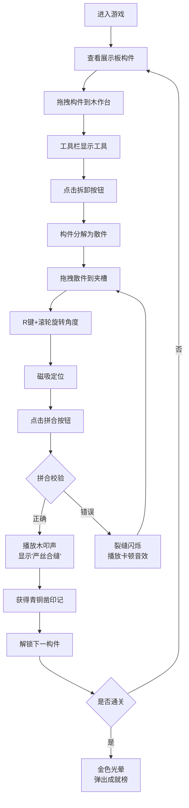

## 1. 产品概述

"匠作榫卯"是一款古代榫卯结构拆解与拼合验证的互动教育游戏，用户扮演北宋少府监匠人，在虚拟作坊中学习和体验中国传统木作技艺。通过沉浸式的互动体验，让用户了解榫卯结构的原理和工艺价值。

- 核心目的：传承中国传统木作文化，让用户以游戏化方式学习榫卯结构知识
- 目标用户：对中国传统文化、古代工艺、建筑历史感兴趣的各年龄段用户
- 市场价值：将传统技艺数字化，以寓教于乐的方式推广非物质文化遗产

## 2. 核心功能

### 2.1 用户角色

| 角色 | 注册方式 | 核心权限 |
|------|----------|----------|
| 少府监匠人 | 无需注册，直接进入 | 选择构件、拆卸操作、拼合验证、查看成就 |

### 2.2 功能模块

1. **主场景**：CSS 绘制的北宋将作监工坊剖面图，包含展示板、木作台、工具栏
2. **构件展示与选择**：墙上展示板陈列多种榫卯构件，支持拖拽选择
3. **拆卸系统**：使用手摇钻、木槌等工具沿分割线拆解构件
4. **拼合系统**：拖拽旋转散件，按正确顺序和方向拼合，带磁吸和校验
5. **音效反馈**：Web Audio API 模拟木叩声、卡顿声等音效
6. **工部日志**：记录进度、拼合次数、耗时、青铜凿印记
7. **行进目录**：渐进式解锁复杂构件，点亮木雕图标
8. **成就系统**：通关后金色光晕效果和成就榜

### 2.3 页面详情

| 页面名称 | 模块名称 | 功能描述 |
|----------|----------|----------|
| 主场景 | 工坊背景 | CSS 绘制青砖地面、木柱、墙壁、展示板、木作台 |
| 主场景 | 构件展示板 | 陈列 3-4 件榫卯构件，支持拖拽到木作台 |
| 主场景 | 木作台区域 | 接收构件、夹槽固定、散件网格区、拼合动画 |
| 主场景 | 工具栏 | 手摇钻、木槌、三角刮刀三件工具，点击切换操作模式 |
| 主场景 | 拆卸按钮 | 触发构件沿虚线分割线分解动画 |
| 主场景 | 拼合按钮 | 触发拼合校验，播放音效和动画 |
| 右侧面板 | 工部日志 | 显示构件名称、拼合次数、总耗时、青铜凿印记 |
| 右侧面板 | 行进目录 | 展示所有构件解锁进度，点亮木雕图标 |
| 弹窗 | 成就榜 | 通关后展示所有成就和金色光晕 |

## 3. 核心流程

用户进入游戏后，首先看到北宋将作监工坊场景，墙上展示板挂着几件榫卯构件。用户从展示板拖拽一件构件到木作台上，左侧出现三件工具。点击拆卸按钮后，构件分解为散件滑落到右侧网格区。用户拖拽散件到夹槽中，可按 R 键+滚轮旋转角度，距离夹槽 15px 内自动磁吸。点击拼合按钮后，系统校验顺序和方向，正确则播放木叩声显示"严丝合缝"，错误则出现裂缝闪烁。每次成功获得青铜凿印记并解锁下一个更复杂的构件，从直榫→燕尾榫→十字搭接榫→翘昂组合逐步进阶。

## 4. 用户界面设计

### 4.1 设计风格

**配色方案（暖木色系）：**
- 主背景：#f5deb3 小麦色
- 操作区：#f4e4c1
- 按钮：#d4a76a 带 #5d3a1a 深褐描边
- 青砖地面：#6b7b6b
- 木柱：#6b4e3a
- 展示板背景：#5d3a1a 深褐色，带菱形凹槽间距 20px
- 木构件：#c47e3a 到 #a0522d 渐变
- 木纹：#d4a76a
- 青铜凿印记：#c47e3a 圆形徽章
- 裂缝错误：#ff4500 橙色发光描边
- 金色光晕：径向渐变 #ffd700 到透明
- 未解锁图标背景：#1a1a1a

**字体选择：**
- 标题：使用具有书法韵味的字体，如 "Ma Shan Zheng" 或 "ZCOOL XiaoWei"，营造古风氛围
- 正文：清晰易读的宋体类字体，如 "Noto Serif SC"
- 按钮和交互文字：中等粗细，突出可点击性

**按钮样式：**
- 3D 凸起效果，深褐色描边 2px
- 悬停时颜色变深，有轻微下沉动画
- 点击时按压效果，0.2s 过渡
- 圆角 4px，保持古朴方正感

**布局风格：**
- 剖面图式工坊布局，层次分明
- 左侧为木作操作区，右侧为信息面板
- 不对称布局，左侧占 65%，右侧占 35%
- 移动端自动上下堆叠

**动画效果：**
- 所有交互 0.2~0.3 秒 ease-out 过渡
- 拖拽时半透明阴影 rgba(0,0,0,0.3)
- 构件分解滑落动画
- 拼合时榫头滑动嵌入动画
- 错误时 0.5 秒裂缝闪烁
- 行进目录渐进点亮动画

### 4.2 页面设计概述

| 页面名称 | 模块名称 | UI 元素 |
|----------|----------|---------|
| 主场景 | 工坊背景 | 青砖地面纹理、木柱透视、展示板菱形凹槽、木作台木纹 |
| 主场景 | 榫卯构件 | CSS 绘制榫头凸起和卯眼凹陷，木质渐变纹理 |
| 主场景 | 工具图标 | 手摇钻（棕色渐变+银色钻头）、木槌（铜色槌头+木柄）、三角刮刀（银色三角+木柄） |
| 主场景 | 散件网格 | 2×3 网格，浅灰边框，每格 40px×40px，间距 8px |
| 主场景 | 夹槽 | 4px 宽横向凹槽，磁吸范围 15px |
| 右侧面板 | 工部日志 | 仿古卷轴样式，木色边框，青铜凿徽章 |
| 右侧面板 | 行进目录 | 木雕图标队列，未解锁黑色背景，已点亮木质纹理 |
| 弹窗 | 成就榜 | 金色边框，光晕效果，渐变背景 |

### 4.3 响应式设计

- **桌面端（≥ 1024px）**：左右分栏布局，左侧 65% 操作区，右侧 35% 日志面板
- **平板端（768px ~ 1023px）**：保持左右布局，调整比例为 60%/40%
- **移动端（≥ 360px）**：展示板和木作台上下堆叠，工具栏变为水平滚动条，日志面板移至底部或可折叠
- **触控优化**：增大可点击区域至 44px×44px，支持触摸拖拽和双指旋转
- **断点**：360px、768px、1024px

### 4.4 性能要求

- 动画帧率保持 60fps
- 滑动响应延迟 ≤ 16ms
- 使用 CSS transform 和 opacity 进行动画，避免重排重绘
- 拖拽操作使用 will-change 优化
- 限制同时进行的动画数量，避免过度绘制
