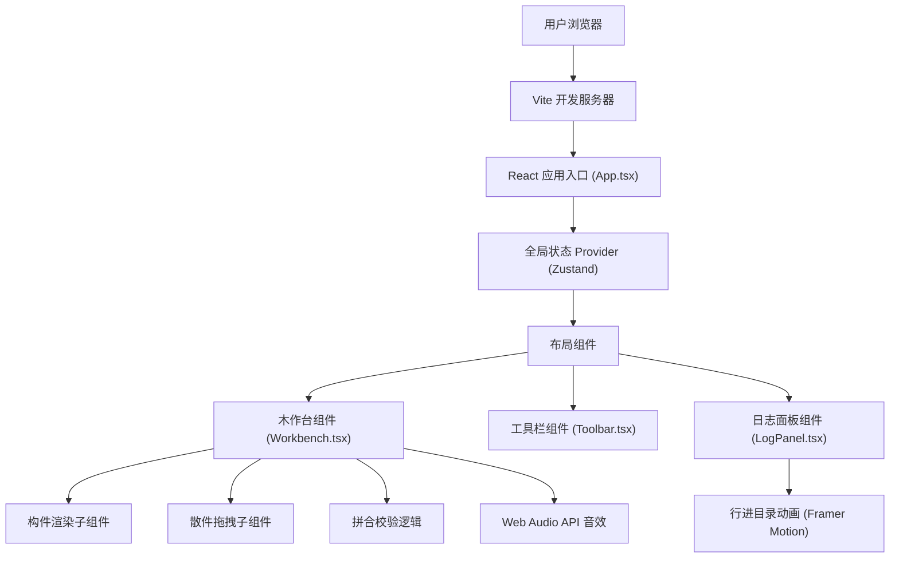

## 1. 架构设计

本项目为纯前端单页应用，采用 React + TypeScript + Vite 技术栈，使用 Zustand 进行状态管理，Framer Motion 实现动画效果。所有视觉元素均通过 CSS 绘制，无需后端服务。



## 2. 技术描述

- **前端框架**：React 18 + TypeScript
- **构建工具**：Vite 5.x，配置 @ 路径别名
- **状态管理**：Zustand 4.x，集中管理游戏状态
- **动画库**：Framer Motion 11.x，实现流畅的过渡动画
- **样式方案**：CSS Modules + CSS 变量，实现主题化管理
- **音效**：Web Audio API 原生实现，无需额外音频文件
- **拖拽**：原生 HTML5 Drag and Drop API + 鼠标事件，实现自定义拖拽逻辑
- **响应式**：CSS Media Queries + 弹性布局

## 3. 项目结构

```
d:\Solocoder\VersionFast\tasks\auto8\
├── index.html                          # 入口 HTML
├── package.json                        # 依赖配置
├── tsconfig.json                       # TypeScript 配置
├── vite.config.js                      # Vite 配置
└── src/
    ├── App.tsx                         # 根组件
    ├── types.ts                        # TypeScript 类型定义
    ├── store/
    │   └── gameStore.ts                # Zustand 状态管理
    ├── components/
    │   ├── Workbench.tsx               # 木作台组件
    │   ├── Toolbar.tsx                 # 工具栏组件
    │   ├── LogPanel.tsx                # 日志面板组件
    │   ├── MortiseTenonComponent.tsx   # 榫卯构件渲染组件
    │   ├── LoosePiece.tsx              # 散件组件
    │   └── DisplayBoard.tsx            # 展示板组件
    ├── hooks/
    │   ├── useDragAndDrop.ts           # 拖拽 Hook
    │   ├── useAudio.ts                 # 音效 Hook
    │   └── useMagneticSnap.ts          # 磁吸 Hook
    ├── utils/
    │   ├── assemblyValidator.ts        # 拼合校验工具
    │   └── woodTextureCSS.ts           # 木纹 CSS 生成工具
    └── styles/
        ├── variables.css               # CSS 变量
        ├── workshop.css                # 工坊场景样式
        └── animations.css              # 动画关键帧
```

## 4. 核心数据模型

### 4.1 类型定义

```typescript
// src/types.ts

export enum ComponentType {
  STRAIGHT_TENON = 'straight_tenon',      // 直榫
  DOVETAIL = 'dovetail',                  // 燕尾榫
  CROSS_LAP = 'cross_lap',                // 十字搭接榫
  DOUGONG_QIAOANG = 'dougong_qiaoang'     // 翘昂组合
}

export enum PieceShape {
  TENON = 'tenon',        // 榫头
  MORTISE = 'mortise',    // 卯眼
  BRIDGE = 'bridge',      // 连接部
  DECORATIVE = 'decorative' // 装饰件
}

export interface LoosePiece {
  id: string;
  componentId: string;
  shape: PieceShape;
  correctOrder: number;   // 正确的拼合顺序 (1-based)
  correctRotation: number; // 正确的旋转角度 (0, 90, 180, 270)
  currentRotation: number; // 当前旋转角度
  isPlaced: boolean;      // 是否已放置到夹槽
  placedSlotIndex: number | null; // 放置的槽位索引
  cssStyle: React.CSSProperties; // CSS 样式用于绘制
}

export interface MortiseTenon {
  id: string;
  type: ComponentType;
  name: string;
  description: string;
  difficulty: number;     // 1-5 难度等级
  pieces: LoosePiece[];
  assemblySteps: string[]; // 组装步骤说明
  cssStyle: React.CSSProperties; // 整体样式
  splitLines: SplitLine[]; // 分割线（用于拆卸动画）
}

export interface SplitLine {
  id: string;
  startX: number;
  startY: number;
  endX: number;
  endY: number;
}

export enum GamePhase {
  IDLE = 'idle',           // 空闲，等待选择构件
  SELECTED = 'selected',   // 已选择构件，待拆卸
  DISASSEMBLING = 'disassembling', // 拆卸动画中
  DISASSEMBLED = 'disassembled',   // 已拆卸，待拼合
  ASSEMBLING = 'assembling',       // 拼合动画中
  SUCCESS = 'success',     // 拼合成功
  FAILED = 'failed'        // 拼合失败
}

export interface GameState {
  components: MortiseTenon[];
  currentComponentId: string | null;
  phase: GamePhase;
  slots: (LoosePiece | null)[]; // 夹槽槽位数组
  assemblyCount: number;         // 总拼合次数
  totalTime: number;             // 总耗时（秒）
  bronzeMarks: number;           // 青铜凿印记数量
  unlockedComponents: string[];  // 已解锁构件 ID 列表
  startTime: number | null;      // 当前构件开始时间
}

export interface GameActions {
  selectComponent: (id: string) => void;
  disassemble: () => void;
  placePiece: (pieceId: string, slotIndex: number) => void;
  removePiece: (slotIndex: number) => void;
  rotatePiece: (pieceId: string, delta: number) => void;
  validateAssembly: () => boolean;
  resetCurrentComponent: () => void;
  unlockNextComponent: () => void;
  incrementAssemblyCount: () => void;
  addBronzeMark: () => void;
  updateTotalTime: (seconds: number) => void;
}
```

### 4.2 状态管理设计

Zustand Store 采用单一状态树，通过 Immer 支持不可变更新：

```typescript
// src/store/gameStore.ts
import { create } from 'zustand';
import { immer } from 'zustand/middleware/immer';
import { GameState, GameActions, MortiseTenon, ComponentType } from '@/types';
import { COMPONENTS_DATA } from '@/data/components';

const initialState: Omit<GameState, keyof GameActions> = {
  components: COMPONENTS_DATA,
  currentComponentId: null,
  phase: 'idle',
  slots: [null, null, null, null, null],
  assemblyCount: 0,
  totalTime: 0,
  bronzeMarks: 0,
  unlockedComponents: [ComponentType.STRAIGHT_TENON],
  startTime: null,
};

export const useGameStore = create<GameState & GameActions>()(
  immer((set, get) => ({
    ...initialState,
    
    selectComponent: (id) => {
      set((state) => {
        state.currentComponentId = id;
        state.phase = 'selected';
        state.startTime = Date.now();
        state.slots = state.slots.map(() => null);
      });
    },
    
    disassemble: () => {
      set((state) => {
        state.phase = 'disassembling';
      });
      // 动画完成后设置为 disassembled
      setTimeout(() => {
        set((state) => {
          state.phase = 'disassembled';
        });
      }, 800);
    },
    
    placePiece: (pieceId, slotIndex) => {
      set((state) => {
        const component = state.components.find(c => c.id === state.currentComponentId);
        if (!component) return;
        
        const piece = component.pieces.find(p => p.id === pieceId);
        if (!piece) return;
        
        // 如果该槽位已有散件，先移除
        if (state.slots[slotIndex]) {
          const existingPiece = state.slots[slotIndex]!;
          existingPiece.isPlaced = false;
          existingPiece.placedSlotIndex = null;
        }
        
        // 如果散件已在其他槽位，先移除原槽位
        if (piece.isPlaced && piece.placedSlotIndex !== null) {
          state.slots[piece.placedSlotIndex] = null;
        }
        
        piece.isPlaced = true;
        piece.placedSlotIndex = slotIndex;
        state.slots[slotIndex] = piece;
      });
    },
    
    removePiece: (slotIndex) => {
      set((state) => {
        const piece = state.slots[slotIndex];
        if (piece) {
          piece.isPlaced = false;
          piece.placedSlotIndex = null;
          state.slots[slotIndex] = null;
        }
      });
    },
    
    rotatePiece: (pieceId, delta) => {
      set((state) => {
        const component = state.components.find(c => c.id === state.currentComponentId);
        if (!component) return;
        
        const piece = component.pieces.find(p => p.id === pieceId);
        if (piece) {
          piece.currentRotation = (piece.currentRotation + delta + 360) % 360;
        }
      });
    },
    
    validateAssembly: () => {
      const state = get();
      const component = state.components.find(c => c.id === state.currentComponentId);
      if (!component) return false;
      
      // 检查所有散件是否都已放置且顺序、角度正确
      const placedPieces = state.slots.filter(s => s !== null) as LoosePiece[];
      if (placedPieces.length !== component.pieces.length) return false;
      
      for (let i = 0; i < component.pieces.length; i++) {
        const slotPiece = state.slots[i];
        if (!slotPiece) return false;
        
        const expectedPiece = component.pieces.find(p => p.correctOrder === i + 1);
        if (!expectedPiece) return false;
        
        if (slotPiece.id !== expectedPiece.id) return false;
        if (slotPiece.currentRotation !== expectedPiece.correctRotation) return false;
      }
      
      return true;
    },
    
    resetCurrentComponent: () => {
      set((state) => {
        const component = state.components.find(c => c.id === state.currentComponentId);
        if (!component) return;
        
        component.pieces.forEach(p => {
          p.isPlaced = false;
          p.placedSlotIndex = null;
          p.currentRotation = 0;
        });
        
        state.slots = state.slots.map(() => null);
        state.phase = 'disassembled';
      });
    },
    
    unlockNextComponent: () => {
      set((state) => {
        const currentIndex = state.components.findIndex(c => c.id === state.currentComponentId);
        const nextIndex = currentIndex + 1;
        
        if (nextIndex < state.components.length) {
          const nextComponent = state.components[nextIndex];
          if (!state.unlockedComponents.includes(nextComponent.id)) {
            state.unlockedComponents.push(nextComponent.id);
          }
        }
      });
    },
    
    incrementAssemblyCount: () => {
      set((state) => {
        state.assemblyCount += 1;
      });
    },
    
    addBronzeMark: () => {
      set((state) => {
        state.bronzeMarks += 1;
      });
    },
    
    updateTotalTime: (seconds) => {
      set((state) => {
        state.totalTime += seconds;
      });
    },
  }))
);
```

## 5. 核心组件设计

### 5.1 App.tsx - 根组件

负责整体布局，将页面分为左侧操作区和右侧日志面板，移动端自动调整为上下布局。

```typescript
// src/App.tsx
import { useGameStore } from '@/store/gameStore';
import Workbench from '@/components/Workbench';
import Toolbar from '@/components/Toolbar';
import LogPanel from '@/components/LogPanel';
import DisplayBoard from '@/components/DisplayBoard';
import '@/styles/variables.css';
import '@/styles/workshop.css';

export default function App() {
  const { phase } = useGameStore();
  
  return (
    <div className="app-container">
      <div className="workshop-scene">
        {/* CSS 绘制的工坊背景 */}
        <div className="workshop-bg">
          <div className="brick-floor" />
          <div className="wooden-pillar left" />
          <div className="wooden-pillar right" />
          <div className="back-wall" />
        </div>
        
        <div className="main-content">
          <div className="left-area">
            {/* 展示板 */}
            <DisplayBoard />
            
            {/* 操作区：木作台 + 工具栏 */}
            <div className="work-area">
              {phase !== 'idle' && <Toolbar />}
              <Workbench />
            </div>
          </div>
          
          <div className="right-area">
            <LogPanel />
          </div>
        </div>
      </div>
    </div>
  );
}
```

### 5.2 Workbench.tsx - 木作台组件

核心交互组件，负责：
- 展示从展示板拖来的构件
- 接收散件放置
- 管理夹槽和散件网格区
- 拼合校验逻辑
- 播放动画和音效

### 5.3 Toolbar.tsx - 工具栏组件

渲染三件工具图标，带 tooltip，点击后切换操作模式。

### 5.4 LogPanel.tsx - 日志面板组件

展示构件信息、拼合次数、耗时、青铜凿印记，以及行进目录（使用 Framer Motion 实现点亮动画）。

### 5.5 自定义 Hooks

- **useDragAndDrop.ts**：封装拖拽逻辑，支持鼠标和触摸事件
- **useAudio.ts**：封装 Web Audio API，提供木叩声、卡顿声等音效
- **useMagneticSnap.ts**：实现磁吸效果，计算散件与槽位的距离

## 6. 性能优化策略

1. **CSS 动画优化**：
   - 仅使用 `transform` 和 `opacity` 属性进行动画
   - 对拖拽元素添加 `will-change: transform`
   - 使用 `contain: layout paint size` 隔离重绘区域

2. **React 性能优化**：
   - 使用 `React.memo` 包装频繁渲染的子组件
   - 使用 `useCallback` 和 `useMemo` 缓存回调和计算值
   - 状态更新采用批量处理

3. **状态管理优化**：
   - Zustand 选择器（selector）精确订阅所需状态
   - 避免不必要的重渲染

4. **动画帧率控制**：
   - 使用 `requestAnimationFrame` 同步动画
   - 复杂动画采用分阶段执行
   - 页面不可见时暂停动画

## 7. 响应式断点

| 断点 | 布局调整 |
|------|----------|
| ≥ 1024px | 左右分栏，左侧 65%，右侧 35% |
| 768px ~ 1023px | 左右分栏，左侧 60%，右侧 40% |
| 360px ~ 767px | 上下堆叠，工具栏水平滚动，日志面板可折叠 |
| < 360px | 缩放适配，保持核心功能可用 |
