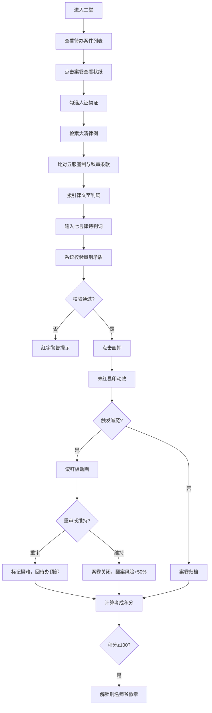

## 1. 产品概述

清代江南县衙刑名幕友审案模拟器是一款沉浸式的法律史题材全栈Web应用。用户扮演精通风土断案的老幕友，在虚拟县衙二堂审理各类案件，通过检索《大清律例》、比对五服图制与秋审条款，最终以七言律诗格式书写判词。

- **主要用途**：寓教于乐的清代法制史体验与法律推理训练
- **目标用户**：历史爱好者、法律从业者、学生群体
- **产品价值**：以游戏化方式呈现清代司法体系，让用户深入理解传统中国法律文化

## 2. 核心功能

### 2.1 用户角色

| 角色 | 注册方式 | 核心权限 |
|------|----------|----------|
| 幕友 | 无需注册，自动进入 | 案件审理、律例检索、判词书写、量刑判定 |

### 2.2 功能模块

1. **案件受理与卷宗管理**：左侧待办案件列表，右侧状纸详情展示
2. **律例检索与比附**：3D双层书架，支持六部分类与笔画索引检索
3. **判词生成与纠错**：七言律诗判词输入、自动校验量刑矛盾、朱红县印画押
4. **喊冤与复核机制**：滚钉板动画、发回重审/维持原判选择
5. **积分与考成系统**：判案评分、成就徽章解锁

### 2.3 页面详情

| 页面名称 | 模块名称 | 功能描述 |
|-----------|-------------|---------------------|
| 主工作台 | 卷宗列表 | 展示待办案件（案号、案由、原告、收案时辰、紧急程度），颜色标记（红签命案、蓝签田土、绿签户婚） |
| 主工作台 | 状纸详情 | 竖排繁体汉字展示状纸全文，人证圆形头像、物证简笔画图标，可勾选证据 |
| 主工作台 | 律例书架 | 3D翻转书架，左侧六部分类，右侧笔画索引，关键词搜索高亮律文 |
| 主工作台 | 判词面板 | 朱红边框判词区，七言律诗校验，画押动效，喊冤弹窗 |
| 主工作台 | 积分考成 | 评分展示、成就徽章、翻案风险提示 |

## 3. 核心流程

## 4. 用户界面设计

### 4.1 设计风格

- **主色调**：深灰 #2a2a2a（背景）、朱红 #800000（强调）、墨黑 #0a0a0a（文字）
- **辅助色**：淡黄 #f5deb3（高亮）、深褐 #4a2a0a（外框）、金线 #d4a76a（内框）、木色 #8b5e3c（钉板）、银色 #c0c0c0（钉尖）
- **书架颜色**：黑漆 #1a0a00
- **按钮样式**：仿古线装书边角，双线边框（外深褐内金线），圆角6px，悬停内阴影
- **字体**：楷体（判词区）、竖排繁体（状纸）
- **排版**：仿古籍右起竖排，writing-mode: vertical-rl

### 4.2 页面设计概述

| 页面名称 | 模块名称 | UI元素 |
|-----------|-------------|-------------|
| 主工作台 | 卷宗列表 | 卡片式布局，颜色标签（红/蓝/绿），悬停上浮效果 |
| 主工作台 | 状纸详情 | 竖排文字容器，人证头像圆形排列，物证图标网格 |
| 主工作台 | 律例书架 | 3D透视翻转，格高80px，搜索框置顶，匹配高亮 |
| 主工作台 | 判词面板 | 朱红边框3px，圆角10px，县印动效（gif压制） |
| 主工作台 | 喊冤动画 | CSS关键帧假人滚动，钉板木色，钉尖银色 |
| 主工作台 | 成就徽章 | 铜质圆形獬豸图案，radial-gradient金属光泽 |

### 4.3 响应式

- **桌面端（1440px+）**：三栏布局（卷宗列表 | 判案区 | 书架）
- **平板端（768px-1439px）**：两栏布局，书架变为底部可横向滚动标签栏
- **移动端（375px-767px）**：单栏布局，卷宗列表变为抽屉式侧滑面板
- **触控优化**：按钮最小48x48px，滑动手势支持侧滑抽屉

### 4.4 动效规范

- 案件列表切换：0.3s ease-in-out
- 书架翻转动画：0.5s rotateY
- 判决模板填入：0.3s fade-in
- 喊冤动画：0.6s 假人滚动关键帧
- 县印压制：0.4s scale-down + opacity
- 帧率要求：≥45fps
- 判词校验响应：≤200ms
