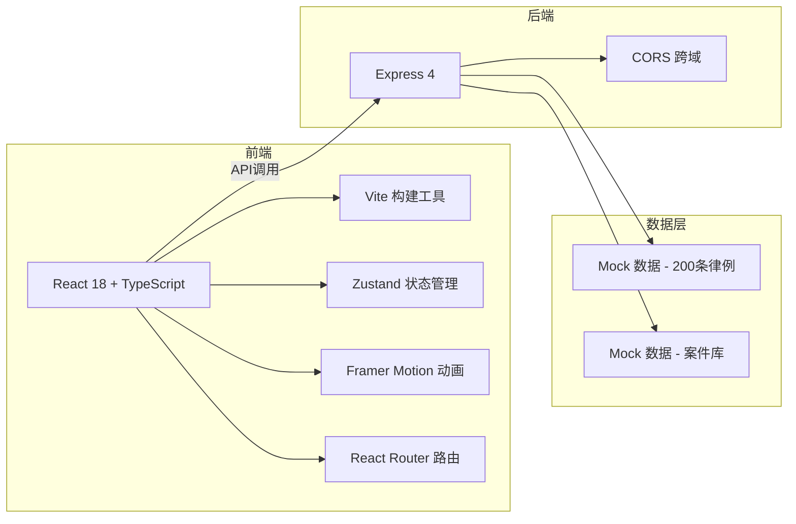
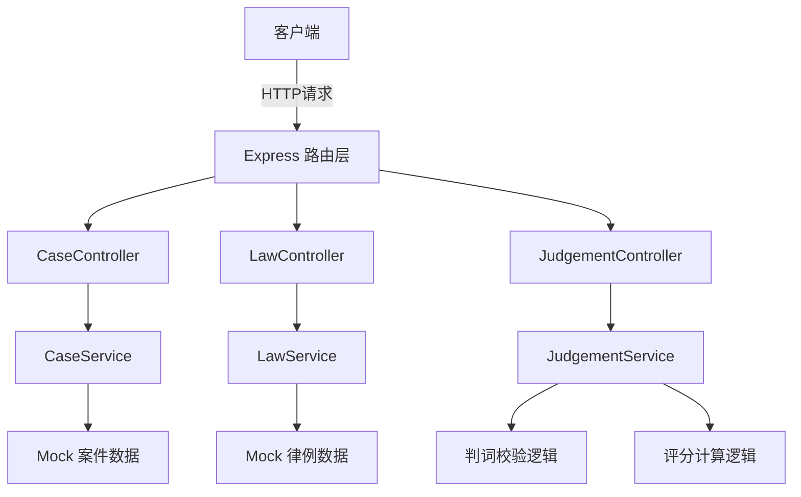
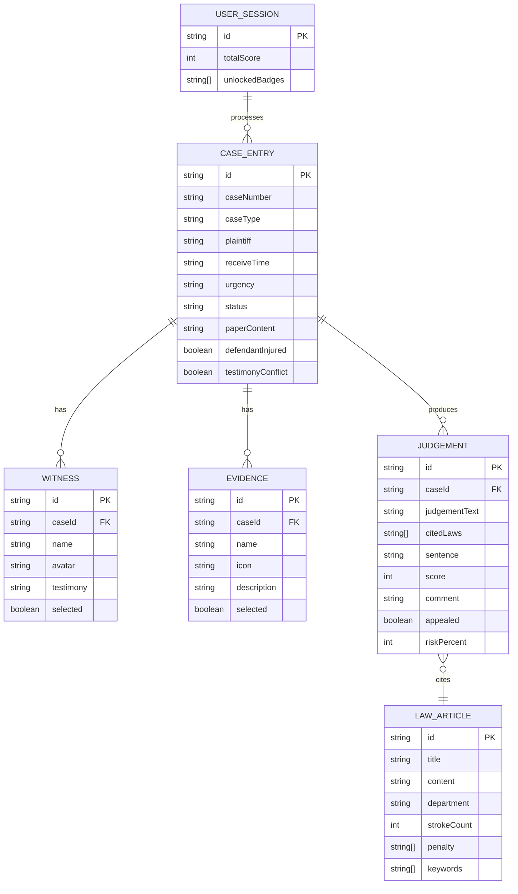

## 1. 架构设计



## 2. 技术描述

- **前端**：React 18 + TypeScript + Vite + Zustand + Framer Motion + Tailwind CSS
- **初始化工具**：vite-init react-express-ts 模板
- **后端**：Express 4 + CORS
- **数据库**：内置Mock数据，无需外部数据库
- **图标库**：Lucide React

## 3. 路由定义

| 路由 | 用途 |
|-------|---------|
| / | 主工作台页面，包含卷宗列表、判案区、书架 |

## 4. API 定义

### 4.1 获取案件列表
```typescript
// GET /api/cases
// 响应：CaseEntry[]
interface CaseEntry {
  id: string;
  caseNumber: string;
  caseType: 'homicide' | 'land' | 'marriage';
  plaintiff: string;
  receiveTime: string;
  urgency: 'high' | 'medium' | 'low';
  status: 'pending' | 'review' | 'closed';
  paperContent: string;
  witnesses: Witness[];
  evidences: Evidence[];
  defendantInjured: boolean;
  testimonyConflict: boolean;
}

interface Witness {
  id: string;
  name: string;
  avatar: string;
  testimony: string;
  selected: boolean;
}

interface Evidence {
  id: string;
  name: string;
  icon: string;
  description: string;
  selected: boolean;
}
```

### 4.2 获取律例库
```typescript
// GET /api/laws
// 响应：LawArticle[]
interface LawArticle {
  id: string;
  title: string;
  content: string;
  department: '吏' | '户' | '礼' | '兵' | '刑' | '工';
  strokeCount: number;
  penalty: string[];
  keywords: string[];
}
```

### 4.3 搜索律例
```typescript
// GET /api/laws/search?keyword=xxx
// 响应：LawArticle[]
```

### 4.4 校验判词
```typescript
// POST /api/judgement/validate
// 请求：
interface ValidateRequest {
  judgementText: string;
  caseId: string;
  citedLaws: string[];
}
// 响应：
interface ValidateResponse {
  valid: boolean;
  errors: string[];
  warnings: string[];
}
```

### 4.5 提交判决
```typescript
// POST /api/judgement/submit
// 请求：
interface SubmitRequest {
  caseId: string;
  judgementText: string;
  citedLaws: string[];
  selectedWitnesses: string[];
  selectedEvidences: string[];
  sentence: string;
}
// 响应：
interface SubmitResponse {
  success: boolean;
  score: number;
  comment: string;
  triggerAppeal: boolean;
  riskPercent: number;
}
```

## 5. 服务器架构图



## 6. 数据模型

### 6.1 数据模型定义



## 7. 项目文件结构

```
.
├── package.json
├── vite.config.ts
├── tsconfig.json
├── index.html
├── src/
│   ├── types.ts
│   ├── store.ts
│   ├── main.tsx
│   ├── App.tsx
│   ├── index.css
│   ├── components/
│   │   ├── Desk.tsx
│   │   ├── CaseList.tsx
│   │   ├── CaseDetail.tsx
│   │   ├── LawBook.tsx
│   │   └── JudgementPanel.tsx
│   ├── hooks/
│   ├── utils/
│   │   └── judgementValidator.ts
│   └── pages/
│       └── MainDesk.tsx
├── server/
│   ├── server.ts
│   ├── controllers/
│   ├── services/
│   └── data/
│       ├── cases.ts
│       └── laws.ts
└── .trae/
    └── documents/
        ├── PRD.md
        └── TECH_ARCHITECTURE.md
```

## 8. 核心技术要点

1. **3D书架实现**：CSS `transform-style: preserve-3d` + `rotateY`，配合 Framer Motion 动画
2. **竖排文字**：CSS `writing-mode: vertical-rl` + `text-orientation: mixed`
3. **判词校验**：正则匹配量刑关键词，检测矛盾组合（如"杖一百"与"徒三年"是否合规）
4. **性能优化**：React.memo 包裹列表项，使用 `will-change` 提升动画性能
5. **搜索高亮**：正则替换匹配文本，包裹 `<mark>` 标签并应用淡黄背景
6. **县印动效**：CSS `@keyframes` + `transform: scale()` + `opacity` 模拟压制效果
7. **滚钉板动画**：CSS 关键帧实现假人滚动路径，钉板用 `linear-gradient` 模拟
