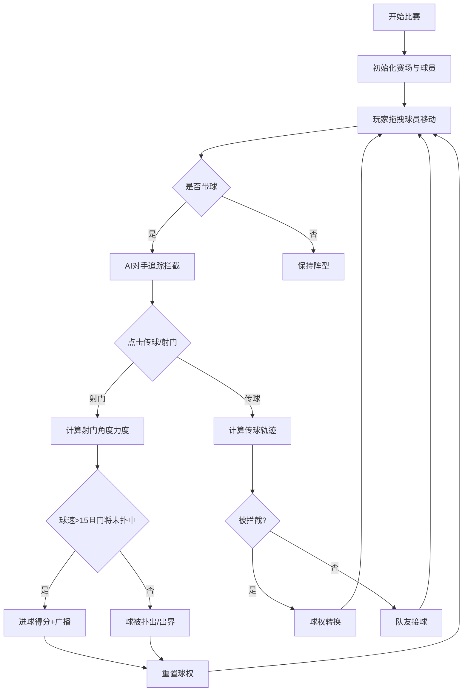

## 1. 产品概述
本产品是一个基于浏览器的古代蹴鞠比赛交互游戏，通过Three.js实现3D物理引擎，模拟唐代工笔画风格的视觉效果，解决虚拟环境中缺乏真实物理反馈和团队战术配合的问题。
- 核心目标：提供沉浸式的古代蹴鞠体验，融合策略操控、战术配合与真实物理反馈
- 目标用户：游戏爱好者、体育游戏玩家

## 2. 核心功能

### 2.1 用户角色
| 角色 | 注册方式 | 核心权限 |
|------|----------|----------|
| 玩家 | 无需注册 | 操控球员、调整战术、参与比赛 |

### 2.2 功能模块
1. **主赛场**：3D竞技场渲染、球员模型、球门、比分显示、时间显示
2. **球员操控**：鼠标拖拽移动、点击传球射门
3. **AI对手**：自动追踪、铲球拦截
4. **战术系统**：三种战术阵型切换
5. **体能系统**：体能条显示、疲劳机制
6. **得分系统**：射门判定、比分更新、球权重置

### 2.3 页面详情
| 页面名称 | 模块名称 | 功能描述 |
|---------|----------|----------|
| 主游戏界面 | 赛场区域 | 3D渲染球场、球员、皮鞠，处理物理碰撞 |
| 主游戏界面 | 顶部面板 | 显示古代时辰制比赛时间、红队与黄队比分 |
| 主游戏界面 | 左侧战术面板 | 三种战术切换按钮，带阵型移动动画 |
| 主游戏界面 | 右下角体能面板 | 显示球员当前体能状态列表 |
| 主游戏界面 | 赛场广播 | 进球时显示比分并重置球权 |

## 3. 核心流程

## 4. 用户界面设计
### 4.1 设计风格
- 主色调：唐代工笔画暖色调，主要色块为杏黄#f4c542、朱红#c03a2b、灰色#808080
- 背景色：浅米色#f5e6c8模拟宣纸质感
- 按钮风格：铜质金属光泽，hover高亮为#d4a76a
- 字体：采用古典风格字体，标题使用书法风格，正文使用清晰易读的衬线字体
- 布局：全屏响应式，中央主赛场占70%宽度
- 动画：球员移动和射门补间动画0.2秒，皮鞠滚动物理惯性效果

### 4.2 页面设计概述
| 页面名称 | 模块名称 | UI元素 |
|---------|----------|--------|
| 主游戏界面 | 赛场区域 | 青砖地面#664b3f，白色边线#ffffff，白色球门#ffffff，绿色网兜#3b7a3b，棕黄色皮鞠#8b5e3c |
| 主游戏界面 | 球员 | 杏黄马甲#f4c542（玩家）、朱红马甲#c03a2b（对手）、灰色门将#808080 |
| 主游戏界面 | 顶部面板 | 古代时辰时间显示、红队黄队比分面板 |
| 主游戏界面 | 战术面板 | 三个铜质按钮：稳守反击、中场控制、全线压上 |
| 主游戏界面 | 体能面板 | 5条绿色体能条，显示每位球员能量 |
| 主游戏界面 | 特效 | 尘土粒子特效、铲球腿部摆动动画、进球广播 |

### 4.3 响应式
- 桌面端优先，支持全屏响应式布局
- 中央赛场区域自适应窗口大小
- 触控设备支持触摸拖拽操作

### 4.4 3D场景指导
- 环境：浅米色宣纸质感背景，青砖地面纹理
- 光照：柔和暖色调主光，模拟古代室内/室外球场自然光
- 摄像机：俯视45度角，可轻微跟随皮球
- 动画：球员移动补间动画0.2秒，皮鞠滚动物理惯性
- 后处理：轻微暖色调滤镜，增强工笔画质感
- 性能：保持60FPS，响应时间低于100毫秒
