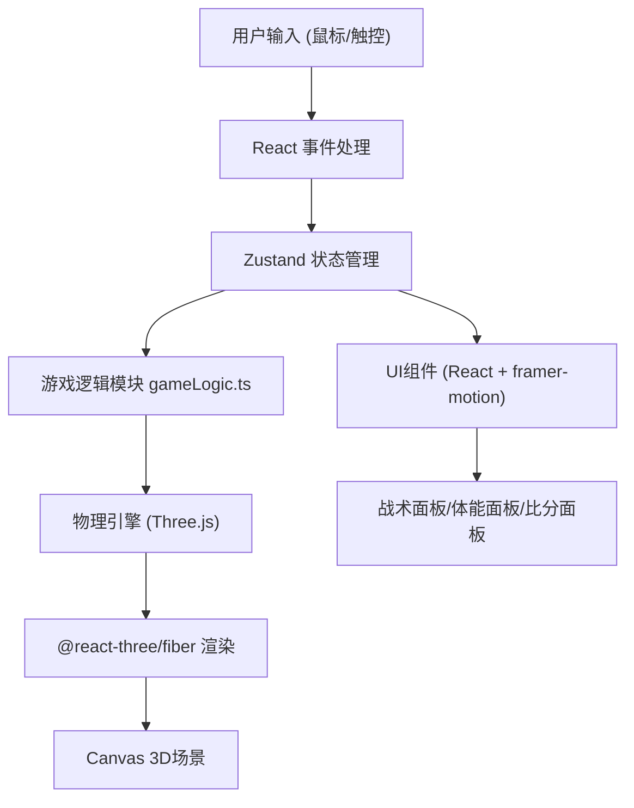

## 1. 架构设计


## 2. 技术描述
- 前端框架：React@18 + TypeScript@5 + Vite@5
- 3D引擎：three@0.160 + @react-three/fiber@8 + @react-three/drei@9
- 状态管理：zustand@4
- 动画库：framer-motion@10
- 构建工具：Vite@5 + @vitejs/plugin-react@4

## 3. 目录结构
```
src/
├── App.tsx                 # 主组件，初始化Three.js场景
├── gameLogic.ts            # 游戏逻辑模块（物理、AI、计算）
├── components/
│   ├── Player.tsx          # 球员组件
│   ├── Pitch.tsx           # 赛场组件
│   ├── Ball.tsx            # 皮鞠组件
│   ├── Goal.tsx            # 球门组件
│   ├── TacticsPanel.tsx    # 战术面板
│   ├── EnergyPanel.tsx     # 体能面板
│   ├── Scoreboard.tsx      # 比分面板
│   └── GameTime.tsx        # 时间显示组件
└── store/
    └── useGameStore.ts     # Zustand状态管理
```

## 4. 核心数据模型

### 4.1 球员状态
```typescript
interface Player {
  id: number;
  team: 'player' | 'ai' | 'goalkeeper';
  number: number;
  position: { x: number; z: number };
  targetPosition: { x: number; z: number };
  velocity: { x: number; z: number };
  energy: number;
  hasBall: boolean;
  isSliding: boolean;
}
```

### 4.2 皮球状态
```typescript
interface Ball {
  position: { x: number; y: number; z: number };
  velocity: { x: number; y: number; z: number };
  rotation: { x: number; y: number; z: number };
  lastTouchedBy: number | null;
}
```

### 4.3 游戏状态
```typescript
interface GameState {
  score: { player: number; ai: number };
  gameTime: number;
  isPaused: boolean;
  pauseTimer: number;
  currentTactics: 'defense' | 'midfield' | 'offense';
  tacticsTransition: number;
  ball: Ball;
  players: Player[];
  broadcastMessage: string | null;
}
```

## 5. 核心算法

### 5.1 物理碰撞检测
- 球员与球碰撞：圆形碰撞检测，半径0.5单位
- 球与球门碰撞：矩形边界检测
- 球与边界碰撞：反弹计算，摩擦系数0.95

### 5.2 AI行为决策
- 追踪带球球员：向量计算方向，最大速度3单位/秒
- 铲球判定：距离<2单位时触发，成功率=相对速度/10
- 门将扑救：预判球的落点，横向移动速度4单位/秒

### 5.3 射门力度计算
- 力度=拖拽距离×0.8，最大值25单位/秒
- 角度=点击位置与球门中心的夹角
- 进球判定：球速>15单位/秒 且 未被门将拦截

### 5.4 体能系统
- 带球/移动消耗：每秒5%
- 静止恢复：每秒2%
- 能量<10%时速度下降30%
- 疲劳暂停：游戏时间暂停5秒恢复

### 5.5 战术阵型
- 稳守反击：球员x坐标范围[-8, -2]
- 中场控制：球员x坐标范围[-2, 2]
- 全线压上：球员x坐标范围[2, 8]
- 切换动画0.5秒，线性插值

## 6. 性能优化
- 使用Three.js InstancedMesh渲染球员
- 物理计算限制在60Hz
- 使用requestAnimationFrame同步渲染
- 粒子系统使用对象池复用
- 状态更新使用Zustand选择性订阅
