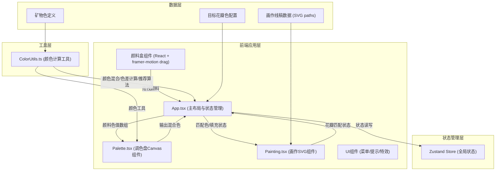
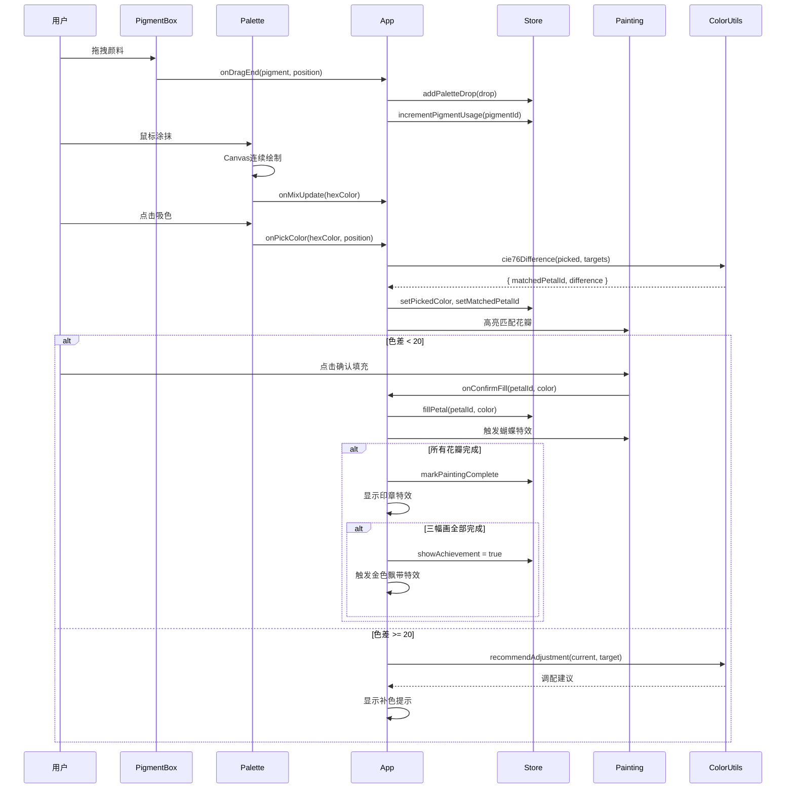

## 1. Architecture Design



## 2. Technology Description

- **前端框架**: React@18 + TypeScript@5
- **构建工具**: Vite@5 + @vitejs/plugin-react@4
- **状态管理**: zustand@4
- **动画库**: framer-motion@11
- **样式方案**: CSS Modules + CSS Variables（避免tailwindcss，保持古典风格自定义样式）
- **渲染技术**: 
  - 颜料混合: HTML5 Canvas 2D API
  - 画作线稿: SVG（便于路径操作和区域填充）
- **初始化方式**: npm create vite@latest -- --template react-ts

## 3. 项目结构与文件说明

```
auto86/
├── package.json              # 项目依赖与脚本
├── vite.config.js            # Vite构建配置，resolv.alias @指向src
├── tsconfig.json             # TypeScript严格模式配置，paths配置
├── index.html                # 入口HTML，title='古画调色盘'
└── src/
    ├── main.tsx              # React入口
    ├── App.tsx               # 主布局组件（左侧颜料盒+中央调色盘+右侧画作）
    ├── Palette.tsx           # 调色盘Canvas组件
    ├── Painting.tsx          # 画作SVG组件
    ├── ColorUtils.ts         # 颜色计算工具函数
    ├── store/
    │   └── useStore.ts       # Zustand全局状态管理
    ├── data/
    │   ├── pigments.ts       # 七种矿物色定义数据
    │   ├── paintings.ts      # 三幅画作线稿SVG数据
    │   └── targetColors.ts   # 五种花瓣目标色定义
    ├── components/
    │   ├── PigmentBox.tsx    # 颜料盒组件
    │   ├── PigmentItem.tsx   # 单个颜料色块组件
    │   ├── ColorPicker.tsx   # 吸色器组件
    │   ├── ColorHint.tsx     # 补色提示组件
    │   ├── PaintingSelector.tsx # 画作选择下拉菜单
    │   ├── SealEffect.tsx    # 印章特效组件
    │   ├── ButterflyEffect.tsx # 蝴蝶特效组件
    │   └── AchievementEffect.tsx # 成就彩蛋组件
    ├── hooks/
    │   ├── useCanvasMix.ts   # Canvas混合自定义Hook
    │   └── useColorMatch.ts  # 颜色匹配自定义Hook
    └── styles/
        ├── global.css        # 全局样式与CSS变量
        ├── animations.css    # 动画关键帧定义
        └── variables.css     # 颜色、字体等变量定义
```

## 4. 核心数据模型定义

```typescript
// src/data/pigments.ts
interface Pigment {
  id: string;
  name: string;          // 中文名称：石青、石绿等
  hex: string;           // 基础色值
  opacity: number;       // 颜料透明度（0.6-0.9）
  gradient: {            // 内圈渐变光泽
    inner: string;
    outer: string;
  };
}

// src/data/paintings.ts
interface PetalPath {
  id: string;
  name: string;          // 花瓣名称：牡丹花瓣1、荷花瓣等
  path: string;          // SVG path数据
  targetColorId: string; // 对应目标色ID
  filled: boolean;       // 是否已填充
  fillColor?: string;    // 填充颜色
}

interface Painting {
  id: string;
  name: string;          // 画作名称
  svgBackground: string; // 背景SVG元素
  petals: PetalPath[];   // 花瓣路径数组
  otherElements: string; // 其他线稿元素（枝叶、鸟、虫等）
}

// src/data/targetColors.ts
interface TargetColor {
  id: string;
  name: string;          // 牡丹红、荷花粉、菊黄、兰紫、梅白
  hex: string;
  lab: { L: number; a: number; b: number }; // CIE Lab色空间值
  recipe: { pigmentId: string; ratio: number }[]; // 标准调配配方
}

// src/store/useStore.ts
interface AppState {
  currentPaintingId: string;
  paletteDrops: PaletteDrop[]; // 调色盘上的色点
  pickedColor: string | null;  // 当前吸取的颜色
  matchedPetalId: string | null; // 匹配的花瓣ID
  colorDifference: number;     // 当前色差
  pigmentUsageCount: Record<string, number>; // 各颜料使用次数
  completedPaintings: string[]; // 已完成的画作ID
  showSeal: boolean;           // 是否显示印章
  showAchievement: boolean;    // 是否显示成就彩蛋
  // actions
  setCurrentPainting: (id: string) => void;
  addPaletteDrop: (drop: PaletteDrop) => void;
  clearPalette: () => void;
  setPickedColor: (color: string | null) => void;
  fillPetal: (petalId: string, color: string) => void;
  incrementPigmentUsage: (pigmentId: string) => void;
  markPaintingComplete: (paintingId: string) => void;
  resetAll: () => void;
}

interface PaletteDrop {
  id: string;
  pigmentId: string;
  x: number;           // 调色盘上的x坐标（相对中心点）
  y: number;           // 调色盘上的y坐标（相对中心点）
  radius: number;      // 色点半径
  timestamp: number;   // 添加时间戳
}
```

## 5. 核心算法与实现要点

### 5.1 颜色混合算法（ColorUtils.ts）
```typescript
// 1. RGB转CIE Lab色空间
function rgbToLab(r: number, g: number, b: number): { L: number; a: number; b: number }

// 2. CIE Lab转RGB
function labToRgb(L: number, a: number, b: number): { r: number; g: number; b: number }

// 3. CIE76色差计算
function cie76Difference(lab1: Lab, lab2: Lab): number

// 4. 颜料加权混合（基于色点位置与透明度）
function blendPigments(drops: PaletteDrop[], point: { x: number; y: number }): string

// 5. 补色调配推荐
function recommendAdjustment(
  currentColor: string,
  targetColor: string,
  availablePigments: Pigment[]
): { pigmentId: string; suggestion: string } | null
```

### 5.2 Canvas混合实现（Palette.tsx）
- 使用`destination-over`合成模式实现颜料叠加
- 色点使用径向渐变模拟颜料质感
- `requestAnimationFrame`实现60fps渲染循环
- 鼠标移动时沿路径绘制连续色点实现涂抹效果

### 5.3 花瓣匹配与高亮（Painting.tsx）
- SVG `<path>`元素绑定点击事件
- 使用CSS `filter: drop-shadow()` 实现高亮效果
- framer-motion `animate`属性实现呼吸式闪烁动画
- 填充使用SVG `<pattern>`或直接设置`fill`属性

## 6. 性能优化策略

1. **Canvas渲染优化**：
   - 使用离屏Canvas缓存静态元素（调色盘背景、冰裂纹）
   - 色点数据增量更新，避免全量重绘
   - 鼠标涂抹节流（throttle 16ms）

2. **颜色计算优化**：
   - 目标色Lab值预计算，存储在数据中
   - 色差计算使用Web Worker（如计算量较大时）
   - 仅对未填充花瓣进行匹配计算

3. **React渲染优化**：
   - 使用`React.memo`包装Pure组件
   - Zustand状态选择器避免不必要重渲染
   - framer-motion使用`layout`属性优化重排

## 7. 状态管理数据流


