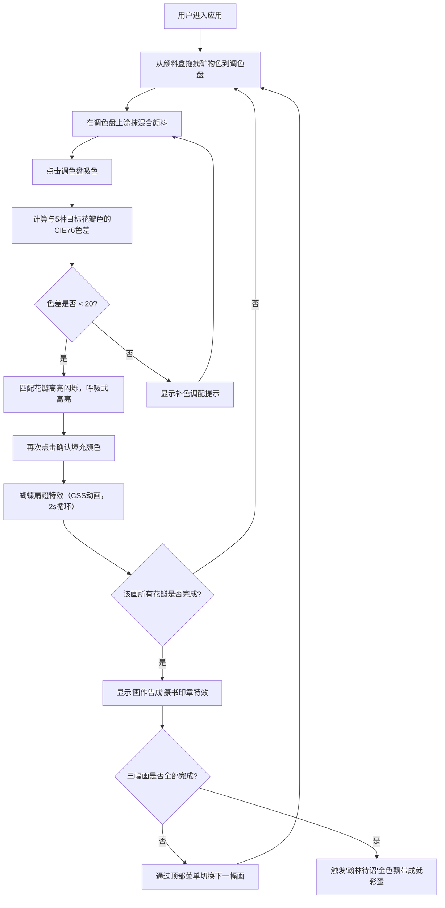

## 1. 产品概述

古画调色盘是一款沉浸式的中国传统工笔花鸟画颜料调配与着色模拟应用。用户化身宋代画院待诏，通过拖拽矿物颜料在瓷质调色盘上混合调配，为三幅传世名画（牡丹锦鸡图、梅雀迎春图、荷花蜻蜓图）的花瓣着色，体验传统书画艺术的魅力。

- **核心价值**：以游戏化交互传承中国传统颜料调配技艺，让用户在趣味中学习工笔画色彩知识
- **目标用户**：书画爱好者、传统文化学习者、对中国传统艺术感兴趣的大众用户

## 2. 核心 Features

### 2.1 Feature Module
1. **颜料选择区**：七种矿物色（石青、石绿、赭石、朱砂、藤黄、花青、钛白），支持拖拽操作
2. **调色盘组件**：Canvas 2D实时颜料混合，支持鼠标涂抹叠加
3. **画作展示区**：三幅工笔花鸟画线稿，花瓣高亮匹配与着色填充
4. **色值匹配系统**：CIE76色差计算，自动匹配最近目标色
5. **补色提示系统**：智能推荐调色方案，辅助用户调出目标色
6. **画作切换系统**：顶部下拉菜单切换画作，带动画过渡
7. **成就统计系统**：颜料使用次数统计、印章特效、"翰林待诏"成就彩蛋

### 2.3 Page Details
| 页面名称 | 模块名称 | 功能描述 |
|---------|---------|----------|
| 主界面 | 颜料盒模块 | 七种矿物色圆形色块展示（直径30px，内圈渐变光泽），HTML5拖拽支持，拖拽时半透明拖影跟随 |
| 主界面 | 调色盘模块 | 白色瓷质调色盘（直径280px，冰裂纹边缘），Canvas 2D绘制色点混合，鼠标涂抹叠加 |
| 主界面 | 吸色器模块 | 点击调色盘吸色（圆形取色器半径5px，十字准星），涟漪扩散动画 |
| 主界面 | 画作模块 | 工笔花鸟画线稿（墨色#2b1a0e，毛笔抖动笔触），花瓣高亮闪烁（0.5s周期），匹配边缘抖动动画 |
| 主界面 | 补色提示模块 | 色差大于20时显示推荐调配方案（如'加少许藤黄可调出荷花粉'） |
| 主界面 | 画作切换模块 | 顶部下拉菜单，framer-motion AnimatePresence动画切换 |
| 主界面 | 成就系统模块 | 单幅完成显示红色篆书印章特效，全部完成触发金色飘带粒子特效 |
| 主界面 | 统计模块 | 记录颜料使用次数，完成度统计 |

## 3. 核心流程

## 4. User Interface Design

### 4.1 Design Style
- **整体风格**：宋代院体画风格，古典雅致，还原传统书画创作氛围
- **主色调**：米黄色#f5e6d3（卷轴背景）、深红色#8b0000（颜料盒边框）、浅米色#faf0e6（颜料盒底色）、浅灰色#dcdcdc（桌面）、雪白#fffcf5（画作背景）、墨色#2b1a0e（线稿）
- **字体**：使用楷体/宋体类书法字体，标题使用仿古篆书风格（如"Noto Serif SC"、"ZCOOL XiaoWei"）
- **布局**：三栏式布局（左：颜料盒 | 中：调色盘 | 右：画作），移动端垂直堆叠
- **装饰元素**：仿古宣纸纹理背景、木质边框、冰裂纹理、毛笔笔触抖动效果

### 4.2 Page Design Overview
| 模块名称 | UI Elements |
|---------|-------------|
| 颜料盒 | 深红色木质边框，浅米色底色，七种圆形色块（直径30px），内圈径向渐变模拟矿物色光泽，hover有轻微上浮效果 |
| 调色盘 | 白色瓷质圆盘（直径280px），边缘冰裂纹纹理，放置于带木纹渐变的浅灰色桌面上，Canvas绘制色点混合 |
| 画作区 | 雪白背景，工笔花鸟线稿（墨色，毛笔抖动笔触），未着色花瓣有细边描线，匹配时呼吸式高亮 |
| 吸色器 | 圆形取色器（半径5px），十字准星，点击时涟漪扩散动画 |
| 顶部菜单 | 仿古卷轴样式下拉菜单，选择画作时AnimatePresence动画过渡 |
| 补色提示 | 仿古便签样式，位于画作区右侧，淡入淡出动画 |
| 印章特效 | 红色篆书印章，缩放+淡入动画，印泥质感 |
| 蝴蝶特效 | CSS动画蝴蝶，2s循环扇翅，从着色花瓣飞出 |
| 成就彩蛋 | 金色飘带粒子效果，环绕屏幕飘落 |

### 4.3 Responsiveness
- **桌面端（≥768px）**：三栏水平布局，左侧颜料盒（200px）+ 中央调色盘（320px）+ 右侧画作（自适应剩余宽度）
- **移动端（<768px）**：垂直堆叠布局，顶部画作区 → 中部调色盘 → 底部颜料盒，所有元素等比缩放适应屏幕宽度
- **触摸优化**：颜料拖拽支持touch事件，吸色区域扩大到44x44px便于触摸操作

## 5. 非功能需求
- **性能要求**：Canvas混合帧率≥45 FPS，色差计算耗时<50ms，拖拽无掉帧
- **浏览器兼容**：Chrome 90+、Firefox 88+、Safari 14+
- **无障碍**：主要操作支持键盘导航，颜色对比度符合WCAG AA标准
