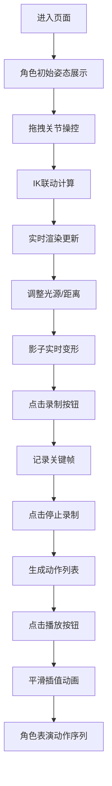

## 1. 产品概述

古代皮影戏角色操控与光影交互浏览器演示项目，让用户在虚拟宋元戏台幕布后，体验皮影戏师傅操控纸雕皮影人物的乐趣。

- 核心价值：通过现代化的 Web 技术，将传统皮影戏艺术转化为可交互的数字体验
- 目标用户：对传统艺术、动画、交互设计感兴趣的用户和学习者
- 产品定位：文化传承与技术创新结合的互动演示项目

## 2. 核心功能

### 2.1 功能模块

1. **皮影角色操控**：七关节骨骼联动，IK 逆运动学拖拽，缓动回正
2. **光影交互系统**：虚拟油灯光源控制，实时影子变形计算
3. **动作录制与播放**：关键帧录制，动作序列编排，平滑插值播放
4. **戏台界面**：暗色调仿古戏台 UI，幕布焦痕效果，隶书标题

### 2.2 页面详情

| 页面名称 | 模块名称 | 功能描述 |
|-----------|-------------|---------------------|
| 主页面 | 戏台幕布区 | 渲染皮影角色和光影效果，占主体 70% 区域，支持鼠标拖拽交互 |
| 主页面 | 左侧控制面板 | 光源位置滑块、距离滑块、动作列表缩略图展示 |
| 主页面 | 顶部标题区 | 隶书风格戏名展示，带阴影效果 |
| 主页面 | 底部控制区 | 录制、播放、停止、重置按钮，铜色圆角风格 |

## 3. 核心流程

用户进入页面后，首先看到唐代武士皮影角色站立在微黄绢布幕布上。用户可以通过鼠标拖拽任意关节点来操控角色姿态，拖拽时相邻关节自动跟随旋转。调整左侧光源滑块可以观察影子实时变形。点击录制按钮开始记录动作，多次拖拽调整后停止录制，点击播放即可看到角色按顺序表演整段动作序列。

## 4. 用户界面设计

### 4.1 设计风格

- **主色调**：深赭 `#3e2c1f`（戏台边框），微黄 `#f5eedc`（幕布），铜色 `#b87333`（按钮）
- **辅助色**：暗红 `#cc3333`（皮影填充），深棕 `#4a3728`（关节木棍），炽白 `#fff4e0`（灯光中心）
- **按钮风格**：圆角铜色按钮，悬停时变为 `#d49455`，带有轻微立体感
- **字体**：隶书风格标题（24px，带阴影），正文字体使用清晰易读的衬线字体
- **布局风格**：左侧竖条控制面板 + 中央幕布主体 + 顶部标题 + 底部控制栏，非对称布局
- **视觉效果**：幕布边缘蜡烛焦痕模糊，木纹斜线渐变背景，径向渐变灯光光圈

### 4.2 页面设计概述

| 页面名称 | 模块名称 | UI 元素 |
|-----------|-------------|-------------|
| 主页面 | 幕布区域 | 微黄背景 `#f5eedc`，边缘焦痕模糊，70% 宽高居中 |
| 主页面 | 皮影角色 | 七关节骨骼，黑色描边 0.5px，半透明红黑填充，关节点高亮 |
| 主页面 | 光源控制 | 横向滑块，范围 ±150px，实时更新灯光位置 |
| 主页面 | 距离控制 | 横向滑块，范围 0-60px，控制影子变形程度 |
| 主页面 | 动作列表 | 左侧边栏横向缩略图，点击可快速跳转 |
| 主页面 | 控制按钮 | 录制（红点）、播放（三角）、停止（方块）、重置（圆圈），铜色圆角 |

### 4.3 响应式设计

- 桌面端优先设计，中央幕布区域保持固定比例
- 移动端适配时，控制面板可折叠为底部抽屉
- 所有交互元素支持触摸操作，拖拽区域放大至 20px 点击范围

### 4.4 动画与交互规范

- 拖拽关节：相邻关节自动跟随旋转（IK 简算）
- 松开鼠标：缓动回正位（ease-out 0.3s）
- 播放动作：关节平滑插值过渡，每步 0.4s
- 动作停顿：关键帧间停留 1.5s，模拟换手停顿
- 影子效果：CSS filter: drop-shadow 动态生成，带柔边模糊
- 帧率要求：骨骼动画和影子变形不低于 55fps
