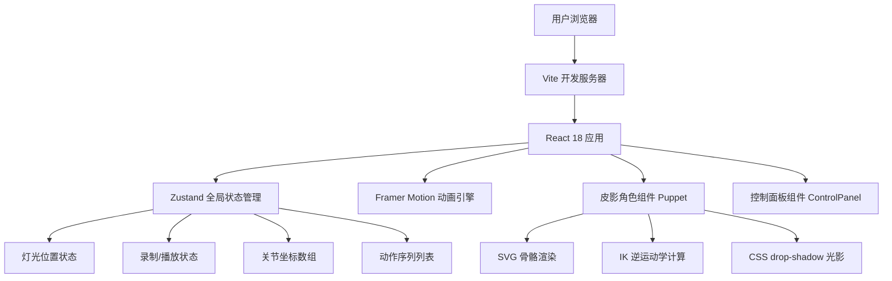

## 1. 架构设计



## 2. 技术描述

- **前端框架**：React 18 + TypeScript 5
- **构建工具**：Vite 5 + @vitejs/plugin-react
- **状态管理**：Zustand 4
- **动画引擎**：Framer Motion 11
- **渲染技术**：SVG 矢量图形 + CSS 滤镜 + 径向渐变
- **图标库**：lucide-react

## 3. 核心数据结构

### 3.1 关节点定义

```typescript
interface Joint {
  id: string;
  name: string;
  x: number;
  y: number;
  angle: number;
  parentId: string | null;
  length: number;
  minAngle: number;
  maxAngle: number;
}

interface PuppetState {
  joints: Joint[];
  isDragging: boolean;
  dragJointId: string | null;
}
```

### 3.2 动作关键帧

```typescript
interface Keyframe {
  id: string;
  timestamp: number;
  joints: Joint[];
  pauseDuration: number;
}

interface ActionSequence {
  id: string;
  name: string;
  keyframes: Keyframe[];
  thumbnail: string;
}
```

### 3.3 全局状态

```typescript
interface AppState {
  lightPosition: number;
  puppetDistance: number;
  isRecording: boolean;
  isPlaying: boolean;
  currentFrameIndex: number;
  actionSequences: ActionSequence[];
  activeSequenceId: string | null;
}
```

## 4. 项目文件结构

```
auto87/
├── package.json
├── vite.config.js
├── tsconfig.json
├── index.html
└── src/
    ├── main.tsx
    ├── App.tsx
    ├── store/
    │   └── useAppStore.ts
    ├── components/
    │   ├── Puppet.tsx
    │   ├── ControlPanel.tsx
    │   └── Stage.tsx
    ├── hooks/
    │   ├── useIK.ts
    │   └── useAnimationFrame.ts
    ├── utils/
    │   ├── ik.ts
    │   ├── interpolation.ts
    │   └── shadow.ts
    └── types/
        └── index.ts
```

## 5. 核心算法

### 5.1 IK 逆运动学简算

采用两关节 IK 求解，适用于肩-肘-腕和髋-膝-踝联动：

```typescript
function solveIK(
  targetX: number,
  targetY: number,
  rootX: number,
  rootY: number,
  length1: number,
  length2: number
): { angle1: number; angle2: number } {
  const dx = targetX - rootX;
  const dy = targetY - rootY;
  const distance = Math.sqrt(dx * dx + dy * dy);
  // 余弦定理求解
  const angle2 = Math.acos(
    Math.max(-1, Math.min(1, 
      (length1 * length1 + length2 * length2 - distance * distance) / 
      (2 * length1 * length2)
    ))
  );
  const angle1 = Math.atan2(dy, dx) - Math.acos(
    Math.max(-1, Math.min(1,
      (length1 * length1 + distance * distance - length2 * length2) /
      (2 * length1 * distance)
    ))
  );
  return { angle1, angle2 };
}
```

### 5.2 影子变形计算

根据灯光位置和角色距离计算影子偏移和拉伸：

```typescript
function calculateShadow(
  jointX: number,
  jointY: number,
  lightX: number,
  lightY: number,
  distance: number
): { offsetX: number; offsetY: number; scale: number } {
  const dirX = jointX - lightX;
  const dirY = jointY - lightY;
  const dist = Math.sqrt(dirX * dirX + dirY * dirY);
  const stretchFactor = 1 + distance / 30;
  const offsetFactor = distance / 15;
  return {
    offsetX: (dirX / dist) * offsetFactor,
    offsetY: (dirY / dist) * offsetFactor,
    scale: stretchFactor
  };
}
```

### 5.3 关键帧插值

采用四元数球面线性插值 (Slerp) 进行关节角度平滑过渡：

```typescript
function lerpJoint(from: Joint, to: Joint, t: number): Joint {
  const easeT = easeInOutCubic(t);
  return {
    ...from,
    x: from.x + (to.x - from.x) * easeT,
    y: from.y + (to.y - from.y) * easeT,
    angle: from.angle + normalizeAngle(to.angle - from.angle) * easeT
  };
}
```

## 6. 性能优化策略

1. **requestAnimationFrame 驱动**：所有动画统一由 RAF 调度，避免重复重绘
2. **SVG 局部更新**：仅更新发生变化的关节元素，使用 memo 缓存子组件
3. **CSS 变量传递**：灯光位置、距离等参数通过 CSS 变量传递，避免 JS 重计算
4. **will-change 提示**：对频繁变换的元素添加 will-change 优化合成层
5. **离屏渲染**：动作缩略图使用 OffscreenCanvas 预渲染
6. **防抖节流**：拖拽事件使用 requestAnimationFrame 节流，避免过度计算
