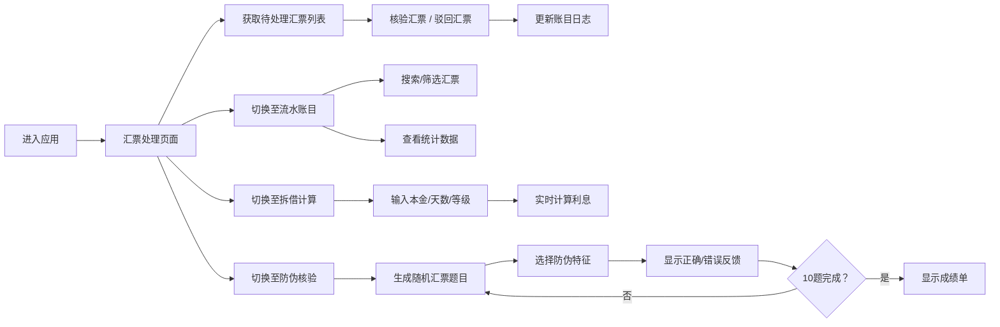

## 1. 产品概述

晋通票号汇兑账房是一款模拟明清晋商票号日常运营的全栈Web应用，让用户以资深掌柜的身份管理汇票处理、账目流水、拆借利息计算和防伪核验等核心业务。通过沉浸式的复古界面和流畅的交互体验，重现晋商票号严谨细致的金融运作场景。

- 核心目标：构建高度沉浸感的票号业务模拟体验
- 目标用户：对历史金融文化感兴趣的玩家、教育场景学习者
- 市场价值：传承晋商文化，提供寓教于乐的金融历史体验

## 2. 核心 Features

### 2.1 用户角色

| 角色 | 登录方式 | 核心权限 |
|------|----------|----------|
| 掌柜 | 直接进入 | 汇票处理、账目查询、利息计算、防伪核验全部权限 |

### 2.2 Feature Module

1. **汇票处理**：待处理汇票列表、核验/驳回操作、印章动画、统计显示
2. **流水账目**：已处理汇票表格、日期/票号搜索、今日统计卡片
3. **拆借计算**：本金/天数/等级输入、实时利息计算、仿古算盘面板、拨珠动画
4. **防伪核验**：CSS绘制汇票、防伪特征识别、计分系统、闯关答题

### 2.3 页面详情

| 页面名称 | 模块名称 | 功能描述 |
|---------|----------|----------|
| 汇票处理 | 汇票列表 | 展示10张待处理汇票卡片，每张显示编号、日期、汇出票号、汇入票号、金额、手续费 |
| 汇票处理 | 操作按钮 | 核验按钮触发印章放大动画并移除汇票，驳回按钮使卡片变灰滑入回收区 |
| 汇票处理 | 统计栏 | 底部实时显示已核验（绿色）和驳回（红色）数量 |
| 流水账目 | 账目表格 | 显示所有已处理汇票的日期、票号（加粗）、金额、手续费、状态图标 |
| 流水账目 | 搜索功能 | 顶部搜索框支持按日期和票号模糊搜索 |
| 流水账目 | 统计卡片 | 显示今日核验笔数和合计金额 |
| 拆借计算 | 输入表单 | 本金输入框（500-50000两）、天数滑动条（1-90天）、等级下拉框（甲/乙/丙） |
| 拆借计算 | 结果面板 | 原木色仿古算盘面板显示利息、年化利率、本息合计，带数字跳动动画 |
| 防伪核验 | 汇票展示 | CSS绘制包含印章（#cc0000）、花押（#111）、水印的汇票图 |
| 防伪核验 | 答题系统 | 三选一防伪特征选择题，答对+5分答错-3分，共10题 |
| 防伪核验 | 反馈效果 | 正确显示绿色对勾+粒子特效，错误显示红色叉号+抖动动画 |
| 防伪核验 | 成绩单 | 10题完成后弹出，>=60分显示"合格掌柜"，否则"还需历练" |

## 3. 核心流程

## 4. 用户界面设计

### 4.1 设计风格

- **主色调**：深红褐 #4a2c2a（木柜台质感）、米白 #f5e6ca（宣纸质感）
- **辅助色**：深金色 #c9a96e（按钮）、红色 #cc0000（印章）、原木色 #d4a76a（算盘面板）
- **字体**：仿古楷体 'KaiTi', 'STKaiti', serif，字号18px，导航项颜色 #e0c9a6
- **布局风格**：左窄右宽双列布局，左侧固定200px深色导航栏（#3a1f1a），右侧米白色主工作区
- **卡片样式**：深棕色边框（2px solid #5c3d2e）、圆角6px、纸纹阴影（2px 2px 6px rgba(0,0,0,0.1)）
- **按钮样式**：深金色背景，悬停变亮，平滑过渡（0.2s ease）
- **输入框样式**：复古卷边效果，焦点状态有平滑过渡
- **选中导航项**：左侧4px金色（#c9a96e）竖条指示，背景微亮（#4a2c2a）

### 4.2 页面设计概览

| 页面名称 | 模块名称 | UI 元素 |
|---------|----------|----------|
| 汇票处理 | 汇票卡片 | 红色印章、6位编号、核验/驳回按钮、印章缩放动画、驳回滑入动画 |
| 汇票处理 | 统计栏 | 绿色已核验数、红色驳回数 |
| 流水账目 | 表格 | 日期列、加粗票号列、金额列（整数）、手续费列（两位小数）、状态图标列（✓/✗） |
| 流水账目 | 搜索区 | 搜索框、统计卡片 |
| 拆借计算 | 表单 | 数字输入框、滑动条（带实时数值）、下拉选择框 |
| 拆借计算 | 算盘面板 | 原木色背景、利息金额、年化利率、本息合计、数字跳动动画 |
| 防伪核验 | 汇票图 | CSS绘制边框纹样、印章、花押、半透明水印 |
| 防伪核验 | 答题区 | A/B/C三个选项按钮、得分显示（如45/100）、进度显示（如5/10） |
| 全局 | 导航栏 | 竖向导航，选中动效，响应式折叠 |
| 全局 | 页面切换 | fade（0.4s）+ slide（0.3s右侧滑入）混合动画 |

### 4.3 响应式设计

- **桌面端**：左侧200px固定导航栏，右侧主工作区
- **移动端**（<768px）：顶部60px高度导航栏，菜单项缩减为图标+简写文字，主工作区占满宽度

### 4.4 动画与交互

- **页面切换**：framer-motion实现fade（透明度0→1，0.4s）+ slide（右侧滑入，0.3s）
- **印章动画**：核验时缩放1.2倍再回正
- **驳回动画**：卡片变灰并滑入右侧回收区
- **数字动画**：利息计算时数字跳动拨珠效果
- **答题反馈**：正确-绿色对勾+3秒粒子特效；错误-红色叉号+抖动动画
- **导航选中**：金色竖条指示+背景微亮动效
- **悬停/焦点**：0.2s平滑过渡效果
