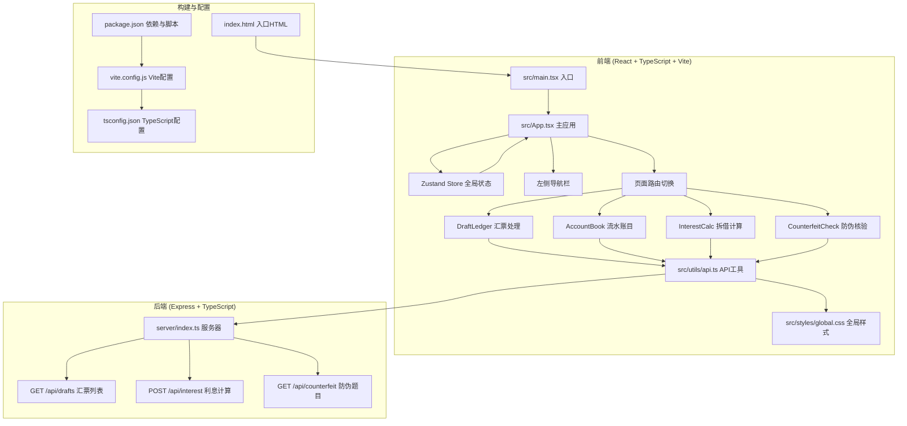
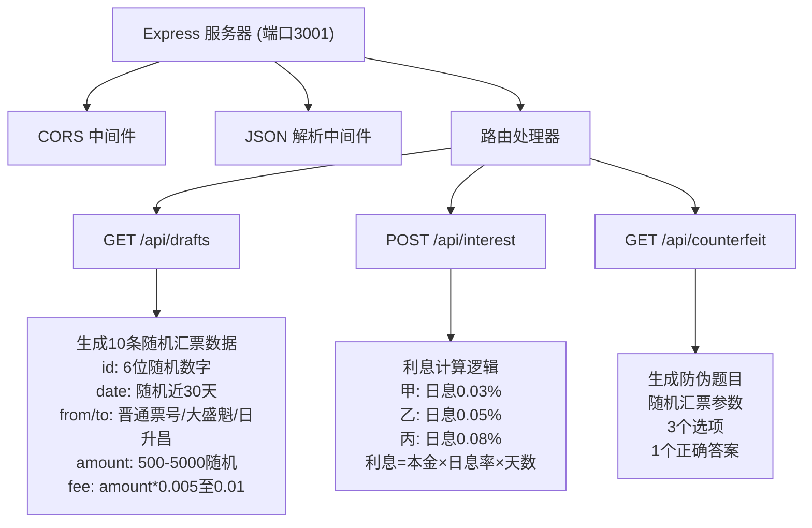
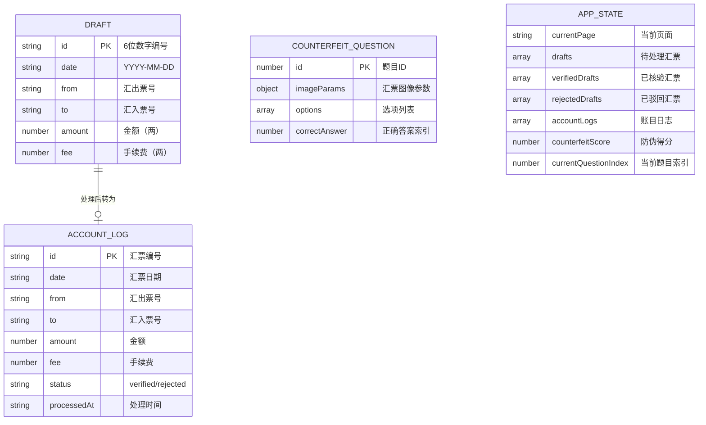

## 1. 架构设计



## 2. 技术选型说明

- **前端框架**：React@18 + TypeScript@5
- **构建工具**：Vite@5
- **后端框架**：Express@4
- **状态管理**：Zustand@4
- **动画库**：Framer Motion@11
- **日期处理**：Day.js@1
- **HTTP中间件**：Cors@2
- **开发服务器**：Vite开发服务器（端口5173）+ Express API服务器（端口3001）

### 依赖清单

| 依赖 | 版本 | 用途 |
|------|------|------|
| react | ^18.2.0 | 前端框架 |
| react-dom | ^18.2.0 | React DOM渲染 |
| typescript | ^5.4.0 | 类型系统 |
| vite | ^5.2.0 | 构建工具 |
| @vitejs/plugin-react | ^4.2.0 | Vite React插件 |
| express | ^4.18.0 | 后端服务 |
| cors | ^2.8.5 | 跨域资源共享 |
| zustand | ^4.5.0 | 状态管理 |
| framer-motion | ^11.0.0 | 动画效果 |
| dayjs | ^1.11.0 | 日期处理 |

## 3. 路由定义（前端页面导航）

| 页面标识 | 页面名称 | 对应组件 |
|----------|----------|----------|
| drafts | 汇票处理 | DraftLedger |
| account | 流水账目 | AccountBook |
| interest | 拆借计算 | InterestCalc |
| counterfeit | 防伪核验 | CounterfeitCheck |

## 4. API 定义

### 类型定义

```typescript
// 汇票数据类型
interface Draft {
  id: string;           // 6位数字编号
  date: string;         // YYYY-MM-DD格式
  from: string;         // 汇出票号：晋通票号/大盛魁/日升昌
  to: string;           // 汇入票号
  amount: number;       // 金额（两），500-5000
  fee: number;          // 手续费（两），amount*0.005至0.01浮动
}

// 账目日志类型
interface AccountLog extends Draft {
  status: 'verified' | 'rejected';  // 核验状态
  processedAt: string;              // 处理时间
}

// 利息计算请求
interface InterestRequest {
  principal: number;    // 本金（两）
  days: number;         // 拆借天数（1-90）
  tier: '甲' | '乙' | '丙';  // 票号等级
}

// 利息计算响应
interface InterestResponse {
  principal: number;
  days: number;
  tier: string;
  dailyRate: number;    // 日息率
  annualRate: number;   // 年化利率
  interest: number;     // 利息
  totalAmount: number;  // 本息和
}

// 防伪核验题目
interface CounterfeitQuestion {
  id: number;
  imageParams: {
    sealColor: string;
    signatureStyle: string;
    watermarkPattern: string;
    borderStyle: string;
  };
  options: string[];
  correctAnswer: number;
}
```

### 接口详情

| 方法 | 路径 | 请求参数 | 响应 | 说明 |
|------|------|----------|------|------|
| GET | /api/drafts | 无 | Draft[] | 返回10条随机汇票数据 |
| POST | /api/interest | { principal, days, tier } | InterestResponse | 计算拆借利息 |
| GET | /api/counterfeit | 无 | CounterfeitQuestion | 返回一道随机防伪题目 |

## 5. 服务器架构



## 6. 数据模型

### 6.1 数据模型定义



### 6.2 Zustand Store 状态

```typescript
interface AppState {
  // 页面状态
  currentPage: 'drafts' | 'account' | 'interest' | 'counterfeit';
  setCurrentPage: (page: AppState['currentPage']) => void;
  
  // 汇票数据
  drafts: Draft[];
  setDrafts: (drafts: Draft[]) => void;
  
  // 已核验/驳回
  verifiedDrafts: Draft[];
  rejectedDrafts: Draft[];
  
  // 账目日志
  accountLogs: AccountLog[];
  
  // 操作方法
  verifyDraft: (draftId: string) => void;
  rejectDraft: (draftId: string) => void;
  
  // 防伪核验
  counterfeitScore: number;
  currentQuestionIndex: number;
  addScore: (points: number) => void;
  nextQuestion: () => void;
  resetCounterfeit: () => void;
}
```
