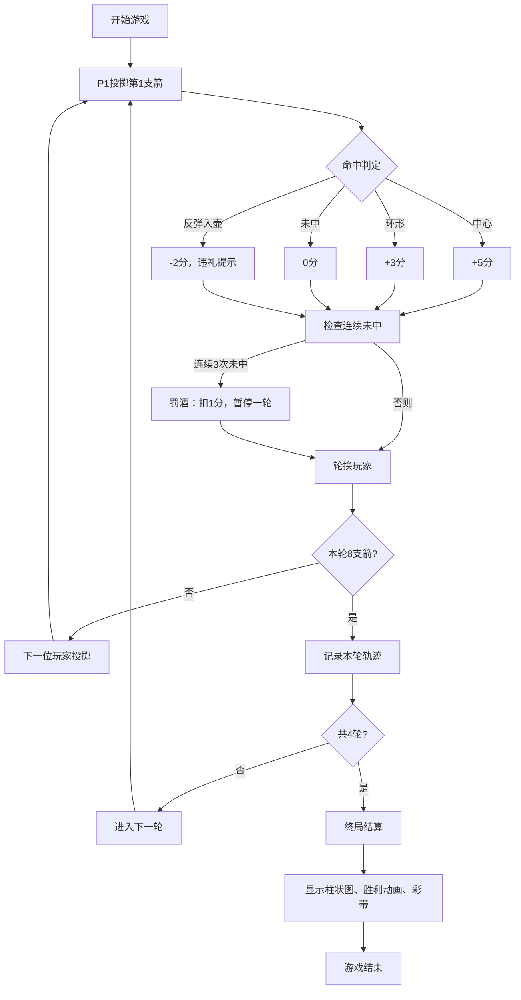

## 1. 产品概述

古代投壶雅戏是一款基于周代礼仪文化的双人回合制投掷游戏。玩家在虚拟宴席厅场景中，手持箭矢向远处青铜壶投掷，根据投中结果和《礼记·投壶》的礼仪规则累积分数。

- 核心目标：还原古代投壶礼仪文化，提供沉浸式的雅戏体验
- 目标用户：对中国传统文化感兴趣的游戏玩家、文化教育学习者

## 2. 核心功能

### 2.1 用户角色

| 角色 | 参与方式 | 核心权限 |
|------|---------|----------|
| 玩家1（P1） | 本地双人模式 | 投掷箭矢、查看分数、回放历史 |
| 玩家2（P2） | 本地双人模式 | 投掷箭矢、查看分数、回放历史 |

### 2.2 功能模块

1. **主游戏区**：Canvas场景渲染、投掷交互、物理模拟
2. **计分面板**：分数显示、回合信息、剩余箭数
3. **历史记录**：轨迹缩略图、动画回放控制
4. **终局结算**：总分对比柱状图、胜利动画、彩带效果
5. **音效系统**：Web Audio API生成多种音效

### 2.3 页面详情

| 页面名称 | 模块名称 | 功能描述 |
|---------|----------|----------|
| 游戏主界面 | 投掷交互 | 鼠标拖拽调整角度和力度，释放投掷箭矢 |
| 游戏主界面 | 物理引擎 | 抛物线轨迹计算、命中判定、落地反弹检测 |
| 游戏主界面 | 青铜壶模型 | Canvas绘制投壶，三区域命中判定 |
| 游戏主界面 | 礼仪规则 | 违礼扣分、连续未中罚酒机制 |
| 游戏主界面 | 双人回合 | 玩家轮换、高亮当前玩家、对方箭矢半透明 |
| 历史面板 | 轨迹回放 | 8支箭缩略图、半速回放、暂停/加速控制 |
| 结算界面 | 终局动画 | 柱状图增长动画、胜利者闪烁、彩带粒子 |

## 3. 核心流程

## 4. 用户界面设计

### 4.1 设计风格

- **主色调**：仿古宣纸色#f5eedc（背景）、青铜色#b87333（箭矢/壶）、红色#8b0000（地毯/玩家2）、蓝色#1e90ff（玩家1）、金色#ffd700（高亮/胜利）
- **字体**：Google Fonts 思源宋体（Source Han Serif），竖向排版文字用于计分面板
- **按钮风格**：仿古木纹边框，点击波纹扩散效果（radial-gradient 0.3秒）
- **布局风格**：桌面端70%主游戏区 + 30%右侧计分面板，移动端堆叠布局
- **质感**：毛边纹理背景、虚化宴席厅背景图、木纹边框

### 4.2 页面设计概述

| 页面名称 | 模块名称 | UI元素 |
|---------|----------|--------|
| 游戏主界面 | 主游戏区 | Canvas画布（占70%宽，100vh），青铜壶居中偏下（距顶部45%），红色地毯地面，虚化宴席背景 |
| 游戏主界面 | 计分面板 | 右侧30%宽，仿古宣纸背景，竖向排版文字，玩家分数弹跳动画 |
| 游戏主界面 | 玩家信息 | 左上角圆形头像（36px），剩余箭数小圆点图标 |
| 游戏主界面 | 当前玩家高亮 | 金色光晕#ffd700，CSS filter动画 |
| 历史面板 | 缩略图 | 左侧80px×80px Canvas轨迹图，每轮8支箭，颜色区分玩家 |
| 历史面板 | 回放控制 | 播放/暂停、加速按钮，波纹效果 |
| 结算界面 | 柱状图 | P1蓝色#1e90ff、P2红色#dc143c，平滑增长动画1.5秒 |
| 结算界面 | 胜利效果 | 金色大字闪烁（@keyframes pulse 1.5秒周期），200个彩带粒子 |

### 4.3 响应式设计

- **桌面端（≥768px）**：中心主游戏区70%宽，右侧计分面板30%宽
- **移动端（<768px）**：主游戏区占满宽度，计分面板下移到底部
- **触控优化**：支持触摸拖拽调整角度和力度，触控目标≥48px

### 4.4 动画细节

- **投掷动画**：箭矢抛物线飞行，半透明尾迹持续0.3秒
- **计分弹跳**：分数变化时transform: scale(1.2) 持续0.2秒
- **罚酒提示**：屏幕边缘闪烁红色，持续2秒
- **按钮波纹**：点击时radial-gradient扩散，持续0.3秒
- **柱状图增长**：framer-motion实现平滑增长，1.5秒完成
- **彩带粒子**：200个随机颜色方块从屏幕上方掉落，持续3秒
