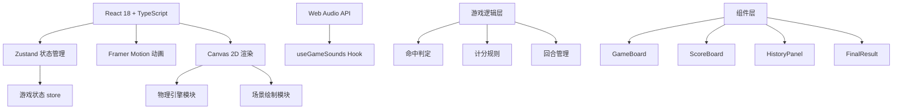

## 1. 架构设计



## 2. 技术描述

- **前端框架**：React 18 + TypeScript + Vite 5
- **状态管理**：Zustand
- **动画库**：Framer Motion
- **渲染引擎**：Canvas 2D API
- **音效系统**：Web Audio API（自定义Hook管理）
- **构建工具**：Vite 5（端口3000）
- **后端**：无（纯前端应用）
- **数据库**：无（内存状态管理）

## 3. 项目结构

```
d:\Solocoder\VersionFast\tasks\auto89\
├── package.json
├── vite.config.js
├── tsconfig.json
├── index.html
└── src\
    ├── types.ts          # 类型定义
    ├── gameLogic.ts      # 核心游戏逻辑
    ├── hooks\
    │   └── useGameSounds.ts  # 音效Hook
    ├── utils\
    │   └── physics.ts    # 物理引擎
    ├── components\
    │   ├── GameBoard.tsx     # 主游戏板
    │   ├── ScoreBoard.tsx    # 计分板
    │   ├── HistoryPanel.tsx  # 历史记录面板
    │   ├── FinalResult.tsx   # 终局结算
    │   └── Arrow.tsx         # 箭矢组件
    ├── store\
    │   └── useGameStore.ts   # Zustand状态管理
    ├── App.tsx
    ├── index.tsx
    └── index.css
```

## 4. 路由定义

| 路由 | 用途 |
|------|------|
| / | 游戏主界面（单页应用，无路由切换） |

## 5. 数据模型

### 5.1 类型定义

```typescript
// src/types.ts
export enum GamePhase {
  IDLE = 'idle',
  AIMING = 'aiming',
  FLYING = 'flying',
  ROUND_END = 'round_end',
  GAME_OVER = 'game_over',
  PENALTY = 'penalty',
  REPLAY = 'replay',
}

export enum HitZone {
  CENTER = 'center',     // 5分
  RING = 'ring',         // 3分
  OUTSIDE = 'outside',   // 0分
  BOUNCE = 'bounce',     // -2分
}

export interface PlayerState {
  id: number;
  name: string;
  score: number;
  arrowsLeft: number;
  consecutiveMisses: number;
  color: string;
  skipTurn: boolean;
}

export interface ArrowState {
  id: string;
  playerId: number;
  x: number;
  y: number;
  angle: number;
  velocity: number;
  active: boolean;
  trajectory: { x: number; y: number }[];
  hitResult?: HitZone;
  score?: number;
  bounced: boolean;
  bounceHeight: number;
}

export interface RoundRecord {
  roundNumber: number;
  arrows: ArrowState[];
}

export interface GameState {
  phase: GamePhase;
  currentPlayer: number;
  currentRound: number;
  totalRounds: number;
  arrowsPerRound: number;
  players: PlayerState[];
  activeArrow: ArrowState | null;
  roundHistory: RoundRecord[];
  replaying: boolean;
  replaySpeed: number;
  currentReplayIndex: number;
}
```

### 5.2 物理参数

| 参数 | 类型 | 默认值 | 说明 |
|------|------|--------|------|
| GRAVITY | number | 0.5 | 重力加速度 |
| MAX_ANGLE | number | 60 | 最大投掷角度（度） |
| MIN_ANGLE | number | 0 | 最小投掷角度（度） |
| MAX_POWER | number | 25 | 最大力度 |
| MIN_POWER | number | 8 | 最小力度 |
| ARROW_LENGTH | number | 20 | 箭矢长度（px） |
| BOUNCE_THRESHOLD | number | 10 | 反弹判定阈值（px） |

### 5.3 命中区域

| 区域 | 半径范围 | 得分 |
|------|----------|------|
| 中心 | 0-6px | +5 |
| 环形 | 8-12px | +3 |
| 壶外 | >12px | 0 |
| 反弹入壶 | 任意 | -2 |

## 6. 核心模块说明

### 6.1 Zustand Store（useGameStore）

- 管理全局游戏状态
- 提供动作：startGame, throwArrow, nextPlayer, nextRound, replayRound, calculateScore
- 选择器优化性能，避免不必要重渲染

### 6.2 物理引擎（physics.ts）

```typescript
export function calculateTrajectory(
  startX: number,
  startY: number,
  angle: number,  // 弧度
  power: number,
  timeStep: number
): { x: number; y: number; vy: number; grounded: boolean }[]
```

- 计算抛物线轨迹
- 检测与地面、壶的碰撞
- 计算反弹高度

### 6.3 游戏逻辑（gameLogic.ts）

- `determineHitZone(arrowX: number, arrowY: number, potX: number, potY: number): HitZone`
- `calculateScore(hitZone: HitZone, bounced: boolean, bounceHeight: number): number`
- `checkConsecutiveMisses(player: PlayerState): boolean`
- `rotatePlayer(players: PlayerState[], current: number): number`

### 6.4 音效Hook（useGameSounds.ts）

使用Web Audio API生成：
- 拨弦音（射出）：440Hz，0.2秒
- 清脆铃音（中壶）：0.5秒
- 沉闷鼓声（未中）：0.3秒
- 低沉号角（罚酒）：1秒

### 6.5 Canvas渲染（GameBoard.tsx）

- requestAnimationFrame 60fps循环
- 场景分层：背景 → 地毯 → 壶 → 箭矢 → 尾迹
- 对象池管理尾迹粒子，避免频繁GC

## 7. 性能优化

1. **Canvas渲染**：分层渲染，静态背景离屏缓存
2. **物理计算**：时间步长固定16ms内，Web Worker可选
3. **状态更新**：Zustand选择器精确订阅，减少重渲染
4. **内存管理**：轨迹数组限制长度，历史记录适时清理
5. **动画**：CSS transform/GPU加速，避免布局抖动
6. **对象池**：尾迹粒子、箭矢对象复用，减少GC压力
